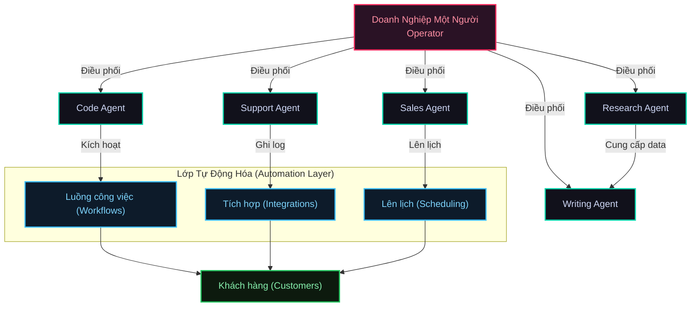
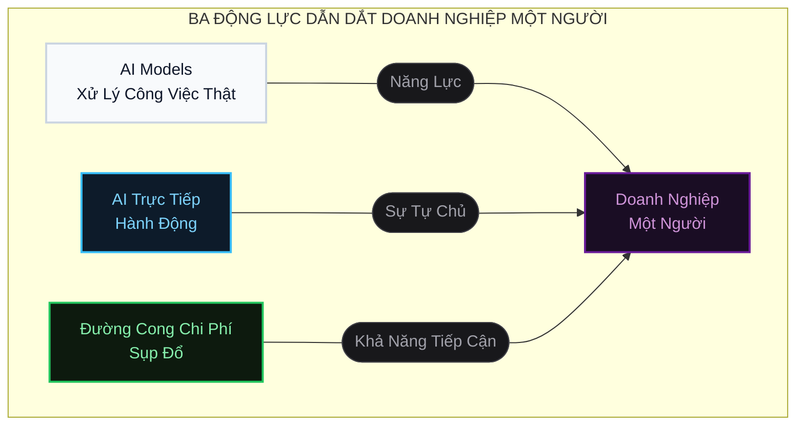
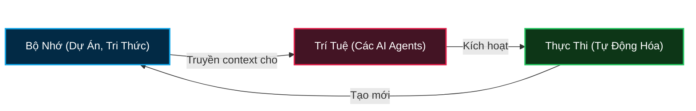
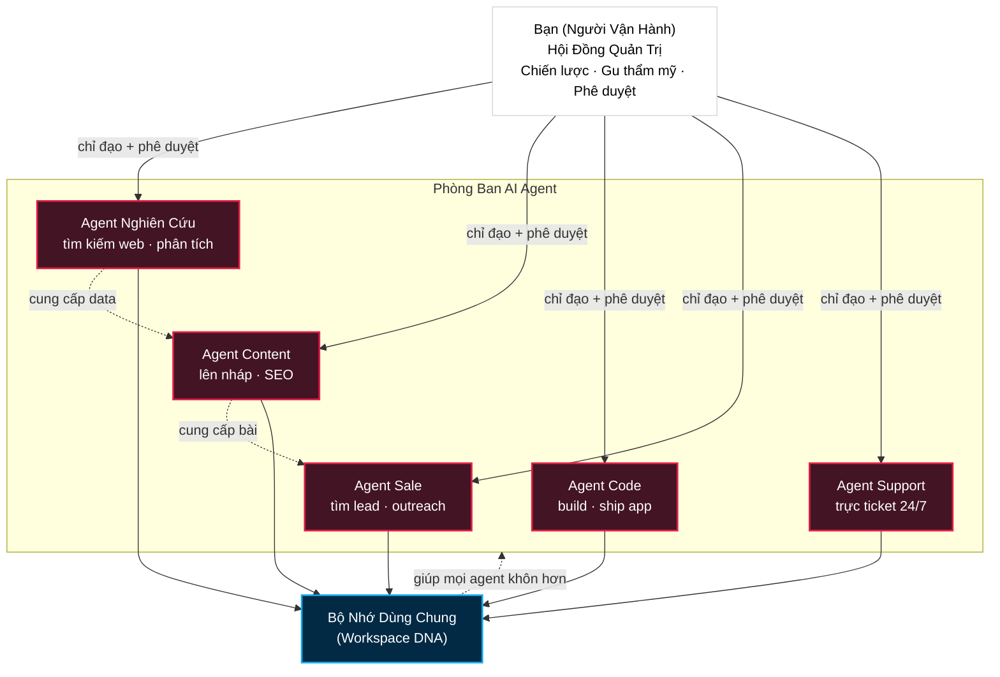
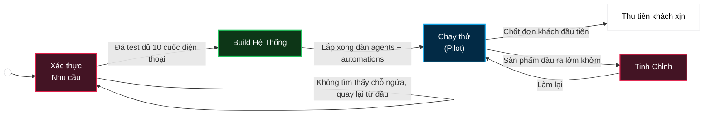
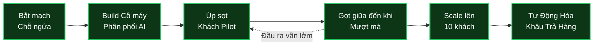
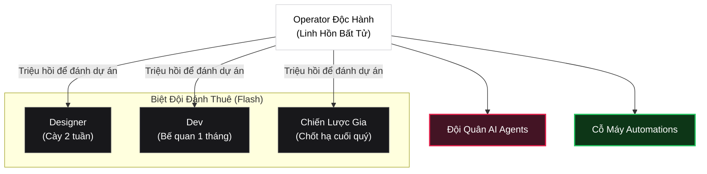

# Doanh Nghiệp Một Người: Cẩm Nang AI Cho Solo Founder

- **Phần 1: Sự trỗi dậy của Doanh nghiệp Một người (One-Person Company):** Lời tiên tri tỷ đô, 3 động lực chính (Năng lực AI, Khả năng hành động, Chi phí sụp đổ) và lợi thế biên lợi nhuận khổng lồ.
- **Phần 2: 5 Luồng công việc thực chiến (Workflows):** Giải phẫu các mô hình kinh doanh Solo kiếm hàng chục đến hàng trăm ngàn USD (Podcast Agency, Local Biz Automation, Micro-SaaS, Content Agency, E-commerce).
- **Phần 3: Sử dụng AI vs. Điều phối AI (Orchestration):** Sự khác biệt cốt lõi giữa việc coi AI là công cụ rời rạc so với việc biến AI thành hệ thống nhân sự chia sẻ chung bộ nhớ (Memory).
- **Phần 4: Bản đồ thực thi 5 Bước (The Playbook):** Từ Validation State Machine đến System Delivery Workflow, và mô hình vận hành lai (Hybrid Operating Model) với Workspace DNA.

> [!NOTE]
> **TÓM TẮT CỐT LÕI & CHIẾN LƯỢC ỨNG DỤNG**
> 
> **1. Lõi tư tưởng:**
> Lợi thế cạnh tranh tối thượng không còn nằm ở quy mô nhân sự, mà ở năng lực "điều phối" (orchestration) hệ thống AI. operator (người điều hành) tư duy như một Hội đồng Quản trị, giao phó mọi tác vụ execution cho mạng lưới AI Agents có chung bộ nhớ (Memory).
> 
> **2. Framework & Quy trình:**
> - **Validation State Machine:** Máy trạng thái thẩm định ý tưởng — tuyệt đối không build hệ thống nếu chưa validate được nỗi đau thật sự của thị trường bằng những cuộc gọi thực tế.
> - **System Delivery Workflow:** Đóng gói toàn bộ quá trình biến input thành output, tách rời "Quy trình" khỏi "Người thực thi" để AI có thể thay thế.
> - **Hybrid Operating Model:** Mô hình vận hành kết hợp: Human (Cốt lõi/Quyết định) + AI Agents (Nhiệm vụ liên tục) + Automations (Logic tĩnh) + Freelance Sprints (Dự án đặc thù).
> - **Workspace DNA:** Vòng lặp tự nâng cấp: `Memory -> Intelligence -> Execution`. Mỗi hành động tạo ra tri thức mới, lưu ngược lại vào Memory để làm Agent thông minh hơn.
> 
> **3. Đối chiếu Playbook Chiến lược:**
> Tài liệu này tương thích 100% với Identity v4.1 (Định hướng Solopreneur & Tự do thời gian/địa điểm). Cung cấp mảnh ghép chiến lược lớn nhất để giải quyết nỗi đau `system-bloat` (hệ thống cồng kềnh) ở Phase 3 & 4. Xóa bỏ tư duy "thuê nhân sự" truyền thống, thay bằng tư duy "build agent".

> - **Nguồn:** [Taskade Blog](https://www.taskade.com/blog/one-person-companies)
> - **Ngày đăng:** March 30, 2026 (Cập nhật: June 12, 2026)
> - **Tags:** #one-person-company, #solopreneur, #ai-agents

Trong phần lớn lịch sử hiện đại, yếu tố kìm hãm doanh nghiệp là nhân sự. Nếu bạn muốn làm nhiều hơn, bạn cần nhiều người hơn. Thêm việc đồng nghĩa với thêm tuyển dụng, thêm quy trình phối hợp, thêm quỹ lương, thêm quản lý vi mô (micromanagement). Bạn không thể tăng quy mô đầu ra nếu không tăng quy mô nhân sự.

Phương trình đó đã vỡ nát vào năm 2025.

Các trợ lý trí tuệ nhân tạo (AI agents) không chỉ giúp con người làm việc nhanh hơn — chúng thay đổi hoàn toàn tính kinh tế của sản lượng (economics of output). Khi chi phí sản xuất trở nên siêu rẻ, mô hình kinh doanh dựa trên số lượng nhân sự sẽ sụp đổ. Đơn vị mở rộng quy mô (scaling unit) chuyển từ nhân viên sang AI agents. Và một danh mục kinh doanh mới ra đời: **doanh nghiệp một người (one-person company)**.

Đây không phải là hình ảnh một freelancer cày 80 giờ mỗi tuần. Cũng không phải một lifestyle blogger sống nhờ link tiếp thị liên kết (affiliate). Đây là một operator (người điều hành) duy nhất, ngồi ở vị trí trung tâm của một hệ thống vận hành bằng AI. Hệ thống này tạo ra khối lượng công việc bằng một team 10 người — trong khi con người chỉ tập trung vào chiến lược, gu thẩm mỹ (taste) và kết quả cho khách hàng.

> **TL;DR:** Doanh nghiệp một người đang trở thành mô hình vận hành mặc định cho lao động tri thức (knowledge work) vào năm 2026. Các nhà sáng lập độc lập (solo founders) như Pieter Levels (kiếm $3M+/năm, không có nhân viên nào) chứng minh mô hình này đang thực sự hiệu quả. AI agents xử lý 80-85% khối lượng công việc thực thi với chi phí chỉ bằng 2-5% so với một đội ngũ truyền thống. Kỹ năng chiến thắng không phải là sử dụng AI — mà là **điều phối (orchestrating)** nó. Hệ điều hành cho kỷ nguyên mới này chính là không gian làm việc tự chủ (agentic workspace): kết hợp bộ nhớ (memory), agents và tự động hóa (automations) trong một vòng lặp khép kín.

_Cập nhật lần cuối: Tháng 6 năm 2026._

* * *

## Doanh Nghiệp Một Người Là Gì?

Một doanh nghiệp một người không có nghĩa là một người làm tất cả mọi việc. Đó là một operator trực tiếp điều phối một hệ thống gồm AI agents, automations và các công cụ chuyên biệt để lo phần thực thi (execution) — trong khi con người vẫn nắm quyền kiểm soát chiến lược, chất lượng và mối quan hệ với khách hàng.

Khái niệm này đã có từ trước khi AI bùng nổ. Năm 2017, Paul Jarvis xuất bản cuốn _Company of One_, lập luận rằng tăng trưởng không phải lúc nào cũng là mục tiêu — một số doanh nghiệp nên chủ động giữ quy mô nhỏ. Nhưng làn sóng 2025-2026 mang bản chất hoàn toàn khác. Đây không phải là sự lựa chọn cố tình nhỏ bé. Đây là câu chuyện **một người tạo ra sản lượng của mười người** bởi vì AI đã xóa sổ điểm nghẽn thực thi.

| Kỷ nguyên | Đơn vị mở rộng | Điểm nghẽn | Giới hạn doanh thu |
| --- | --- | --- | --- |
| **Tiền internet** (trước 1995) | Nhân viên + sự hiện diện vật lý | Địa lý, vốn | Bị giới hạn bởi thị trường địa phương |
| **Kỷ nguyên internet** (1995-2015) | Đội ngũ digital + outsourcing | Phối hợp, tuyển dụng | $1-10M với 10-50 người |
| **Kỷ nguyên SaaS** (2015-2023) | Cloud tools + nhà thầu | Phân mảnh công cụ | $1-5M với 5-15 người |
| **Kỷ nguyên AI agent** (2024-nay) | AI agents + điều phối | Gu thẩm mỹ, phán đoán, phân phối | $1-10M+ với 1 người |

Sự chuyển dịch từ kỷ nguyên SaaS sang kỷ nguyên AI agent là một bước ngoặt chí mạng. Trong kỷ nguyên SaaS, các công cụ như Notion, Slack và Zapier giúp nhóm nhỏ làm việc hiệu quả hơn — nhưng bạn vẫn cần con người để thực thi. Trong kỷ nguyên AI agent, chính bản thân các agents là người thực thi.



* * *

## Lời Tiên Tri 1 Tỷ USD: Một Dòng Thời Gian

Ý tưởng về một doanh nghiệp tỷ đô chỉ có một người không xuất hiện sau một đêm. Nó leo thang qua một chuỗi các dự đoán từ những nhà lãnh đạo công nghệ, mỗi lời tiên tri lại tham vọng hơn lời trước.

### Chuỗi Leo Thang Của [Sam Altman](https://blog.samaltman.com/)

| Thời gian | Phát biểu | Bối cảnh |
| --- | --- | --- |
| **Tháng 9/2023** | _"Tôi nghĩ chúng ta hoàn toàn có thể chứng kiến một công ty tỷ đô chỉ có một người trong tương lai không xa."_ | Bài blog, sau khi ra mắt GPT-4 |
| **Tháng 2/2024** | _"Kỳ lân (unicorn) một người đầu tiên sắp xuất hiện."_ | Phỏng vấn, khi năng lực AI agent bắt đầu ló rạng |
| **Tháng 3/2025** | _"Chúng ta sắp thấy những công ty quy mô tương đương 10,000 người nhưng chỉ do một người điều hành."_ | Reddit AMA, sau khi phát hành GPT-5 |
| **Kỷ niệm 20 năm YC (2024)** | _"Tôi nghĩ điều này sẽ xảy ra nhanh hơn mọi người tưởng."_ | Keynote tại sự kiện Y Combinator |

Altman làm rõ rằng anh không có ý nói nghĩa đen là "không có nhân viên nào" — anh muốn nói tới đòn bẩy nhận thức (cognitive leverage) của AI sẽ giúp một người đạt được những gì mà trong lịch sử từng đòi hỏi cả một tổ chức khổng lồ. Sự tinh tế nằm ở chỗ: không phải là bạn tự làm mọi thứ một mình, mà là **chỉ đạo AI làm việc**.

### Góc Nhìn Từ Các Lãnh Đạo Công Nghệ Khác

| Lãnh đạo | Trích dẫn | Thời gian |
| --- | --- | --- |
| **Jensen Huang** (NVIDIA) | _"Với AI, mỗi nhân viên có thể là một phòng ban. Mỗi phòng ban có thể là một công ty."_ | CES 2025 |
| **Satya Nadella** (Microsoft) | _"Một startup một người giờ đây có thể sở hữu năng lực cấp doanh nghiệp (enterprise-grade)."_ | Davos 2025 |
| **Eric Schmidt** (Cựu CEO Google) | _"Những công ty vĩ đại tiếp theo sẽ được xây dựng bởi các nhóm nhỏ dùng AI. Lợi thế của việc to xác đang biến mất."_ | Tọa đàm tại Stanford 2024 |
| **Dario Amodei** (Anthropic) | Mô tả AI tạo ra "sự nén ép thời gian" — biến nhiều năm làm việc thành vài tuần. | Tiểu luận _Machines of Loving Grace_, 10/2024 |
| **Emad Mostaque** (Cựu CEO Stability AI) | _"Đến năm 2030, không công ty nào cần hơn 10 nhân viên để đạt định giá 1 tỷ USD."_ | Phỏng vấn 2024 |
| **Paul Graham** (Y Combinator) | _"AI làm cho mô hình solo founder trở nên khả thi hơn bao giờ hết. Tôi đã sai khi từng quá tuyệt đối về việc bắt buộc phải có co-founders."_ | Twitter/X 2024 |
| **Garry Tan** (Y Combinator) | _"Chúng ta đang thấy nhiều solo founder hơn bao giờ hết, và họ đang build sản phẩm nhanh hơn những team 10 người cách đây 5 năm."_ | Phỏng vấn 1/2025 |

Sự quay xe của Paul Graham là minh chứng rõ nhất. Trong tiểu luận nổi tiếng năm 2006 "18 Sai lầm giết chết Startups", ông xếp việc "chỉ có một founder" là sai lầm số 1. Hai mươi năm sau, AI đã buộc ông phải công khai đính chính quan điểm đó.

Nhận định của Garry Tan kết nối trực tiếp với [dự đoán rộng hơn của ông về việc vibe coding sẽ giết chết SaaS](https://www.taskade.com/blog/will-vibe-coding-kill-saas) — nếu một solo founder có thể lập trình và ra mắt phần mềm thông qua ngôn ngữ tự nhiên, thì một đội ngũ phát triển truyền thống trở thành một thứ không bắt buộc.

### Bảng Điểm Dự Đoán (Tính Đến 3/2026)

| Dự đoán | Trạng thái | Bằng chứng |
| --- | --- | --- |
| Công ty 1 người tỷ đô | **Chưa đạt được** | Gần nhất: Maor Shlomo (Base44, bán cho Wix giá $80M, build một mình trong 6 tháng) |
| Solo founder kiếm $1M+ ARR | **Hàng chục người đã đạt** | Pieter Levels, Danny Postma, Marc Lou, Mike Perham và nhiều người khác |
| Operator một người với năng suất 10,000 người | **Đạt được một phần** | AI agents tạo ra 4% toàn bộ các commit trên GitHub; solo dev vận hành với tốc độ của một team |
| AI agents thay thế lao động tri thức | **Đang diễn ra** | Klarna thay thế 700 tổng đài viên; Gartner: 20% tổ chức sẽ làm phẳng cấu trúc nhân sự vào 2026 |

Dario Amodei cho rằng có **70-80% xác suất công ty tỷ đô một người đầu tiên sẽ xuất hiện vào năm 2026**, rất có thể rơi vào các ngách như giao dịch nội bộ (proprietary trading), công cụ lập trình, hoặc dịch vụ chăm sóc khách hàng tự động.

### Tín Hiệu Từ Trung Quốc: 16 Triệu Doanh Nghiệp Một Người

Trong khi Thung lũng Silicon vẫn đang tranh cãi xem doanh nghiệp một người có khả thi không, thì Trung Quốc đã bắt đầu xây dựng chính sách quốc gia xoay quanh nó.

Đầu năm 2026, các chính quyền địa phương tại Trung Quốc tung ra những chương trình trợ giá hung hãn nhằm ươm tạo các doanh nghiệp một người sử dụng AI (OPC). Hãy nhìn vào những con số:

| Chỉ số | Con số | Nguồn |
| --- | --- | --- |
| Tổng số OPC tại Trung Quốc | **16M+** | Cục Thống kê Quốc gia |
| Tốc độ tăng trưởng hàng năm | **47%** | Rest of World (3/2026) |
| OPC mới thành lập trong 6 tháng (H2 2025) | **2.86 triệu** | Báo cáo chính phủ |
| Các cộng đồng OPC tại Tô Châu | 30 cộng đồng, 1,000 doanh nghiệp đến 2028 | Chính quyền TP. Tô Châu |
| Trợ cấp tính toán (compute) tại Phố Đông, Thượng Hải | Lên đến **300,000 tệ (~$44K)** mỗi OPC | Chính sách khu Phố Đông mới |

Tô Châu, Thượng Hải và các thành phố khác đang cung cấp trợ cấp máy chủ, không gian làm việc chung (co-working) và luồng cấp phép nhanh (fast-track) dành riêng cho những doanh nghiệp solo vận hành bằng AI. Chính phủ Trung Quốc coi doanh nghiệp một người không phải là một ngách nhỏ — mà là **một hạng mục kinh tế mới** có thể thúc đẩy làn sóng tăng trưởng tiếp theo.

Jensen Huang đã củng cố điều này tại GTC 2026, khi tiết lộ rằng nội bộ NVIDIA đang chạy **100 AI agents cho mỗi nhân viên con người** — 7.5 triệu agents phục vụ 75,000 con người. Khung tư duy của ông: _"Trong tương lai, phòng IT của mọi công ty sẽ trở thành phòng HR quản lý các AI agents."_

Bảng Xếp Hạng Các Công Ty AI Tinh Gọn (Lean AI Native) — theo dõi những doanh nghiệp có doanh thu trên mỗi nhân viên cao nhất — cho thấy xu hướng này đang tăng tốc:

| Công ty | Doanh thu/Nhân viên | Tổng doanh thu | Nhân sự |
| --- | --- | --- | --- |
| **[BuiltWith](https://builtwith.com/)** | ~$14M | ~$14M | ~1 |
| **Midjourney** | $4.7M | ~$500M | 107 |
| **Cursor (Anysphere)** | $3.3M | $2B ARR | ~600 |
| **Pieter Levels (tổng hợp)** | $3-5M | $3-5M | 0 |
| **Trung bình Top 10 Lean AI** | $3.48M | — | — |
| **Trung bình SaaS truyền thống** | $200-300K | — | — |

Khoảng cách giữa các công ty AI tinh gọn và SaaS truyền thống là **10-15 lần xét về doanh thu trên mỗi đầu người.** Đó không còn là trào lưu — đó là sự thay đổi cấu trúc về cách thức giá trị được tạo ra. Các [nền tảng kỹ thuật tự chủ (agentic engineering platforms)](https://www.taskade.com/blog/agentic-engineering-platforms) thúc đẩy sự thay đổi này đã đi vào sản xuất trên quy mô lớn.

* * *

## Súng Cao Su Của David: Vì Sao Doanh Nghiệp Một Người Là Một Chiến Lược Quốc Gia

Trong cuộc phỏng vấn a16z American Dynamism vào tháng 4/2026, Giám đốc Công nghệ của Palantir - Shyam Sankar, đã mô tả sự chuyển dịch của doanh nghiệp một người theo các khía cạnh địa chính trị mà hầu hết các builder không hề nghe thấy:

> "Chúng ta có một cơ hội lịch sử để sửa chữa sự đứt gãy nền tảng đã xảy ra từ những năm 70 giữa tăng trưởng tiền lương và tăng trưởng GDP. Một sĩ quan tình báo giờ đây đột nhiên có thể làm được quá nhiều việc — tôi thấy điều đó đang diễn ra ở phòng chăm sóc tích cực (ICU). Tôi thấy điều đó trên sàn nhà máy. Có một cơ hội để trang bị siêu năng lực AI cho công nhân Mỹ. **Đó là chiếc súng cao su của David trong một thế giới nơi gã khổng lồ Goliath (Trung Quốc) đang như một lỗ đen hút lấy sự thịnh vượng của nước Mỹ.**"
> 
> Shyam Sankar, Palantir — a16z American Dynamism (Tháng 4/2026)

Nếu bạn không nắm bắt lấy vũ khí mới (AI), bạn đang chọn cách bỏ qua chi phí cơ hội cực lớn để đối thủ bỏ xa mình. Insight đắt giá nhất dành cho solo founder: Giá trị kinh tế của AI là **bất đối xứng (asymmetric)**. Nó không phải là mức tăng năng suất 10% rải đều lên một sơ đồ tổ chức cồng kềnh. Nó là hệ số nhân 50–100x trao thẳng tay cho những cá nhân có chuyên môn sâu trong một lĩnh vực — sĩ quan tình báo, y tá trưởng, thợ cơ khí lành nghề, hay một người sáng lập (founder) thực sự thấu hiểu khách hàng. Ví dụ của Sankar từ trong nội bộ Quân đội Hoa Kỳ: những binh sĩ trẻ có thể tự xây dựng các ứng dụng AI thực chiến chỉ trong hai tuần, thứ mà trước đây vốn dĩ chỉ tồn tại trên các slide PowerPoint để thuyết trình báo cáo cho các quản lý cấp cao nghe tại sao chúng không thể làm được.

```mermaid
flowchart TD
    subgraph NEW ["HÀM SẢN XUẤT ĐƯỢC DẪN DẮT BỞI AI"]
        direction LR
        A1["Chuyên gia lĩnh vực (Domain expert)"]:::customer
        B1["Ý tưởng / Ý định"]:::customer
        C1["Hệ thống AI:<br>agents · automations · apps"]:::operator
        D1["Chu kỳ thi công 2 tuần"]:::customer
        E1["Kết quả sắc bén, cụ thể<br>được tinh chỉnh cho lợi thế CỦA BẠN"]:::customer
        
        A1 --> B1 --> C1 --> D1 --> E1
    end

    subgraph OLD ["HÀM SẢN XUẤT THỜI TIỀN AI"]
        direction LR
        A2["Chuyên gia lĩnh vực"]:::neutral
        B2["Ý tưởng / Ý định"]:::neutral
        C2["Thuê 10-20 chuyên viên<br>hoặc ký hợp đồng vendor"]:::warning
        D2["Chu kỳ thi công 6-18 tháng"]:::warning
        E2["Kết quả chung chung, mờ nhạt"]:::warning
        
        A2 --> B2 --> C2 --> D2 --> E2
    end

    classDef operator fill:#2a1225,stroke:#ff2d60,stroke-width:2px,color:#ff8fa3;
    classDef customer fill:#0d1a0e,stroke:#22c55e,stroke-width:2px,color:#86efac;
    classDef neutral fill:#1e1e2e,stroke:#475569,stroke-width:1px,color:#94a3b8;
    classDef warning fill:#1a140a,stroke:#e65100,stroke-width:2px,color:#ffb74d;
```



### Sự Đổi Mới Nằm Ở Phía Hạ Lưu Của Sản Xuất (Vì Sao Làm Việc Tập Trung Lại Thắng Toàn Cầu Hóa)

Góc nhìn khác của Sankar cũng vô cùng thấm thía: **sự đổi mới (innovation) là hệ quả của năng suất (productivity)**. Nếu bạn không tự tay làm ra sản phẩm, bạn không thể đổi mới cách bạn làm ra nó hoặc định nghĩa nó là cái gì. SpaceX gom các kỹ sư R&D và đặt họ làm việc ngay trên sàn sản xuất vì lý do chính xác như vậy — vòng lặp phản hồi và thời gian hoàn thiện chu kỳ là vô song. Khi nước Mỹ đẩy khâu sản xuất ra nước ngoài (offshoring) vào những năm 90 và 2000 với giả định rằng "chúng ta sáng tạo ở đây, họ sản xuất ở đó," sự đổi mới dần trôi đi theo dây chuyền sản xuất. WuXi đã đi từ những cánh tay xử lý ống nghiệm giá rẻ trở thành đơn vị vận hành 50% toàn bộ các thử nghiệm lâm sàng. Quá trình sản xuất nắm bắt luôn sự đổi mới do chính nó sinh ra.

Đối với một solo founder, đây là insight chiến lược quan trọng nhất trong bài viết này. "Sàn nhà máy" của bạn chính là khách hàng của bạn — những người có nỗi đau mà bạn giải quyết, người mà dữ liệu của họ chảy qua hệ thống của bạn, và phản hồi của họ định hình roadmap của bạn. Hãy xây dựng (build), tung ra (ship), và vận hành (operate) ngay bên trong vòng lặp đó và sự đổi mới tiếp theo sẽ xuất hiện một cách tự nhiên. Nếu bạn outsource (thuê ngoài) bất kỳ khâu nào, sự đổi mới sẽ bị đối tác outsource cướp mất. Bạn sẽ mất trắng.

```text
Kỷ nguyên Công nghiệp       Kỷ nguyên Toàn cầu hóa       Kỷ nguyên Quyền năng AI
   ─────────────────          ──────────────────────         ─────────────────────
   R&D ▶ Sản Xuất             R&D ở đây ▶ Sản Xuất ở kia     R&D ◀▶ Sản Xuất
   ▲                          ▲                              (cùng một người,
   └─ phản hồi chặt chẽ       └─ phản hồi hao mòn            AI làm cả hai)
```

```text
Sự đổi mới tăng tốc        Sự đổi mới trôi dạt ra hải ngoại  Sự đổi mới quay lại bản địa
                                                             và tiếp tục tăng tốc
```

Đây là lý do sâu xa nhất vì sao **phần mềm alpha lại chiến thắng** trong thời kỳ hậu SaaS (xem bài phân tích [Sự phân rã vĩ đại của SaaS](https://www.taskade.com/blog/great-saas-unbundling) của chúng tôi): một founder tự tay thiết kế, triển khai, và vận hành một quy trình AI-native của riêng mình sẽ có được vòng lặp phản hồi mà không một agency outsource (BPO) giá $300/tháng hay nhà cung cấp SaaS giá $50K/năm nào có thể sánh kịp. AI không chỉ là một công cụ giảm chi phí; nó là **công cụ gom mọi tác vụ về một chỗ (co-location enabler)** — cùng một người đó giờ đây có thể thực hiện công việc đạt chất lượng production (sẵn sàng tung ra thị trường) qua nhiều mảng khác nhau, điều mà trước đây đòi hỏi những team riêng biệt ngồi ở những tòa nhà khác nhau.

## Ba Động Lực Thay Đổi Tất Cả

Doanh nghiệp một người không tự nhiên xuất hiện từ một bước đột phá đơn lẻ. Đó là sự hội tụ của ba động lực cùng nhau tạo ra một thực tế kinh tế mới.



### Động lực 1: Các Mô Hình AI Xử Lý Công Việc Thật

Không phải là những câu prompt ngẫu nhiên — mà là các tác vụ đòi hỏi ngữ cảnh, cấu trúc và khả năng lập luận đa bước. Các [trợ lý AI (AI agents)](https://www.taskade.com/blog/what-are-ai-agents) giờ đây có thể viết lách, lập kế hoạch, phân tích, viết code, thiết kế và thực thi toàn bộ luồng công việc với tỷ lệ sai sót ít hơn bao giờ hết.

Bước nhảy vọt từ GPT-3 lên GPT-4 đến [Claude Opus](https://www.taskade.com/blog/anthropic-claude-history) không phải là tịnh tiến — nó là sự thay đổi về chất. Những mô hình đời đầu chỉ biết tự động điền nốt câu. Những mô hình hiện tại có thể quản lý các dự án nhiều bước, duy trì ngữ cảnh xuyên suốt hàng ngàn token và tự lập luận qua các yêu cầu mơ hồ. Bên trong [Taskade Genesis](https://www.taskade.com/create), chế độ "Auto" tự động điều phối mỗi tác vụ tới một trong hơn 15 mô hình AI tiên tiến nhất (frontier models) từ OpenAI, Anthropic, Google và các bên mã nguồn mở, giúp một operator không bao giờ phải chọn mô hình thủ công nữa.


### Động lực 2: AI Chuyển Từ Chatbot Sang Kẻ Hành Động

AI không còn chỉ trả lời câu hỏi. Nó click nút, gọi API, kích hoạt [automations (tự động hóa)](https://www.taskade.com/automate), cập nhật database và vận hành ngay bên trong các công cụ bạn đang dùng. Giây phút AI bắt đầu tự hành động, nó ngừng làm một phần mềm để bạn sử dụng, và biến thành **phần mềm tự làm việc**.

Đây chính là sự chuyển dịch từ [vibe coding](https://www.taskade.com/blog/vibe-coding-for-non-developers) sang [agentic engineering (kỹ nghệ tự chủ)](https://www.taskade.com/blog/agentic-engineering-platforms) — từ việc bảo AI phải build cái gì, sang việc để AI tự build, tự deploy (triển khai) và tự vận hành.

### Động lực 3: Đường Cong Chi Phí Sụp Đổ

| Công cụ AI | Chỉ số quan trọng (Q1 2026) | Ý nghĩa |
| --- | --- | --- |
| **Cursor** | $2B ARR, SaaS phát triển nhanh nhất lịch sử | Viết code bằng AI đã trở thành mặc định |
| **Claude Code** | 4% tổng số commit public trên GitHub (135K+ commit/ngày) | AI viết code production ở quy mô lớn |
| **Replit** | 50M users, định giá $9B, $120M ARR | Người không biết code vẫn tự build phần mềm |
| **GitHub Copilot** | Chiếm 37-42% thị phần doanh nghiệp | Công cụ dev mặc định |
| **Midjourney** | Doanh thu ~$500M, 107 nhân viên ($4.7M/người) | Bằng chứng: Team tí hon = Sản lượng khổng lồ |

Cái giá của trí thông minh và khả năng tạo ra sản phẩm đang rơi tự do. Trong thế giới cũ, thuê một người thông minh rất đắt đỏ và chậm chạp. Trong thế giới mới, triển khai một AI agent diễn ra ngay lập tức, quy mô không giới hạn và rẻ tới mức bạn có thể chạy hàng tá agent cùng lúc.

Kết hợp cả ba động lực trên, bạn có được một quyền năng mới: **một con người duy nhất giao việc cho đội ngũ AI y hệt như cách một CEO giao việc cho nhân viên.**

Đó là thứ đám đông ngoài kia đang hiểu sai. Không phải "AI làm bạn nhanh hơn." Mà AI biến bạn thành **một người quản lý công suất (manager of capacity).**

* * *

## Những Con Số: Khi Solo Founder Bỏ Túi Tiền Triệu

Doanh nghiệp một người không phải lý thuyết suông. Những solo founder ngoài đời thực đang công khai khoe doanh thu — trên Twitter/X và Indie Hackers.

### Doanh thu Solo Founder Đã Xác Minh (2024-2026)

| Founder | Sản phẩm | Doanh thu năm | Quy mô Team | Stack công nghệ |
| --- | --- | --- | --- | --- |
| **Pieter Levels** | PhotoAI, NomadList, RemoteOK | **$3-5M/năm** | 0 nhân sự | PHP, jQuery, SQLite + AI |
| **Danny Postma** | HeadshotPro | **$3.6M ARR** | 1 → 3 | AI tạo ảnh chân dung |
| **Marc Lou** | ShipFast + portfolio | **$1M+/năm** | 1 | Next.js boilerplate + AI tools |
| **Maor Shlomo** | Base44 | **Bán cho Wix giá $80M** | 1 (build trong 6 tháng) | AI app builder |
| **Tony Dinh** | TypingMind | **$500K+ ARR** | 1 | Giao diện thay thế ChatGPT |
| **Mike Perham** | Sidekiq | **$2M+ ARR** | 1 | Ruby background jobs |
| **Damon Chen** | Testimonial.to | **$1M+ ARR** | 1 → 2 | SaaS thu video testimonial |
| **Pat Walls** | Starter Story | **$1M+ ARR** | 1 → 2 | Content/SaaS |
| **Caleb Porzio** | Livewire/Alpine.js | **$1M+/năm** | 1 | Tài trợ mã nguồn mở |
| **Jon Yongfook** | Bannerbear | **$600K+ ARR** | 1 | API/tự động hóa hình ảnh |

Pieter Levels là gương mặt đại diện hoàn hảo. Anh vận hành toàn bộ danh mục sản phẩm bằng bộ khung thuần túy PHP, jQuery, và SQLite — cộng thêm các AI coding assistants. Không nhân sự, không văn phòng, không gọi vốn. Chỉ một chiếc laptop và một hệ sinh thái các [công cụ AI](https://www.taskade.com/ai/apps). Đối với những solo founder bắt đầu từ con số 0, playbook tương tự giờ đây chạy trên các [free AI app builders](https://www.taskade.com/blog/free-ai-app-builders) giúp ra mắt sản phẩm hoàn chỉnh mà không cần viết lấy một dòng code nào.

> _"Kỷ nguyên của những lập trình viên solo bỏ túi hàng triệu đô đã đến. AI đang gánh vác toàn bộ những việc mà trước đây tôi phải bỏ tiền đi thuê người làm."_ — Pieter Levels, 2024

### Sự Thật Về Phân Bổ Doanh Thu

Những câu chuyện thành công ở trên là **những ngoại lệ cực độ**. Dữ liệu từ Indie Hackers phơi bày sự thật trần trụi:

| Mức doanh thu | Tỷ lệ Solo Founder |
| --- | --- |
| Dưới $1,000/tháng | ~70% |
| $1,000-$5,000/tháng | ~20% |
| $5,000-$50,000/tháng | ~7-8% |
| $50,000+/tháng | ~1-2% |
| $1M+ ARR | ~2-3% |

Mức trung bình (median) của một solo founder là **$3,000/tháng** (~$36K/năm). Nhóm kiếm $1M+ luôn dễ nhìn thấy vì hội chứng thiên kiến kẻ sống sót (survivorship bias) — còn những người đang chật vật thì vô hình.

Nhưng mẫu số chung đang bùng nổ. **Tỷ lệ startup chỉ có một founder đã vọt từ 23.7% năm 2019 lên tới 36.3% vào giữa 2025.** Cục Điều tra Dân số Hoa Kỳ ghi nhận **28.5 triệu doanh nghiệp không thuê nhân sự** — chiếm 81% tổng số doanh nghiệp Mỹ. MBO Partners báo cáo có **6.2 triệu cá nhân làm việc độc lập với thu nhập cao** (trên $100K/năm), tăng từ 4.8 triệu vào 2022.

### Đội Ngũ Ngày Càng Tí Hon

Quy mô team trung bình của một startup đang teo nhỏ lại qua từng năm:

| Năm | Quy mô Team vòng Seed | Nguồn |
| --- | --- | --- |
| 2020 | 7 | SignalFire |
| 2022 | 6 | SignalFire |
| 2024 | 4 | SignalFire |
| 2025 | 3.5 | Kruze Consulting |

Batch W2025 của Y Combinator có **~75% tập trung vào AI**, với sự gia tăng đột biến của các solo founder (~15-20% toàn batch, tăng so với mốc 5-10% trong lịch sử). Jared Friedman, Partner của YC khẳng định: _"Quy mô nhân sự tối thiểu (minimum viable team) đang co cụm lại. Việc trước đây tốn 5 kỹ sư giờ chỉ cần 1 kỹ sư được trang bị AI."_

* * *

## Đội Ngũ Giá $300/Tháng: Bộ Công Cụ AI Thực Sự Trông Như Thế Nào

Đây là phép toán gây khó chịu. Một đội ngũ 10 người theo mô hình truyền thống sẽ "đốt" của bạn **$80,000-$120,000/tháng** phí duy trì (lương, phúc lợi, văn phòng, thiết bị, tuyển dụng).

Trong khi đó, một solo founder vận hành bằng [AI agents](https://www.taskade.com/agents) chỉ tốn **$300-$500/tháng**.

### Team Truyền Thống vs. Team AI (So Sánh Chi Phí Hàng Tháng)

| Vị trí / Vai trò | Chi phí thuê người | Công cụ AI thay thế | Chi phí AI |
| --- | --- | --- | --- |
| Kỹ sư phần mềm (2) | $23,000 | Cursor + Claude Code | ~$40 |
| Quản lý Marketing | $10,000 | ChatGPT + SEO tools | ~$30 |
| Thiết kế (Designer) | $8,000 | Canva Pro + Midjourney | ~$25 |
| Content Writer | $6,500 | Claude Pro + Descript | ~$40 |
| Chăm sóc khách hàng (2) | $10,000 | Intercom Fin | ~$30 + $0.99/ticket |
| Chuyên viên Sales | $9,000 | Clay + Apollo | ~$50 |
| Quản lý Vận hành | $10,000 | Make/n8n + Zapier | ~$30 |
| Trợ lý ảo (VA) | $4,500 | Các agents của [Taskade Genesis](https://www.taskade.com/pricing) | ~$6 |
| **Tổng cộng** | **~$81,000/tháng** |  | **~$300-500/tháng** |

Cộng thêm chi phí chìm (văn phòng, phúc lợi, thiết bị), team truyền thống sẽ cán mốc **$100,000-$120,000/tháng**. Còn team AI: **$3,600-$6,000/năm**.

Đây là sự **cắt giảm chi phí lên tới 95-98%.**

```mermaid
xychart-beta
    title "Chi phí vận hành hàng tháng: Team Truyền Thống vs. Team AI"
    x-axis ["Dev (2)", "Marketing", "Design", "Content", "Support (2)", "Sales", "Ops", "VA"]
    y-axis "Chi phí ($/tháng)" 0 --> 25000
    bar [23000, 10000, 8000, 6500, 10000, 9000, 10000, 4500]
    bar [40, 30, 25, 40, 30, 50, 30, 8]
```



### Lợi Thế Biên Lợi Nhuận Khổng Lồ

| Chỉ số | Truyền thống (10 người) | Dẫn dắt bởi AI (1 người) |
| --- | --- | --- |
| Chi phí vận hành hàng tháng | $80,000-$120,000 | $300-$500 |
| Chi phí vận hành hàng năm | $960,000-$1,440,000 | $3,600-$6,000 |
| Biên lợi nhuận (Operating margin) | 10-20% | **60-80%** |
| Thời gian tuyển người/mở rộng | 2-6 tháng | Vài phút |
| Hao tổn chi phí phối hợp | Họp hành, Slack, 1:1, standup | Bằng Không |
| Doanh thu hòa vốn | ~$100K/tháng | ~$500/tháng |

Báo cáo State of AI 2025 của McKinsey chỉ ra rằng **71% tổ chức đang sử dụng GenAI thường xuyên** — nhưng hơn 80% báo cáo không tạo ra tác động đo lường được nào vào lợi nhuận (EBIT) của công ty. Sự mỉa mai ở đây là: công nghệ này hoạt động tốt đối với từng cá nhân độc lập hơn là cho các bộ máy quan liêu khổng lồ. Một người với định hướng cực kỳ rõ ràng sẽ vắt kiệt giá trị từ AI hiệu quả hơn hẳn một tập đoàn 500 người đang chết chìm trong các cuộc họp đồng bộ (alignment meetings).

* * *

## Bộ Công Cụ Của Solo Founder: Một Không Gian Làm Việc vs. Tám Gói Đăng Ký

Một doanh nghiệp một người cần bao phủ 7 phân khu (functions): xây dựng sản phẩm, agents, automations, quản lý dự án, quản trị tri thức (knowledge), chăm sóc khách hàng và phân phối. Cách thức chắp vá (fragmented stack) sẽ buộc bạn phải mua 8 gói đăng ký ($85-200/tháng) và đau đớn nhất là chúng hoàn toàn không chia sẻ context cho nhau. [Taskade Genesis](https://www.taskade.com/create) phủ sóng cả 7 ngách đó trong một workspace duy nhất từ mức $6/tháng, bởi vì Bộ nhớ (Memory), Trí tuệ (Intelligence) và Năng lực Thực thi (Execution) cùng chia sẻ một kho trạng thái (state). Dưới đây là bản đồ đối chiếu chức năng.

| Chức năng kinh doanh | Tech Stack chắp vá | Taskade Genesis (1 workspace) |
| --- | --- | --- |
| Xây dựng sản phẩm | Cursor / Bolt + hosting + DB | 1 dòng prompt → Deploy thẳng App |
| Đồng đội AI (Teammates) | Mua tài khoản ChatGPT/Claude riêng lẻ | 34 công cụ cài sẵn, agent nhận diện được toàn bộ workspace |
| Tự động hóa (Automation) | Zapier / Make / n8n | Tích hợp sẵn (Native), 100+ cổng kết nối hai chiều |
| Quản lý dự án + tri thức | Notion / Monday | 7 góc nhìn dự án (views) + Bộ nhớ cho agent |
| Support + Phân phối | Intercom + Slack + Loom | Agents tích hợp sẵn + Community Gallery |

Công bằng mà nói, những công cụ chắp vá thực sự là những món "đỉnh của chóp" trong từng chức năng riêng lẻ của chúng. Cursor và Claude Code là những bề mặt viết code bá đạo nhất, trong khi Zapier và Make ôm trọn bộ catalog khổng lồ các trigger từ bên thứ ba. Một solo founder nếu chỉ muốn tối ưu duy nhất một chức năng thì nên chọn một công cụ chuyên biệt. Nhưng vũ khí tối thượng của một [không gian làm việc tự chủ (agentic workspace)](https://www.taskade.com/blog/agentic-workspaces) không phải là đánh tay đôi với từng chuyên gia ở mỗi ngách. Sức mạnh của nó là khả năng **chia sẻ context** mượt mà đi xuyên qua 7 lớp chức năng, sao cho Research Agent tự động mớm thông tin sang cho Writing Agent, và hệ thống [automation](https://www.taskade.com/automate) thì thừa biết hôm qua Agent kia vừa học được cái gì.


* * *


## Giải Phẫu Doanh Nghiệp Một Người: 5 Luồng Công Việc Thực Chiến

### Workflow 1: Agency Sản Xuất Podcast ($18K/tháng)

Hãy xem ví dụ của Sarah — người điều hành một công ty sản xuất podcast từng xuất hiện trong video triệu view [There's An AI For That](https://www.youtube.com/watch?v=Q5FvShPlLVY).

Cô lấy những tập podcast dạng dài và biến chúng thành 30 đoạn clip ngắn có tỷ lệ giữ chân cao (high-retention) mỗi tuần cho khách hàng. Cô tính phí **$3,000/tháng mỗi khách hàng** và đang có 6 khách hàng. Đó là **$18,000/tháng doanh thu.**

```text
LUỒNG CÔNG VIỆC SẢN XUẤT PODCAST
───────────────────────────────────────────────────────────────────────────────────────────────────────────────
[Podcast Gốc] ──► [AI Phiên Mã   ] ──► [Custom GPT Chọn] ──► [AI Editor ] ──► [AI Phụ đề +  ] ──► [Sarah Duyệt]
[Tải lên    ]     [(Opus Clip)   ]     [Đoạn Cắt       ]     [(Descript)]     [Ảnh Bìa      ]     [& Xuất Bản ]
```

| Bước | Công cụ | Thời gian | Sự tham gia của con người |
| --- | --- | --- | --- |
| Phiên mã | Opus Clip | 5 phút | Chỉ tải file lên |
| Xác định đoạn cắt | Custom GPT | 10 phút | Duyệt qua các lựa chọn |
| Cắt video | Descript | 15 phút | Phê duyệt bản cắt |
| Phụ đề + Ảnh bìa | AI generator | 10 phút | Kiểm tra chất lượng |
| Lần duyệt cuối + Xuất | Làm tay | 20 phút | Định hướng sáng tạo |
| **Tổng cộng mỗi khách/tuần** |  | **~2 giờ** | **~45 phút thực làm** |

Trong thế giới cũ, cô sẽ cần biên tập viên, người viết kịch bản, designer làm ảnh bìa và một quản lý dự án — **một team 4 người tốn kém $25,000+/tháng**. AI đang gồng gánh 85% phần thực thi. Con người ở lại trong vòng lặp với vai trò **đạo diễn**, chứ không phải thợ nề.

### Workflow 2: Tự Động Hóa Doanh Nghiệp Địa Phương ($20K/tháng)

Xây dựng một luồng công việc giám sát các đánh giá (reviews) mới trên Google cho các phòng khám nha khoa, kích hoạt một tin nhắn cảm ơn kèm link đặt lịch hẹn, và gửi một chuỗi email bám đuổi (follow-up) đến những người đánh giá 5 sao để xin referral (lời giới thiệu). Tính phí $2,000/tháng cho mỗi phòng khám. Một mình ôm 10 khách hàng.

| Thành phần | Công cụ AI | Chức năng |
| --- | --- | --- |
| Theo dõi review | Google Business API + n8n | Phát hiện review mới theo thời gian thực |
| Tin nhắn cảm ơn | [Taskade Genesis](https://www.taskade.com/create) agent | Phản hồi cá nhân hóa kèm link đặt lịch |
| Chuỗi bám đuổi | Make automation | Chuỗi 3-email (drip) gửi nhóm đánh giá 5 sao |
| Tracking Referral | Custom dashboard | Build bằng Taskade Genesis trong 1 prompt |
| Báo cáo hàng tháng | PDF tạo bởi AI | Tự động gửi cho chủ phòng khám |

**Doanh thu: $20,000/tháng. Chi phí biên trên mỗi khách hàng: ~$30/tháng tiền tool AI.**


### Workflow 3: Micro-SaaS ($50K+ MRR)

Xây dựng một công cụ chuyên biệt cho một ngách công nghiệp duy nhất. Pattern mới là: mô tả ứng dụng bằng ngôn ngữ tự nhiên → dùng [vibe code](https://www.taskade.com/blog/vibe-coding-for-non-developers) ép nó ra đời → deploy kèm tên miền riêng → lặp lại dựa trên phản hồi của người dùng.

| Giai đoạn | Cách cũ (2022) | Cách mới (2026) |
| --- | --- | --- |
| Phát triển MVP | 3-6 tháng, 2-3 lập trình viên | 1-3 ngày, solo bằng AI |
| Thiết kế/UI | Thuê designer, $5K-$15K | Canva AI + v0 + Midjourney, ~$50 |
| Backend/Hạ tầng | Kỹ sư DevOps, setup CI/CD | 1-click deploy qua [Taskade Genesis](https://www.taskade.com/create) |
| CSKH | Thuê nhân viên, $4K/tháng | Intercom Fin, $0.99/ticket |
| Website Marketing | Copywriter + designer, $3K-$8K | AI tạo trong 30 phút |
| **Tổng chi phí launching** | **$50K-$150K + 6 tháng** | **$500-$2K + 1 tuần** |

Gil Hildebrand đã bán trước (pre-sell) 50 suất lifetime deal tạo ra **$20K trước khi viết bất kỳ dòng code nào** cho Subscribr — thẩm định nhu cầu trước, build sau. Maor Shlomo xây dựng Base44 một mình trong 6 tháng và bán lại cho Wix với giá **$80M**.


### Workflow 4: Agency Nội Dung Bằng AI ($30K/tháng)

| Chức năng | AI Agent | Vai trò của con người |
| --- | --- | --- |
| Nghiên cứu chủ đề | Perplexity + Claude Research | Xác thực bằng dữ liệu khán giả |
| Viết bản nháp | Claude (bài dài), ChatGPT (bài ngắn) | Căn chỉnh Brand Voice |
| Tối ưu SEO | Surfer SEO + Clearscope | Đưa ra quyết định từ khóa cuối cùng |
| Tài sản hình ảnh | Midjourney + Canva AI | Giữ tính nhất quán về phong cách |
| Phân phối Social | [Taskade automations](https://www.taskade.com/automate) | Theo dõi lượng tương tác |
| Báo cáo khách hàng | Dashboard tự động tạo | Đề xuất chiến lược |

Tính phí $5,000/tháng mỗi khách hàng. Phục vụ 6 khách hàng. Khâu nghiên cứu bơm data trực tiếp vào các bản nháp AI sao cho khớp với brand voice của từng khách. Việc kiểm tra chất lượng (QC) diễn ra tự động trước khi đến tay con người. Con người chỉ tập trung vào **chiến lược và quan hệ khách hàng** trong khi AI lo liệu khâu thực thi.

### Workflow 5: Người Vận Hành E-commerce ($100K+/tháng)

| Thành phần | Tech Stack | Đòn bẩy AI |
| --- | --- | --- |
| Cửa hàng | Shopify + custom Genesis apps | Viết mô tả sản phẩm, tự động hóa tồn kho |
| Quảng cáo | Meta/Google Ads + AI creative | AI tự tạo và A/B test các mẫu quảng cáo |
| CSKH | Intercom Fin + tích hợp Shopify | Xử lý 24/7, leo thang lên con người với ca khó |
| Hoàn tất đơn (Fulfillment) | 3PL + n8n automations | Điều phối đơn hàng, cập nhật tracking |
| Phân tích | PostHog + custom dashboards | Báo cáo hiệu suất hàng tuần do AI tạo |

Tích hợp [Shopify bên trong Taskade automations](https://www.taskade.com/automate) kết nối danh mục sản phẩm, quản lý đơn hàng và CSKH vào chung một [không gian làm việc tự chủ](https://www.taskade.com/blog/agentic-workspaces).


* * *

## Kinh Tế Học Về Đòn Bẩy: Từ Số Đếm Đầu Người Đến Số Đếm Agent

Trong phần lớn lịch sử hiện đại, những công ty quyền lực nhất là những công ty có khả năng chi trả cho đội ngũ lớn nhất. Lợi thế không nằm ở tính sáng tạo — nó nằm ở **công suất (capacity)**. Kẻ nào có nhiều người nhất thì kẻ đó tạo ra nhiều sản lượng nhất.

AI đang lật ngược hoàn toàn điều này.

### Doanh Thu Trên Mỗi Nhân Viên: Thước Đo Của Đòn Bẩy

| Công ty | Nhân sự | Doanh thu | Doanh thu/Nhân viên | Năm |
| --- | --- | --- | --- | --- |
| **Midjourney** | 107 | ~$500M | **$4.7M** | 2025 |
| **Cursor (Anysphere)** | ~600 | $2B ARR | **$3.3M** | 2026 |
| **Pieter Levels** | 0 | $3-5M | **$3-5M** (một người) | 2025 |
| **Instagram** (khi bị mua lại) | 13 | — | $77M/người (tính theo định giá) | 2012 |
| **WhatsApp** (khi bị mua lại) | 55 | — | $345M/người (tính theo định giá) | 2014 |
| **OpenAI** | ~3,000 | $4.5B ARR | **$1.5M** | 2025 |
| **Trung bình SaaS truyền thống** | — | — | $200K-$300K | — |

Pattern ở đây là: những công ty sở hữu đòn bẩy mạnh nhất trong lịch sử là những công ty có **ít người nhất trên mỗi đồng giá trị được tạo ra.** AI kéo giãn xu hướng này tới điểm cực hạn — một người, đa nguồn thu, bằng không quỹ lương.

> **Tấm gương phản chiếu xu hướng này ở quy mô nền tảng:** Những công ty SaaS di sản thời kỳ "decacorn" (định giá chục tỷ đô) đang chạy đua để tự tái cấu trúc bản thân xoay quanh chính cái kiến trúc workspace-native mà các operator solo đang dùng. Airtable là case study rõ ràng nhất — CEO Howie Liu đã tổ chức lại toàn bộ công ty 14 năm tuổi của mình thành hai nửa "suy nghĩ nhanh" và "suy nghĩ chậm", rồi tung ra 3 sản phẩm AI-native chỉ trong 18 tháng: Omni (Tháng 6/2025), Superagent (Tháng 1/2026 — sản phẩm độc lập đầu tiên của Airtable trong 13 năm), và Hyperagent (đầu 2026). Toàn bộ góc nhìn này có trong bài [lịch sử Airtable](https://www.taskade.com/blog/history-of-airtable). Tín hiệu phát ra: các operator solo tung sản phẩm ra thị trường nhanh hơn nhiều nhờ nền tảng kiến trúc workspace-native, và các nền tảng decacorn đang phải tự tái sinh mình để bắt kịp.

### Hiệu Ứng Nén Ghế (Seat Compression Effect)

Điều này kết nối trực tiếp với [Sự phân rã vĩ đại của SaaS](https://www.taskade.com/blog/great-saas-unbundling). Khi một người làm công việc của mười người, các công ty sẽ cần **ít hơn 90% số lượng ghế (seats) phần mềm**. Mô hình định giá theo ghế (per-seat pricing) của SaaS — mô hình từng mang lại 285 tỷ USD doanh thu — đang vỡ vụn.

| Công ty SaaS | Chuyện gì đã xảy ra | Tác động |
| --- | --- | --- |
| **Atlassian** | Tốc độ tăng trưởng số ghế sụt giảm năm 2025 | Giảm tốc doanh thu |
| **Salesforce** | Mức giá $300/ghế chịu áp lực nặng nề | Phải tung ra Agentforce (AI-first) |
| **Monday.com** | Thay thế nhân viên SDR con người bằng AI | Cần ít ghế nội bộ hơn |
| **Notion** | Các tính năng AI làm giảm nhu cầu phối hợp nhóm | Mô hình tính tiền theo ghế bị đặt dấu hỏi |

Garry Tan đã nói đúng: _"Vibe coding sẽ ăn thịt SaaS."_ [Bảng điểm dự đoán của ông](https://www.taskade.com/blog/garry-tan-prediction-scorecard) ba tháng sau đó cho thấy sự gián đoạn này đang tăng tốc nhanh hơn dự kiến.

Đối với doanh nghiệp một người, đây là cơn gió xuôi chiều kép (double tailwind): thứ AI làm giảm số lượng ghế nhân sự ở các tập đoàn cũng chính là thứ AI trao quyền cho một operator solo vận hành toàn bộ cơ ngơi kinh doanh.

* * *


## Kỹ Năng Phân Định Kẻ Thắng Người Thua: Dàn Nhạc AI (AI Orchestration)

Nếu phải rút gọn doanh nghiệp một người xuống thành một kỹ năng duy nhất, thì đó là **sự điều phối (orchestration)** — không chỉ là sử dụng AI, mà là điều hành nó như một lực lượng lao động.

### Dùng AI vs. Điều Phối AI

| Khía cạnh | Dùng AI | Điều Phối AI |
| --- | --- | --- |
| **Đầu vào** | Một câu prompt đơn lẻ | Một hệ thống có cấu trúc nhiều bước |
| **Đầu ra** | Kết quả "ăn liền" (One-shot) | Thành phẩm được lặp lại, tinh chỉnh liên tục |
| **Ngữ cảnh (Context)** | Chỉ tồn tại trong một phiên chat | Lưu trữ vĩnh viễn xuyên suốt các phiên làm việc |
| **Agents** | Một con chatbot | Nhiều chuyên gia agent cùng làm việc |
| **Vòng lặp phản hồi** | Copy-paste thủ công | Tự động truyền từ agent này sang agent khác |
| **Tiềm năng doanh thu** | Tăng năng suất biên (Marginal) | Đòn bẩy ở quy mô doanh nghiệp |

Dưới đây là sự khác biệt trong thực chiến:

**Người A** yêu cầu ChatGPT: _"Viết cho tôi một landing page về dịch vụ coaching."_ Nhận được một kết quả chung chung. Bỏ cuộc.

**Người B** bẻ nhỏ bài toán: _"Viết landing page nhắm tới các Executive Coach, những người đang giúp các Phó Chủ tịch (VP) bị kiệt sức chuyển hướng sang làm tư vấn. Lời hứa: chốt được khách hàng tư vấn $50K đầu tiên trong 90 ngày. Giọng văn: trực diện, từng trải, không sáo rỗng. Phải có social proof, CTA rõ ràng, và giải quyết nỗi sợ mất đi sự an toàn chốn công sở."_ Nhận được một bản nháp xuất sắc. Tinh chỉnh thêm 3-5 vòng. Đem đi chạy thật.

Người A dùng AI. Người B **điều phối** AI. Đó là lằn ranh giữa kẻ cưỡi ngựa xem hoa và người chiến thắng.

### Ngăn Xếp Điều Phối (Orchestration Stack) Năm 2026

Ba giao thức (protocols) đang tiêu chuẩn hóa cách các agent tương tác với nhau:

| Giao thức | Người tạo | Chức năng | Độ phủ sóng |
| --- | --- | --- | --- |
| **MCP** (Model Context Protocol) | Anthropic → Linux Foundation | Cách agent dùng công cụ | 75+ đầu nối bên trong Claude |
| **A2A** (Agent-to-Agent) | Google | Cách các agent hợp tác | 150+ tổ chức hỗ trợ |
| **AG-UI** | CopilotKit | Cách agent giao tiếp với người dùng | Tiêu chuẩn mở |

Gartner báo cáo **sự gia tăng 1,445% trong các truy vấn từ doanh nghiệp về hệ thống điều phối đa agent (multi-agent orchestration)** trong năm 2025. Thị trường AI agent tự chủ đã vượt mốc **$7.6 tỷ vào năm 2025** và được dự báo chạm tới **$50 tỷ vào năm 2030** (theo Deloitte).

Với các solo founder, ứng dụng thực tế là: **các AI agent của bạn bắt buộc phải dùng chung một bộ não (shared context).** Agent nghiên cứu phải mớm thông tin cho Agent viết lách. Agent CSKH phải báo cáo cho Agent vạch lộ trình sản phẩm. Những con chatbot bị cô lập sẽ chạm trần. Những agent được kết nối sẽ tạo ra sức mạnh lãi kép.



Đây chính là [Workspace DNA](https://www.taskade.com/blog/agentic-workspaces) — một vòng lặp tự cường hóa nơi Bộ Nhớ (Memory) mớm thông tin cho Trí Tuệ (Intelligence), Trí Tuệ ra lệnh Thực Thi (Execution), và Thực Thi lại sinh ra Bộ Nhớ mới. Mỗi vòng lặp khiến hệ thống khôn ngoan hơn. Mỗi tác vụ hoàn thành là bài học cho tác vụ tiếp theo. Đối với doanh nghiệp một người, vòng lặp này **chính là** con hào kinh tế (moat).

### Sơ Đồ Tổ Chức Của Solo Founder Trông Sẽ Ra Sao?

Sơ đồ tổ chức của một doanh nghiệp một người có duy nhất một con người đứng trên đỉnh, đóng vai trò Hội đồng Quản trị, bên dưới là các phòng ban lấp đầy bởi AI agent. operator (người vận hành) đưa ra chiến lược và phê duyệt đầu ra. Agent thầu việc nghiên cứu, viết content, code, sale và support, rồi luân chuyển công việc cho nhau qua một kho lưu trữ chung. Cấu trúc đó trông như thế này.




Những cấu trúc có thứ bậc như "sơ đồ tổ chức solopreneur" thực sự là một mô hình tư duy (mental model) cực kỳ giá trị, và là lối tư duy đáng để áp dụng. Bí quyết để biến bản vẽ đó thành một cỗ máy kiếm tiền là khối Bộ nhớ dùng chung (Shared Memory) nằm ở chính giữa. 5 con chatbot đơn lẻ sẽ mau chóng kịch trần vì lần chat nào chúng cũng khởi động lại từ số 0. Nhưng cũng 5 [AI agent](https://www.taskade.com/agents) đó nếu được kết nối qua Workspace DNA, sức mạnh của chúng sẽ nhân lên theo cấp số nhân, bởi vì mọi kết quả tìm kiếm, mọi bản nháp, mọi lượt phản hồi khách hàng đều chảy về chung một bộ não để con agent tiếp theo kế thừa. NVIDIA đang chạy 100 AI agent phục vụ cho 1 nhân sự nội bộ, chứng minh rằng mô hình "phòng ban toàn agent" có thể mở rộng (scale) vượt xa con số 5.

* * *

## Ảo Tưởng Chết Người: Lý Do Hầu Hết Sẽ Thất Bại

Có một lời nói dối độc hại đang lây lan: ai cũng có thể làm giàu chớp nhoáng với AI.

AI làm giảm chi phí sản xuất. Nhưng nó không xóa bỏ yêu cầu về giá trị. Khi việc tạo ra sản phẩm trở nên quá dễ dàng, **sản phẩm đó trở nên vô giá trị.** Đó là một nghịch lý.

> _"AI tạo ra một vụ nổ về nguồn cung. Thế giới chuẩn bị bị nhấn chìm trong những sản phẩm nhạt nhẽo, những nội dung nhạt nhẽo, những dịch vụ nhạt nhẽo."_ — trích dẫn từ video triệu view, thứ đã thu hút 204K lượt xem chính vì nó dám gọi tên sự thật mất lòng này.

Khi ai cũng có thể sản xuất, thì năng lực sản xuất không còn là lợi thế cạnh tranh. Vậy cái gì sẽ là lợi thế mới?

| Lợi Thế Cũ | Lợi Thế Mới |
| --- | --- |
| Khả năng sản xuất | **Định hướng (Direction)** — biết phải build cái gì |
| Quy mô đội ngũ | **Phân phối (Distribution)** — chạm đúng tệp khán giả |
| Kỹ năng kỹ thuật | **Gu (Taste)** — phân biệt được thế nào là ngon, thế nào là rác |
| Tiền vốn | **Lòng tin (Trust)** — chiếm được sự tín nhiệm của khách hàng |
| Tốc độ gõ phím | **Tốc độ ra quyết định** |

### Ảo Giác Về Sự Tiến Bộ

Quá trình thất bại của doanh nghiệp một người trong kỷ nguyên này thường diễn ra theo kịch bản sau:

1. Dành hàng tuần liền để generate (tạo) linh tinh.
2. Ngồi tỉa tót landing page không hồi kết.
3. Xuất xưởng 1,000 bài content các loại.
4. Mày mò build đường ống [automation](https://www.taskade.com/automate).
5. Thiết kế logo và bộ nhận diện thương hiệu.
6. Cảm giác bản thân cực kỳ "productive" (hiệu quả).
7. **Không ai mua** — bởi vì mảnh ghép còn thiếu chính là **nhu cầu thực (demand)**.

Một nhu cầu có thật. Phần nhàm chán nhất của kinh doanh. Đi nói chuyện với khách hàng, xác thực nỗi đau, đào bới xem người ta đang xì tiền ra cho những khoản nào.

Một bình luận viên trên YouTube châm biếm: _"Tôi là một gã IT đang thất nghiệp, ôm 3 con card RTX3090 và một tách cà phê xịn. Hãy run sợ trước tôi đi."_ — nhận về 459 likes. Lời đùa này ăn tiền vì nó vạch trần khoảng cách vời vợi giữa năng lực (capability) và khả năng thực thi (execution).

Một bình luận khác tóm gọn vấn đề: _"Tôi làm nghề xây dựng hệ thống AI (xuất thân từ ngành Machine Learning) và tôi cam đoan với bạn, hệ thống nào cũng cần con người giám sát. Nên kinh doanh kiểu này không bao giờ là thu nhập thụ động 100% được."_ — 354 likes.

AI xóa sổ rào cản thực thi. Nó KHÔNG xóa sổ **nỗi sợ thất bại, nỗi sợ bán hàng, nỗi sợ gánh trách nhiệm, hay nỗi sợ phải một mình đối diện với hệ quả do chính mình tạo ra.**

### Nguyên Lý Nhu Cầu Tiềm Ẩn: Bí Mật Của Những Tay Chơi Sừng Sỏ Tại Thung Lũng Silicon

Marc Andreessen và cựu Giám đốc Chiến lược Microsoft, Charlie Songhurst, đã chỉ ra khái niệm ranh giới phân biệt những solo founder thành công với 97% những kẻ thất bại: **Nhu cầu tiềm ẩn (latent demand)** — những ý định mua hàng đã tồn tại sẵn, chỉ chờ được định hình và quy chuẩn hóa.

Boris Cherny, cha đẻ của [Claude Code](https://www.taskade.com/blog/claude-code-alternatives) kiêm cựu Kỹ sư trưởng tại Meta, gọi đây là "nguyên lý quan trọng bậc nhất trong việc làm sản phẩm":

> "Bạn không bao giờ ép được người khác làm thứ mà họ chưa từng làm. Hãy tìm ra cái khao khát họ đang có và lái nó đi đúng hướng."

Tại Meta, 40% các bài đăng trong Facebook Group là hoạt động mua bán. Người dùng vốn đã tự giao thương với nhau; Marketplace sinh ra chỉ để chuẩn hóa lại quy trình đó. 60% lượt xem profile cá nhân nhắm vào những người khác giới không nằm trong danh sách bạn bè — người dùng vốn dĩ đang âm thầm đi tìm bạn đời; Facebook Dating ra đời chỉ để gọt giũa cái ý định đó.

Đối với doanh nghiệp một người, bài học ứng dụng ở đây rất thực dụng: **đừng cố xây một thứ chỉ vì AI có khả năng làm được nó — hãy xây thứ mà đám đông đang phải chắp vá thủ công một cách khổ sở.** Một solo founder dùng AI để tự động hóa một quy trình mà 500 người đang phải hì hục làm bằng Excel và Email, đó chính là người nắm trong tay nhu cầu tiềm ẩn. Ngược lại, một solo founder làm ra cái app AI mới toanh chỉ vì thấy nó "ảo ma, xịn xò", đó là kẻ đang kẹt trong một mớ rắc rối của việc dư thừa nguồn cung.

Andreessen cũng chỉ ra lý do tại sao văn hóa trọng chữ Tín (high-trust) ở Thung lũng Silicon lại tiếp tay mãnh liệt cho những founder tìm trúng mạch "nhu cầu tiềm ẩn". Trong giới Tech (khác với Hollywood), cuộc chơi này là **non-zero-sum** (trò chơi không có tổng bằng không) — thành công của công ty này không triệt tiêu cửa sống của công ty khác. Điều đó tạo ra một động lực tâm lý mà Andreessen gọi là "FOMO-driven trust": Các nhà đầu tư và đối tác sợ việc bị lỡ đò một siêu dự án (sự nuối tiếc cắn rứt hàng thập kỷ) hơn là nỗi sợ mất tiền vì một canh bạc sai. Andy Bechtolsheim từng ném tờ séc $100K cho cái tên "Google Inc." trước cả khi công ty này chính thức thành lập — không cần giấy tờ, không cần hứa hẹn.

Bài học cho solo founder: **đừng cố thuyết phục đám đông rằng ý tưởng của bạn sẽ thành công — hãy gieo vào đầu họ một nỗi sợ chân thực rằng: nếu quay lưng với dự án này, họ sẽ phải chứng kiến một kẻ khác ẵm trọn thành quả trong suốt 20 năm tới.**

> "Khi công ty phá sản, nỗi đau kết thúc. Nhưng khi bạn ngoảnh mặt với một công ty sau này vươn lên thành kỳ lân, nỗi đau đó sẽ theo bạn xuống mồ." — Marc Andreessen

### Sự Thật Tàn Khốc Từ Số Liệu

| Chỉ số | Thực tế |
| --- | --- |
| Thu nhập trung vị của Solo founder | $3,000/tháng (~$36K/năm) |
| Tỷ lệ Solo founder chạm mốc $1M ARR | ~2-3% |
| Tỷ lệ Solo founder chạm mốc $10M ARR | Gần như bằng 0 (tầm này ai cũng phải thuê người) |
| Tỷ lệ dự án AI chết yểu trước năm 2027 | Hơn 40% (Gartner) |
| Doanh nghiệp thấy lợi nhuận (ROI) từ AI | 1/5 đem lại ROI đo lường được (Gartner) |
| Tỷ lệ Solo founder trụ được quá 6 tháng | Thiểu số rất nhỏ |

Sự thật mất lòng: AI tạo cơ hội cho hàng triệu người ra mở công ty riêng. Một phần nhỏ trong số đó sẽ làm thật. Và một phần cực kỳ nhỏ bé sẽ cầm cự qua mốc 6 tháng.

* * *

## Doanh Nghiệp Một Người Sẽ Giết Chết Những Ai?

Nhiều mô hình kinh doanh sống thọ đến nay chỉ vì trước đây, việc xử lý một số tác vụ nhất định vốn dĩ rất đắt đỏ, chậm chạp hoặc phiền toái. Khi AI khiến công việc đó trở nên rẻ bèo, những công ty này sẽ bị tước sạch lợi thế.

### Những Doanh Nghiệp Nằm Trên Thớt

| Loại doanh nghiệp | Tại sao sụp đổ? | Thời điểm |
| --- | --- | --- |
| Agency bán các gói content rập khuôn | Khách tự bấm máy ra được bài viết đủ xài (good-enough) ngay lập tức | Đang diễn ra |
| Đơn vị build landing page công nghiệp | [Vibe coding](https://www.taskade.com/blog/vibe-coding-for-non-developers) dựng web trong 3 phút | Đang diễn ra |
| Freelancer cày việc admin lặp đi lặp lại | [Automation](https://www.taskade.com/automate) ôm trọn với chi phí tiệm cận 0 | 2025-2026 |
| Dịch vụ định dạng, copy-paste format | Định nghĩa chuẩn của việc có thể tự động hóa | Đang diễn ra |
| Kế toán nhập liệu cấp thấp | AI + OCR (nhận diện ảnh) + Automation | 2025-2027 |
| Chăm sóc khách hàng hạng Junior | Intercom Fin, Ada, Sierra xử đẹp 80%+ số lượng ticket | Đang diễn ra |
| Thiết kế "mì ăn liền" theo template | Canva AI, Midjourney hốt trọn thị phần commodity design | 2024-2026 |

Bọn họ không sụp đổ vì AI là quỷ dữ. Bọn họ sụp đổ vì **chi phí sản xuất thứ lõi nhất mà họ đang đem bán đã rớt giá thê thảm.**

### Case Study: Cú Tát Từ Klarna

Klarna là ví dụ chấn động nhất. CEO Sebastian Siemiatkowski đã đăng đàn tuyên bố rằng con chatbot AI của họ đã giành lấy bát cơm của **700 nhân sự CSKH**. Tập đoàn này mạnh tay cắt giảm quân số từ ~5,000 xuống còn ~3,800 (trong giai đoạn 2022-2024) mặc cho doanh thu vẫn đang tăng trưởng. Siemiatkowski chốt hạ: _"Chúng tôi cơ bản là đã đóng băng tuyển dụng. AI đã có thể làm được việc."_

Những nạn nhân khác:

| Công ty | Động thái | Quy mô |
| --- | --- | --- |
| **Duolingo** | Trảm 10% quân số nhà thầu phiên dịch | Bị thay bởi AI |
| **Dropbox** | Sa thải 16% lực lượng lao động (~500 người) | CEO gọi thẳng tên AI |
| **Chegg** | Bay màu 50% giá trị vốn hóa | ChatGPT cướp sân chơi gia sư |
| **GitHub** | 46% lượng code mới sinh ra là từ AI | Copilot được ốp cho toàn doanh nghiệp |

### Ai Sẽ Sống Sót?

Tầng lớp tầm trung (middle) sẽ sụp đổ trước tiên. Những nhà cung cấp nhàng nhàng bị ép bẹp dí. Chỉ có những **chuyên gia đạt ngưỡng uy tín cao (high-trust specialists)** và những **operator chốt đơn dựa trên kết quả (high-outcome operators)** mới có cửa sống.

| Kẻ Bỏ Mạng | Kẻ Sống Sót |
| --- | --- |
| Bán mồ hôi công sức | Bán kết quả đầu ra |
| Cung cấp dịch vụ đại trà | Đào sâu kiến thức ngách |
| Sản xuất content công nghiệp | Góc nhìn chuyên gia cá tính (Opinionated) |
| Tính tiền theo giờ | Định giá dựa trên giá trị |
| Làm rập khuôn theo mẫu | Tư vấn chiến lược |

Nếu bạn đi bán sức lực (effort), bạn lên thớt. Nếu bạn đi bán kết quả (outcomes), cuộc chơi của bạn chỉ mới bắt đầu.

* * *

## Trận Chiến Tay Đôi: Một Người Đấu Với Mười Người

Một Marketing Agency 10 người nhận được đề bài: _"Chúng tôi cần chiến lược định vị và kế hoạch content để ra mắt sản phẩm mới trong 2 tuần nữa."_

### Quy Trình Của Agency (10 Người)

| Ngày | Hoạt động | Nhân sự liên quan |
| --- | --- | --- |
| Thứ Hai | Họp Kickoff | Account, Strategist, PM |
| Thứ Ba - Thứ Tư | Cày research, bão não | 3-4 nhân sự |
| Thứ Năm | Họp nội bộ check nháp | 5+ mạng ngồi chung phòng |
| Thứ Sáu | Sửa bản nháp | Writer, Designer, Strategist |
| Thứ Hai Tuần Sau | Thuyết trình cho khách | Account, Strategist |
| **Tổng thời gian** | **7+ ngày** |  |
| **Chi phí** | **$8,000** |  |

### Quy Trình Của Doanh Nghiệp Một Người (1 Operator)

| Bước | Hoạt động | Thời gian |
| --- | --- | --- |
| 1 | AI càn quét đối thủ, phân tích thị trường | 30 phút |
| 2 | AI đẻ ra 3 phương án chiến lược kèm lịch lên bài | 30 phút |
| 3 | Operator nhảy vào duyệt, chọn phương án xịn nhất, gọt giũa | 45 phút |
| 4 | AI xuất xưởng bản final kèm hình ảnh demo | 15 phút |
| **Tổng thời gian** | **Cùng ngày hoặc ngay ngày hôm sau** |  |
| **Chi phí** | **$3,000** |  |

Khách hàng nhận về một kết quả y chang nhưng Nhanh Hơn và Rẻ Hơn. Lợi thế ở đây không phải là gõ phím nhanh — mà là **tốc độ chốt quyền (decision speed).** Một doanh nghiệp một người có thể ra quyết định cho đủ thứ chuyện với tốc độ nhanh hơn cả việc một cái agency 10 mạng mở Google Calendar lên để tìm lịch họp chung.

> _"Trận chiến giữa kẻ có team đông nhất vs. kẻ có giấc mơ lớn nhất."_ — YouTube commenter, 174 likes

Team to thì cồng kềnh. Chi phí phối hợp, họp hành, xin xỏ phê duyệt, loạn luân trong giao tiếp, lệch pha, ra quyết định rùa bò, văn hóa chính trị nội bộ. Doanh nghiệp một người miễn nhiễm hoàn toàn với mấy thứ đó. Một thuyền trưởng, một bánh lái, một danh sách ưu tiên, một người duy nhất đứng mũi chịu sào.

> _"Tôi có một công ty lập trình cỏ. Bài học sương máu là: cứ tậu thêm một nhân viên thì tôi lại phải cày thêm 10%. Nó cũng đồng nghĩa với việc tôi phải đối mặt với một đống giấy tờ hành chính quỷ quái, thứ mà lúc làm một mình tôi chẳng bao giờ phải đụng tới."_ — YouTube commenter, 50 likes

### Khi Nào Một Người Dễ Thua Nhất

| Tiêu chí | Lợi thế của Một Người | Lợi thế của Mười Người |
| --- | --- | --- |
| Tốc độ | Ra quyết định siêu tốc | — |
| Chi phí | Rẻ hơn 95% | — |
| Sự tập trung | Không tốn thời gian họp đồng bộ | — |
| Độ lì đòn (Resilience) | — | Rủi ro sập tiệm thấp (Bus factor), có phương án dự phòng |
| Đàm phán cá mập | — | Tận dụng được các đòn bẩy quan hệ |
| Ngành cần tính tuân thủ cao | — | Có cả đội ngũ lo pháp lý |
| Túc trực 24/7 | — | Thay ca liên tục |
| Chốt deal B2B Enterprise | — | Rải thảm được nhiều điểm chạm |

Doanh nghiệp một người đang nuốt trọn miếng bánh của dân **cổ cồn trắng (knowledge work), làm dịch vụ sáng tạo, sản xuất content, [micro-SaaS](https://www.taskade.com/blog/what-are-micro-apps), và dân tư vấn (consulting).** Còn lại thì không. Công nghệ sinh học, làm phần cứng, các ngành bị quản lý nghiêm ngặt và giới thầu dự án Enterprise vẫn bắt buộc phải có quân đoàn.

* * *

## Bắt Đầu Một Doanh Nghiệp Một Người Như Thế Nào? Bản Đồ 30 Ngày

Bạn lập ra một doanh nghiệp một người bằng việc: xác thực nhu cầu (validate) trong tuần đầu tiên, build hệ thống phân phối trong tuần hai và ba, và chốt được khách hàng trả tiền đầu tiên vào ngày thứ 30. Trình tự này là bất di bất dịch: phải dò tìm vết đau bằng cơm trước, rồi mới thả AI vào build hệ thống nhân bản nó lên. Dưới đây là lộ trình 30 ngày mà một operator có thể chạy mượt mà ngay bên trong một [Taskade Genesis workspace](https://www.taskade.com/create).

| Tuần | Mục Tiêu | Việc Của Bạn | Việc Của AI |
| --- | --- | --- | --- |
| **Tuần 1** | Xác thực nhu cầu | Nhấc máy gọi 10 người xin lời khuyên; tìm ra thứ họ đang phải khổ sở làm bằng tay | Research agent lập bản đồ đối thủ + bảng giá |
| **Tuần 2** | Build hệ thống | Dùng 1 prompt dựng bộ máy phân phối; đi dây kết nối agents + automations | Taskade Genesis đẻ ra app; agents viết hộ quy trình (SOPs) |
| **Tuần 3** | Chạy thử nghiệm | Úp sọt một khách hàng chuột bạch cho đến khi đầu ra ổn định | Agents đi làm culi; automations cứ thế chạy kể cả lúc bạn ngủ |
| **Tuần 4** | Chốt khách xịn | Quay phim làm bằng chứng (Loom + Testimonial); thu tiền | Support agent trực ticket; CRM tự động nhảy số |

Bộ khung trình tự bất biến này được đúc kết từ chính kỷ luật làm việc (calendar discipline) đã tạo nên bản đồ solopreneur-triệu-đô của NxCode. Loại lời khuyên này cực kỳ đắt giá: nhịp độ "chốt KPI theo tuần" ăn đứt kiểu bơm động lực chung chung "cứ đi build một cái gì đó đi", bởi vì nó ép bạn phải nhấc mông đi xác thực thị trường (validate) trước khi cắm mặt vào code. Bản sơ đồ trạng thái (state machine) dưới đây chỉ mặt điểm tên nơi phần lớn các operator hay ngã ngựa, và mũi tên vòng lặp sẽ tống cổ họ quay về vạch xuất phát.



Trước khi manh động, hãy ngó qua bài test "Sinh / Tử". Hầu hết các doanh nghiệp một người chết ỉu vì họ lao vào build một thứ mà ngoài đời chả ai phải hì hục ngồi chắp vá cả, đây chính là căn bệnh ảo tưởng dư thừa nguồn cung mà AI cũng đành bó tay. Cái cây logic bên dưới sẽ là cửa ải để lọc máu.

```text
┌─────────────────────────────────────────────────────────────┐
│ BÀI TEST SINH/TỬ CHO DOANH NGHIỆP MỘT NGƯỜI                 │
└─────────────────────────────────────────────────────────────┘

Có ít nhất 10 mạng đang phải hì hục ngồi chắp vá thứ này bằng tay không?
       │
       ├── KHÔNG ──▶ DỪNG LẠI. Đó là căn bệnh ảo tưởng nguồn cung AI không đỡ được.
       │             Về tìm "Nhu cầu tiềm ẩn" trước đi.
       │
       └── CÓ ─▶     AI có gánh được 80% phần việc không?
                       │
                       ├── KHÔNG ──▶ Chọn sai ngách rồi. Nhắm vào một quy trình,
                       │             chứ đừng đâm đầu vào một "nghệ thuật" (craft).
                       │
                       └── CÓ ─▶     Liệu có ai đó sẵn sàng quẹt thẻ trong một
                                     cuộc điện thoại chiều thứ Ba không (Wizard of Oz)?
                                       │
                                       ├── KHÔNG ──▶ Cứ đi mài dao (validate) tiếp đi.
                                       │             Đừng vội build.
                                       │
                                       └── CÓ ─▶     LÊN ĐỒ.
                                                     1 prompt → 1 hệ thống
                                                     trên Taskade Genesis.
```

* * *

## Cẩm Nang Thực Chiến Của Doanh Nghiệp Một Người (5 Bước)

### ▲ ■ ● Chiêu Thức "Wizard of Oz Trước Khi MVP" Của Dan Martell

Trong cẩm nang gồm 6 bước của Dan Martell (xuất bản tháng 4/2026 với tựa đề "Công ty AI Doanh thu $10M của Một Người Không Cần Code"), ông chèn một bước nghe cực kỳ ngược đời vào giữa giai đoạn _tìm ra điểm đau chí tử_ và _build sản phẩm MVP_: **hãy cắm mặt đi giải quyết nó bằng tay trước đã, sau đó hẵng làm ra một cái bản thử nghiệm bấm-vào-được (clickable prototype) để lừa khách hàng rằng hệ thống đã xong.** Khách tưởng họ đang dùng phần mềm; nhưng thực ra Mày chính là cái thằng đang chạy bằng cơm đằng sau bức màn.

| Bước | Lời đồn | Sự thật trần trụi |
| --- | --- | --- |
| 1 | Bớt lấy thịt đè người đi | Thiết kế hệ thống, chứ đừng tự đi vác tù và |
| 2 | Tìm một nỗi đau đáng tiền để giải quyết | **Bốc máy gọi 10 người xin lời khuyên, chứ KHÔNG phải để bán hàng.** "Nếu mày gọi để gạ tình (bán hàng), mày sẽ nhận được một tràng giáo huấn. Nếu mày gọi để xin lời khuyên, mày sẽ chốt được deal." |
| 3 | Tự lấy thân mình lấp lỗ châu mai trước | Mày, ở trong phòng khách, ôm cái Slack và một mớ Excel — chưa động đến dòng code nào |
| 4 | **Nguyên mẫu Wizard of Oz** | Mặt tiền trông có vẻ mượt, bộ ruột bên trong chính là mày |
| 5 | Lên đời MVP | Phang mỗi các tính năng cốt lõi. Cấm trò nhúng tên (White-label). Cấm vẽ vời dashboard. |
| 6 | Đòn bẩy Agent, KHÔNG tuyển người | "Tao thách mày mở rộng quy mô công ty với số quân ít nhất có thể đấy." |

> _"Hãy vẽ ra một cái bản mẫu bấm qua bấm lại trông có vẻ real, nhưng thực chất là một cú lừa (đếch chạy được). Bọn tôi gọi đó là Wizard of Oz (Phù thủy xứ Oz). Tôi từng lập một công ty tên là Flowtown. Bọn tôi đem cái sản phẩm ma đó đi chém gió với một rổ khách hàng... bọn tôi xác nhận rằng khách thực sự khát khao giải quyết nỗi đau đó, rằng họ mê mẩn giải pháp của mình, rằng họ đã móc thẻ tín dụng ra sẵn rồi, nhưng vì hồi đó bọn tôi đã có cái đếch gì trong tay đâu, nên đành phải câu giờ. Bọn tôi chém gió rằng do nhu cầu mua quá khủng nên máy chủ đang bị sập cmnr."_
> 
> — Dan Martell, Tháng 4/2026.

Thêm 2 chân lý nữa đáng ghim lên trán:

> _"Sự màu mè phức tạp đập nát nhiều công ty hơn là sự cạnh tranh."_ — Dan Martell.
> 
> _"Mày không cần một đạo quân. Mày chỉ cần một cỗ máy, một cỗ máy AI bọc thép, và gan hùm để làm mọi thứ khác bọn bình thường."_ — Dan Martell.

Tại sao bài học này lại sống còn với doanh nghiệp một người? Phần lớn những kẻ độc hành thích ngáo mạn nhảy cóc bỏ qua bước 3, vì ma túy "vibe-coding" làm cho bước 5 có vẻ như một trò chơi xếp hình miễn phí. Chỉ khi bạn trực tiếp lao vào xúc than bằng tay đủ 10 lần, bạn mới tỏ tường cái vòi nước nào cần tự động hóa trước — và bạn mới gom đủ 10 cái testimonial (review khách hàng) dắt túi để đem đi khè thiên hạ khi chính thức launch. Bằng chứng thép: Martell nhắc đến một công ty đã chễm chệ ở mức **$83K/tháng MRR chỉ với một founder và 2 ông cộng tác viên part-time** nhờ ốp nguyên xi cái quy trình này.

[Hành trình hóa rồng từ $400 → $2.5M của Jon Cheney](https://www.taskade.com/blog/vibe-coded-business) là ví dụ chuẩn SGK cho nguyên tắc sắt đá này. Ông anh dùng vibe-code rặn ra một cái phễu trắc nghiệm trong 3 ngày, nhưng cái deal $15K đầu đời lại được _chốt trong một cuốc điện thoại chiều thứ Ba_ trước cả khi dàn agent được dựng lên — Cheney chính là cái con agent đó. Gã này đã biến quy trình Cold-DM (nhắn tin lạnh) của mình thành một hợp đồng tư vấn dạng retainer định kỳ cho vị trí "Giám đốc AI bán thời gian" trong suốt 4 tháng liền, sau đó mới đủ lông đủ cánh để build cái bot Slack-Jarvis xịn xò một khi cái quy trình chạy cơm kia đã chạy trơn tru. **Chạy bằng cơm trước. Lừa tình (Wizard of Oz) sau. Lên code là bước ba. Trải thảm đón Agent là bước chót.**

* * *

### Bước 1: Trúng Huyệt — Bắt Mạch Đúng Chỗ Khách Đang Xót Tiền

Đừng dại dột mở miệng bán "tự động hóa AI". Hãy nhằm thẳng vào cái nút thắt cổ chai đang rỉ máu và cam kết một kết quả đo lường được.

Mò lên Upwork hay Fiverr. Lọc những kèo có giá trên $500. Soi xem thằng nào ăn được nhiều job nhất. Đó chính là **chén thánh (validated demand)**. Rồi hẵng tự vấn: AI có nhai được 80% cục xương này không?

| Định vị dở hơi | Định vị gãi đúng chỗ ngứa | Tại sao ăn tiền? |
| --- | --- | --- |
| "Em nhận làm marketing bằng AI" | "Tôi giúp phòng khám nha khoa hô biến Google review thành 15 lịch hẹn mới mỗi tháng" | Rõ đối tượng, số má rõ ràng |
| "Em nhận làm content bằng AI" | "Tôi xào podcast của anh thành 30 clip short mỗi tuần với giá $3K/tháng" | Giao hàng sắc nét, giá cả nét căng |
| "Em nhận set up hệ thống AI" | "Tôi build cỗ máy cày lead bằng AI cho môi giới BĐS, cam kết ra 20 khách xem nhà/tháng" | Đánh thẳng vào nỗi đau, của ai, chỉ số KPIs |

Cái cột bên trái mang nặc mùi dân bán tool. Thiên hạ đếch ai quan tâm đến tool. Cái cột bên phải là bản án tử cho **một nỗi đau kinh hoàng của một tệp khách hàng cụ thể — những kẻ vốn đã và đang phải cắn răng xì tiền ra để giải quyết nó.**

### Bước 2: Build Cỗ Máy In Tiền Tự Động Đầu Ra

Đừng mang mồ hôi ra chợ bán. Hãy bán kết quả. Hãy dồn lực build một cỗ máy bọc thép trang bị [AI agents](https://www.taskade.com/agents) và hệ thống [automations](https://www.taskade.com/automate) chuyên nhả ra cái kết quả đó với độ ổn định vô đối. Lấy chính mình ra làm chuột bạch hoặc dí cho một khách hàng Pilot (chạy thử) cày cho đến khi đầu ra mượt mà không tì vết.

Bản thân cỗ máy đó mới là linh hồn, quan trọng hơn tỷ lần mấy cái tool vặt vãnh. Pieter Levels cưỡi trên con quái vật $3M+ bằng mớ PHP và jQuery cổ lỗ sĩ — vũ khí tối thượng của gã không phải là stack xịn, mà là hệ thống (system) bất khả chiến bại.



### Bước 3: Đập Tan Sự Hoài Nghi Bằng Bằng Chứng Thép

Trong một cái chốn giang hồ nhan nhản những mồm mép tép nhảy, **bằng chứng là thứ tiền tệ duy nhất có giá trị.**

| Loại Bằng Chứng | Trông nó như thế nào | Tầm sát thương |
| --- | --- | --- |
| Video quay màn hình (Loom) | Phô diễn quá trình lột xác Before/After | Show rõ bài vở, buff uy tín max bình |
| Quăng cái screenshot | Bảng dashboard doanh thu, bảng chỉ số nhảy múa | Lấy số đè người |
| Lời thề của khách hàng (Testimonial) | Trích dẫn thẳng tên tuổi, chức danh khách xịn | Đòn bẩy đám đông (Social proof) |
| Lên bài Case study | Mổ xẻ chi tiết từ A-Z kèm thông số đo đạc | SEO cắn đỉnh + Vũ khí chốt sale |
| Live-stream quá trình build (Build in public) | Ném lên X/Twitter từng giọt mồ hôi | Đẩy reach + Lên thần thái chuyên gia |

Mở Loom lên mà quay lại cảnh lột xác. Cắt cái hình chụp kết quả đập vào mặt. Đi vòi cái lời thề từ mồm khách hàng. Mang đống chiến tích đó quăng lên [Cộng đồng](https://www.taskade.com/community). Biến sự uy tín của bạn thành một thứ tín ngưỡng không thể chối cãi.

### Bước 4: Xây Ống Cống Phân Phối

AI gọt sạch chi phí sản xuất. Thế thì **thứ bị nghẽn lại chính là SỰ CHÚ Ý (Attention).** Chọn lấy một cái rễ rồi đào cho thật sâu.

| Kênh Phân Phối | Dùng Để Úp Sọt Ai | Bao lâu thì nở hoa? |
| --- | --- | --- |
| SEO / Blog đẻ trứng vàng | Nuôi traffic lãi kép | 3-6 tháng |
| X/Twitter "Build in public" | Dân dev/Tệp founder | 1-3 tháng |
| YouTube dạy đời (Tutorial) | Mua chuộc lòng tin + Khẳng định ngôi vương | 3-6 tháng |
| Cold email (cắm AI vào) | Đánh úp mấy anh B2B | 1-2 tuần |
| Chui rúc cày Community | Xưng bá trong ngách siêu nhỏ | 1-3 tháng |
| Bắt tay đối tác (Partnerships) | Cấy sinh vào các tệp dịch vụ cộng sinh | Hên xui |

Thống kê báo về: 38% các đế chế solopreneur kiếm tiền tỷ đều được xây trên nền móng content. Phơi bày mớ quy trình của mày ra. Ghi chép lại những chiến công hiển hách. Mang những thứ học được đem đi dạy lại cho thiên hạ.

### Bước 5: Vũ Khí Cuối Cùng Của Giống Loài (The Human Edge)

Mối quan hệ. Gu thẩm mỹ. Phán đoán. Chữ tín. Chịu sào gánh vác. Đó là những thứ biến mày thành một thực thể thượng đẳng, chứ không phải một thằng bọc giáp AI (AI wrapper) mạt hạng.

Khách hàng không trả tiền cho mày chỉ vì mày biết lướt AI. Bọn họ vứt tiền cho mày vì bọn họ **tin tưởng giao phó cái kết quả cho mày.** AI dọn sạch rác thải trong khâu thực thi. Nhưng con người mới là kẻ cầm trịch định hướng, kẻ đặt ra tiêu chuẩn chất lượng (quality bar), và là kẻ đứng mũi chịu sào mà chẳng có con AI nào có cửa thay thế được.

> _"Kiếm chác một mình thì cũng cool đấy, nhưng kéo cả bè bạn cùng lên đỉnh vinh quang thì phê hơn nhiều!"_ — YouTube commenter, 12 likes

Doanh nghiệp một người không có nghĩa là mày phải đóng cửa tu tiên một mình cho đến lúc tắt thở. Nó có nghĩa là: mày đã đắc đạo thành **một thực thể có năng lực tự tạo ra giá trị độc lập** — và sau đó, quyền sinh sát trong việc khi nào cần bung lụa bành trướng là do mày quyết.

* * *

## Biệt Đội Đặc Nhiệm (Flash Teams): Sự Tiến Hóa Lai Tạo

Không phải con quái vật nào cũng nhai được bằng mô hình solo thuần chủng. Để đánh những trận đánh lớn (sprint), doanh nghiệp một người xài tới **biệt đội đặc nhiệm (flash teams)** — những đội lính đánh thuê tinh nhuệ được triệu tập thần tốc để đập nát một dự án, xong việc là giải tán.

### Nguồn Gốc Của Lính Đánh Thuê

Khái niệm này được những cái đầu đầy sạn ở viện HCI thuộc Stanford (Michael Bernstein cùng các đồng sự, 2014-2015) khai sinh, dùng để miêu tả hình thái crowdsourcing (huy động đám đông) nơi các cao thủ võ lâm được tụ hội chớp nhoáng cho các dự án vòng đời ngắn. Nó được khai quật và đánh bóng lại vào tầm 2024-2025 khi AI như một loại doping tăng tốc độ triệu hồi và giải tán binh đoàn lên mức khủng khiếp.

Reid Hoffman đã thổi bùng trào lưu này trong cuốn thánh kinh năm 2025 _Superagency_: _"AI bơm một thứ ma túy mang tên 'superagency' (siêu quyền lực) — năng lực giúp một cá nhân đấm vỡ mõm những đối thủ ngoại hạng. Đội hình sẽ ở trạng thái lỏng (liquid), tự động tụ lại quanh một dự án và bốc hơi ngay khi nhiệm vụ hoàn tất."_

### Mô Hình Của Hollywood Đổ Bộ Xuống Phố

Một phép ẩn dụ mà thằng nào cũng xài: làm phim. Tuyển diễn viên cho một dự án, bấm máy, xong xuôi giải tán. Phép thuật này giờ đây áp luôn cho cả dân viết code, làm marketing, và build sản phẩm.

| Cái chợ (Platform) | Trò chơi | Tốc độ phình to |
| --- | --- | --- |
| **A.Team** | Nơi tụ hội của lính đánh thuê tinh nhuệ | Tăng trưởng 300% năm 2024 |
| **Contra** | Thợ săn tiền thưởng (Portfolio careers) | 1M+ hội viên |
| **Toptal** | Top 3% giang hồ có mặt gọi tên | Doanh nghiệp nhảy vào húp |
| **Braintrust** | Mạng lưới lính đánh thuê phi tập trung | Sân chơi của giới Web3 |

### Hệ Điều Hành Lai (Hybrid)



**Solo founder giữ chặt cái hồn (tầm nhìn) và cái xác (sản phẩm). Lũ AI gánh việc đâm chém hàng ngày. Thợ lính đánh thuê (Contractors) nhảy vào phụ họa trong những chiến dịch thần tốc (sprints). Đội hình này trôi chảy (fluid), chứ không chết dí một chỗ.**

> _"Mấy cái Flash teams này khéo lại là chân ái của tương lai. Cứ tưởng tượng cái kiểu làm phim hồi xưa ấy, kéo các bô lão về gom bi cho một vụ ngắn hạn, xong xuôi là đường ai nấy đi."_ — YouTube commenter, 6 likes

* * *

## Sợi Dây Máu Vibe Coding

Cái đế chế doanh nghiệp một người này bị trói chặt vào [vibe coding](https://www.taskade.com/blog/vibe-coding-for-non-developers) — cái tà thuật nặn ra phần mềm bằng cách buông vài lời mô tả mong muốn bằng tiếng mẹ đẻ rồi ném cho AI rặn ra code.

Andrej Karpathy ghim cái mác này từ hồi đầu 2025. Thứ tà thuật này bắt tay với [những gì Garry Tan đã soi ra trước đó](https://www.taskade.com/blog/will-vibe-coding-kill-saas): nếu một gã mù công nghệ (non-technical founder) vẫn có thể ngồi phác thảo một cái app, rồi hô biến nó ra đời, online rầm rộ chỉ trong vài giờ đồng hồ, thì cái đội code 5 thằng cạo mủ ngày xưa giờ bị vứt xó.

### Từ Vibe Coding Đến Doanh Nghiệp Một Người

| Level | Chuyện gì đang xảy ra | Đồ chơi (Tool) |
| --- | --- | --- |
| 1. **Khởi niệm (Ideation)** | Lèm bèm mô tả cái app bằng mồm | Bơm prompt vào [Taskade Genesis](https://www.taskade.com/create) |
| 2. **Luyện đan (Building)** | AI nhả ra cả cái hệ thống app | Chơi thẳng trên bộ dựng app Genesis |
| 3. **Phóng hỏa (Deployment)** | 1-click lên dĩa kèm domain xịn | Hưởng xái hosting của Taskade Genesis |
| 4. **Trải thảm Agent** | Nhét [AI agents](https://www.taskade.com/agents) vào để cày CSKH, chọc ngoáy data | Lôi dàn AI agents của Taskade Genesis ra xài (34 công cụ) |
| 5. **Kích hoạt tự động** | Nối dây mạng nhện [workflows](https://www.taskade.com/automate) để cỗ máy tự chạy | Mớ automations của Taskade Genesis (100+ mối nối) |
| 6. **Xưng bá (Scaling)** | Quăng lên [Cộng đồng (Community Gallery)](https://www.taskade.com/community) để chăn khách | Cái chợ phiên Community |

Đó là lý do tại sao một thằng ất ơ trên mạng lại phải thốt lên trong cái video triệu view: _"Con Replit nó rặn cho tôi nguyên một cái web đáng giá $5-10k mà tôi chỉ phải xì ra có $600. Đã thế là tôi còn rảnh háng ngồi bới lông tìm vết từng tí một đấy nhé. Chứ làm qua loa thì đáng nhẽ chỉ mất $200 thôi."_ — 39 likes.

Gáo nước lạnh cho lũ doanh nghiệp một người: cái giá để nặn ra một món đồ chơi kỹ thuật số đã bốc hơi mất 95%+. Khi rào cản sản xuất bị đạp đổ, thì đấu trường sinh tử giờ chỉ còn xoay quanh việc **mày biết phải nặn ra cái gì, và nặn cho thằng nào xài.**

[Bọn có team xài vibe coding khoe là chúng nó đánh bùng lên tốc độ nhanh gấp 10 lần](https://www.taskade.com/blog/vibe-coding-for-teams) — mà đấy là bọn có team đấy nhé. Gặp mấy tay solo founder không vướng bận chuyện họp hành lằng nhằng, thì cái hệ số nhân (multiplier) đó còn khủng khiếp hơn nhiều.

* * *

## Luồng Gió Ngược (Và Tại Sao Chúng Nó Không Sai)

Cái bánh vẽ doanh nghiệp một người cũng có đầy sạn. Muốn chơi sòng phẳng (Intellectual honesty) thì phải vạch áo cho người xem lưng.

### Bảng Chấm Điểm Phản Biện

| Tiếng chửi | Đỗ quyên | Độ thâm (Nuance) |
| --- | --- | --- |
| "Mấy cái trò Lifestyle businesses vớ vẩn" | **Đúng một nửa** | Cày $1M/năm một mình là chuyện có thật, nhưng $1B thì nằm mơ đi. Còn để rặn lên được mốc $10M+ một mình thì hiếm như trúng độc đắc. |
| "AI đang lùa gà bằng ảo giác" | **Chuẩn cmnr** | Giai cấp trung lưu kiếm có $36K/năm thôi con trai. Bọn chăn $1M+ là quái thai ngoại hạng (Outliers) hết. |
| "Cửa dễ vào = Không có hào (moat)" | **Chuẩn cmnr** | Mày dùng AI dựng được cái app X trong 1 nốt nhạc, thì 1,000 thằng kia cũng thế. Nạn dịch "AI wrapper" đang tràn ngập. |
| "Lũ solo chết chìm trong trầm cảm" | **Chuẩn cmnr** | Theo HBR: Bọn solo founder ôm rơm rặm bụng, gánh còng lưng, tỷ lệ trầm cảm/burnout chọc trời so với bọn có team. |
| "Đồ khó thì vẫn cần team" | **Chuẩn cmnr** | Mấy quả Biotech, làm phần cứng, dính dáng pháp lý thì dẹp mộng làm một mình đi. |
| "Định giá theo ghế rồi sẽ tiến hóa" | **Đúng một nửa** | Bọn SaaS sẽ lật kèo sang tính tiền theo hiệu suất/mức độ sử dụng, nhưng hành trình này sẽ đau đớn như thiến vái. |
| "Cắm đầu dùng AI mà thiếu não thì nát" | **Chuẩn cmnr** | Gu và Tầm Nhìn vẫn là đặc ân của con người. "Rác ném vào, rác lòi ra" chưa bao giờ hết thời. |

### Tiếng Nói Phản Kháng

Lão Gary Marcus (đến từ NYU) mòn mỏi gào thét rằng thế giới đang thổi phồng quyền năng của AI thái quá. Bọn Gartner thì dí thẳng cái "Phát triển phần mềm bằng AI" lên **Đỉnh của sự Ảo tưởng (Peak of Inflated Expectations)** trong cái Hype Cycle 2024 — ngầm báo hiệu một cú ngã sấp mặt (trough of disillusionment) sắp sửa diễn ra.

McKinsey bới ra một cục sạn to đùng: trong khi **71% tổ chức đang hít GenAI mỗi ngày**, thì chỉ **1 trên 50 phi vụ rải tiền cho AI thực sự đem về một sự lột xác (transformational value) xứng đáng.** Khoảng trống rợn người giữa việc múa mồm AI và giá trị thật của nó là hiển hiện.

### Căn Bệnh Trầm Cảm Cô Độc

> _"Mô hình doanh nghiệp một người bơm cho mày sức mạnh vô song, nhưng cũng trói cổ mày vào cái ghế trách nhiệm. Đếch có thằng team nào để mày đổ vấy, đếch có thằng sếp nào che chở cho mày, và cũng chẳng có cái văn hóa doanh nghiệp chết tiệt nào đỡ đạn cho mày lúc mày ngu."_ — trích từ video triệu view

Harvard Business Review (2024) bóc phốt: nhóm solo founders vật vã với **chỉ số kiệt sức (burnout) và trầm cảm cao vọt** so với những kẻ có đồng bọn (co-founders). Cái giá phải trả về mặt tâm lý khi mày một tay che trời là thứ khốc liệt nhưng thường bị xem nhẹ.

Kỷ nguyên doanh nghiệp một người sẽ không trải thảm đỏ cho những gã khổng lồ. Nhưng nó cũng từ chối cứu vớt những kẻ tự kỷ. Chén thánh sẽ trao tay những ai biết dung hòa giữa **đòn bẩy AI và sự gắn kết của con người** — tệp khách hàng, bộ lạc cộng đồng, và những kẻ đồng minh.

* * *

## Hệ Điều Hành Phán Xử: Vì Sao Không Gian Làm Việc Tự Chủ (Agentic Workspaces) Lại Lên Ngôi

Một solo founder múa may với 8 món đồ chơi AI lởm khởm sẽ mau chóng tẩu hỏa nhập ma. Cây tool research đếch thèm nói chuyện với cây tool viết lách. Cỗ máy automation đui mù không biết hôm qua con agent đã học được cái quái gì. Ngữ cảnh (Context) bốc hơi mất hút ở từng khâu trao tay.

Đó là căn bệnh ung thư mang tên "fragmented stack" (mớ chắp vá) — và cũng là lý do vì sao [agentic workspaces](https://www.taskade.com/blog/agentic-workspaces) đang lột xác trở thành hệ điều hành mặc định cho dân chơi hệ một người.

### Cỗ Máy Chắp Vá vs. Không Gian Làm Việc Tự Chủ

| Sàn đấu | Cỗ Máy Chắp Vá (Fragmented Stack) | Không Gian Tự Chủ (Agentic Workspace) |
| --- | --- | --- |
| **Đồ chơi** | Notion + Zapier + ChatGPT + no-code builder | Hợp thể (Unified platform) trong 1 mái nhà |
| **Giá chát** | Móc túi $85+/tháng (cho lũ tool không xài chung não) | Lót dạ chỉ từ $6/tháng |
| **Não (Context)** | Rụng lả tả ở mỗi trạm kiểm soát | Thẩm thấu liền mạch đi xuyên qua mọi agent |
| **Bộ Nhớ** | Ngắn ngủn, mất não sau mỗi đoạn chat | Lưu trữ theo dự án, trường tồn với thời gian |
| **Agents** | Lũ chatbot tự kỷ trong phòng tối | Biệt đội agents kết nối chung một luồng suy nghĩ |
| **Automations** | Chỉ nhạy với kích thích từ bên ngoài | Cấy sâu vào não, nắm trọn nội bộ workspace |
| **Khả năng tiến hóa** | Xóa trí nhớ làm lại từ đầu sau mỗi phiên | Trí khôn nhân lên theo năm tháng (Compound) |

### Workspace DNA Nhồi Máu Cho Doanh Nghiệp Một Người Ra Sao

[Taskade Genesis](https://www.taskade.com/create) được đẻ ra để trị đúng cái bệnh này. Trong khi thiên hạ bắt mày phải xé xác ra chọn giữa việc: build app (Cursor, Bolt, Lovable), hay quản lý dự án (Notion, Monday, Asana), hay đi dây automation (Zapier, Make, n8n) — Taskade Genesis nhồi nhét cả 3 thứ đó vào một cái vòng lặp tự sinh tự diệt cường hóa liên tục.

| Tầng Hầm | Bộ Cò | Buff sức mạnh cho Solo Founders thế nào |
| --- | --- | --- |
| **Bộ Nhớ (Memory)** | Dự án, tài liệu, kiến trúc dữ liệu được trải ra [7 góc nhìn](https://www.taskade.com/blog/what-are-ai-agents) (List, Board, Calendar, Table, Mind Map, Gantt, Org Chart) | Nhồi nhét mọi thứ bọn agents cần biết — và dàn trải nó ra theo đúng nếp nhăn não của mày |
| **Trí Tuệ (Intelligence)** | [AI agents](https://www.taskade.com/agents) với 34 mũi giáo, slash commands custom, bộ não không bị tẩy trắng, chới với đa mô hình (15+ frontier models từ OpenAI, Anthropic, Google) | Đâm chém dựa trên cái context tích tụ được — nó nhớ dai như đỉa những gì nó nạp vào từ tuần trước |
| **Thực Thi (Execution)** | [Workflow automations](https://www.taskade.com/automate) được trang bị 100+ cổng kết nối, logic rẽ nhánh/lặp/lọc, cắn rễ với Shopify, Slack, Gmail, HubSpot, Stripe | Bóp cò xả đạn theo lệnh của bọn agents — dọn dẹp chiến trường trong lúc mày còn đang ngáy |

Cái vòng lặp đẻ trứng vàng: Bộ Nhớ (Memory) mớm thông tin cho Trí Tuệ (Intelligence) → Trí Tuệ bóp cò Thực Thi (Execution) → Thực Thi đẻ ra Bộ Nhớ mới. **Mỗi một nhịp đập lại khiến hệ thống sắc lẹm hơn.** Cái đó gọi là [Workspace DNA](https://www.taskade.com/blog/agentic-workspaces) — lằn ranh chia rẽ một cỗ máy sinh sôi nảy nở (compound system) với một đống phế liệu (disconnected tools) chắp vá.

```mermaid
flowchart LR
    subgraph WDNA ["Workspace DNA: Trái Tim Của Solo Founder"]
        direction LR
        
        M["🧠 Bộ Nhớ<br>Dự Án · Tri Thức · Data"]:::memory
        END(["end"]):::endnode
        KB["📚 Tàng Kinh Các<br>Quy Trình (SOPs) · Docs · Tài Liệu Đào Tạo"]:::dark
        I["🤖 Trí Tuệ<br>AI Agents · 34 Món Đồ Chơi"]:::intel
        T["🧑‍💻 Đồng Bọn AI<br>Sale · Support · Báo Cáo"]:::dark
        E["⚡ Thực Thi<br>Automations · 100+ Cổng Kết Nối"]:::exec
        A["📱 App Của Taskade Genesis<br>CRM · Bảng Chỉ Huy · Portal"]:::dark
        
        M ~~~ T
        M ~~~ E
        M ~~~ A
        
        M -->|bơm máu (context) cho| I
        M --> KB
        I --> T
        I -->|Bóp cò| E
        T -->|Bóp cò| E
        E --> A
        
        E -.->|sản sinh ra| M
    end
    
    classDef memory fill:#022a45,stroke:#0ea5e9,stroke-width:2px,color:#fff;
    classDef intel fill:#431424,stroke:#e11d48,stroke-width:2px,color:#fff;
    classDef exec fill:#0d3617,stroke:#22c55e,stroke-width:2px,color:#fff;
    classDef dark fill:#18181b,stroke:#3f3f46,stroke-width:1px,color:#fff;
    classDef endnode fill:#fff,stroke:#d4d4d8,stroke-width:1px,color:#000;
```

Cái này chính là thứ [nhu cầu tiềm ẩn](https://www.taskade.com/blog/one-person-companies) mà Andreessen và Cherny đã chỉ mặt gọi tên: đám solo founders đang khốn khổ ngồi may vá 8 cái công cụ lởm khởm lại với nhau. Taskade Genesis chộp lấy nỗi đau đó và nhét nó vào trong 1 cái workspace duy nhất. Vòng lặp tự học mà [Martin Fowler](https://www.taskade.com/blog/what-is-vibe-coding) bóc phốt là đang mất hút trong vibe coding đã được vá lỗi trọn vẹn trong cái kiến trúc này — cứ mỗi một cú chạm trán của agent lại tưới thêm chất xám cho Bộ Nhớ (Memory), biến con agent tiếp theo thành phiên bản sắc bén hơn.

### Cỗ Máy Kiếm Tiền Solo Founder Có Thể Xây Bằng Taskade Genesis

| Trò chơi (Use Case) | Mày nhận được gì | Cách nó cày xới |
| --- | --- | --- |
| **CRM cấy AI** | Tế sống con [Salesforce hút máu $300/ghế](https://www.taskade.com/blog/build-own-crm-vs-salesforce) | Rặn 1 câu prompt → CRM hiện hồn với bộ tự chấm điểm lead (lead scoring) + chuỗi đeo bám khách tự động |
| **Cổng vào của Khách (Client portal)** | Dashboard chói lọi có dán nhãn brand + domain riêng | Hú 1 câu → deploy → rải link có dán bùa (password protection) |
| **Đồ chơi nội bộ (Internal tools)** | Bảng điều khiển, máy chấm công, tool vặt vãnh | Phun [Vibe code](https://www.taskade.com/blog/vibe-coding-for-non-developers) bằng tiếng người để đẻ ra nó |
| **Trại CSKH bằng AI** | Bọn culi trực chiến 24/7 bú máu từ Tàng kinh các của mày | Quẳng agent ra tiền tuyến → gắn vào web → nó tự cắn rách mặt mọi cái ticket |
| **Dây chuyền sản xuất Content** | Sục sạo (Research) → rặn nháp → gọt giũa → ấn nút phọt bài | [Biệt đội đánh thuê đa hệ (Multi-agent team)](https://www.taskade.com/blog/build-ai-agents-without-code) càn quét từng chặng |
| **Lò mổ Automation (Automation hub)** | Hốt lead, vặt tiền (invoicing), cào báo cáo, lùa gà mới (onboarding) | Đóng dây mạng [100+ cổng kết nối](https://www.taskade.com/automate) nhằng nhịt rễ cây |
| **Phơi mặt App cho thiên hạ (Public app)** | Khoe hàng trên [Cái Chợ Phiên (Community Gallery)](https://www.taskade.com/community) | 150,000+ app đang chưng cất — món của mày sẽ là nạn nhân tiếp theo |

#### Đánh Cắp (Clone) App Của Một Doanh Nghiệp Một Người

Mày đang nhìn thẳng vào bộ não của một tay solo lão làng: CRM chốt sale, Portal xịn xò cho khách, sổ Nam Tào theo dõi dòng tiền (finance tracker), và một cái màn hình check nhịp tim khách hàng (customer-health dashboard). Đống đồ chơi này đang nằm phơi xác trong [Community Gallery](https://www.taskade.com/community). Sờ vào một cái, chôm (clone) nó về tổ ấm của mày, rồi thay tên đổi họ cho vừa vặn với ngách của mày.

[](https://www.taskade.com/share/apps/7iyc4shyd1f9eo1k)

[](https://www.taskade.com/share/apps/1s4lv2y3jb9z7zpf)

[](https://www.taskade.com/share/apps/8cm6rlh17r3yg5mt)

[](https://www.taskade.com/share/apps/564685gvoq7j7oua)

### Tại Sao Taskade Genesis Lại Nghiền Nát Lũ Phế Liệu Chắp Vá

| Sức mạnh | Lũ chắp vá (5-7 đồ chơi) | Taskade Genesis (Sân chơi hợp nhất) |
| --- | --- | --- |
| Dựng App | Cursor/Bolt + mướn đất (hosting) + DB | Khạc 1 câu prompt → app online |
| Bơm AI agents | Ói tiền mua ChatGPT/Claude riêng biệt | Cắm sẵn trong ổ, nhìn thấu toàn bộ nhà cửa (workspace-aware) |
| Quay tay automations | Cúng Zapier ($30/mo) hoặc Make ($20/mo) | Ăn liền tại trận (Native), 100+ cổng kết nối đính kèm |
| Trông coi dự án (Project management) | Cúng Notion ($10/mo) hoặc Monday ($24/mo) | 7 đôi mắt thần, đánh hội đồng (real-time collaboration) |
| Tàng Kinh Các (Knowledge base) | Bê một rổ Wiki/Docs khác vào | Bơm chung một đường máu với agent memory |
| Quậy team (Team collaboration) | Slack + Zoom + Loom | Tán nhảm, call video, chụp màn hình dính liền vào nhau |
| **Tổng hóa đơn** | **Cứa cổ $85-200+/tháng** | **Mò kim đáy bể: Từ $6/tháng** (Starter, trả 1 cục/năm) |
| **Bộ Não Có Khớp Nhau Không?** | Còn khuya — mạnh thằng nào thằng nấy xài | Dính như keo chó — nhờ có Workspace DNA loop |

### Thằng Đi Solo Thì Sắm Gói Nào Của Taskade?

Hội dân chơi solo thường khởi động bằng bản Free để dò mìn, rồi mới bơm tiền lên bản Pro khi khách bắt đầu đút tiền vào mồm. Cây gia phả (plan ladder) bên dưới vạch rõ từng hạng cân ứng với chặng tiến hóa của doanh nghiệp một người. Dò thêm ở bảng [Giá rổ (full pricing)](https://www.taskade.com/pricing) để xem rõ luật chơi.

| Gói | Hút máu/năm | Xài ngon cho | Mở khóa cho dân Solo |
| --- | --- | --- | --- |
| **Free** | $0 | Dò mìn (Testing the loop) | Agents, automations, đẻ app |
| **Starter** | $6/mo | Khẳng định bản lĩnh (tuần 1-4) | Vắt sức agent nhiều hơn, cạy khóa MCP |
| **Pro** ★ | $16/mo | Bến đỗ chân ái (Quốc dân) | Chứa chấp 10 mạng đánh thuê, quẹt thẻ tháng hoặc năm |
| **Business** | $40/mo | Khi rủng rỉnh túi khách | Dán mác domain xịn, cửa ải bảo vệ riêng (GenesisAuth) |
| **Max / Enterprise** | $200 / $400/mo | Bành trướng lãnh thổ + Bầy đàn agency | Rút thẻ vô biên giới, cửa khóa đại gia (SSO) |

Thằng MCP cắm phập vào Claude Desktop, Cursor, với VS Code, và bọn có tiền (trả phí) mới được sờ. Chữ này dịch ra tiếng lóng nghĩa là: cho thằng coder đánh lẻ, bộ nhớ ở nhà gánh tuốt cả cái mớ [AI agents](https://www.taskade.com/agents) đang chạy trên web lẫn mớ code đang quẩy trên màn hình máy tính (desktop).

Sống ảo thì đâm đầu vào lũ [code generators](https://www.taskade.com/blog/agentic-engineering-platforms) (Cursor, Bolt, Lovable) để rặn ra đống file, rồi phải lê lết đi deploy và ẵm dọn cứt. Còn Taskade Genesis đập thẳng vào mặt mày một **hệ sinh thái có hồn (living systems) đã online sẵn sàng**, đính kèm một đống [AI agents](https://www.taskade.com/agents) cắn liền vào dây truyền máu [automations](https://www.taskade.com/automate). Lũ tổ chức công việc mạt hạng (Notion, Monday, Asana) chỉ giỏi làm màu. Thằng Taskade **nhảy vào xé thịt** luôn bằng AI. Còn cái đống bot AI ngáo ngơ (ChatGPT Teams, Claude for Work) chỉ biết hầu chuyện. Taskade **dựng cơ đồ, quăng ra đường (deploy), và cắm máy cày tự động**.

Đó chính là lý do vì sao ngọn gió [vibe coding](https://www.taskade.com/blog/vibe-coding-for-non-developers) và cơn sóng thần doanh nghiệp một người lại đâm sầm vào nhau ở chung một ngã tư đường: **một lãnh địa (workspace) nơi mày chỉ cần lỡ mồm phun 1 câu prompt, là kéo theo sự ra đời của cả một đế chế — không chỉ là đống code nhạt nhẽo, mà là cả một bầy agents, một cỗ máy automations, và một tàng kinh các nhớ dai như đỉa quấn chặt vào nhau.**

> **Doanh nghiệp một người khát một hệ điều hành (operating system), đéo phải dăm ba cái đồ chơi (tools).** Bọn cày code sinh ra để rặn ra mấy cái file. Đồ chơi năng suất sinh ra để xếp lịch nhậu. Lũ AI chatbot sinh ra để làm tổng đài viên. Nhưng cái [không gian làm việc tự chủ (agentic workspace)](https://www.taskade.com/blog/agentic-workspaces) thì nhai đầu cả 3 môn phái đó — và cái giá trị đẻ ra (outputs) nó nhân lên theo cấp số nhân (compound) vì cái Bộ nhớ (memory), Trí tuệ (intelligence), và khâu Thực thi (execution) đều tắm chung trên một dòng sông (context). Lũ còn lại chỉ là mớ băng dính rẻ tiền.

[Chiêm ngưỡng mớ hổ lốn mà hơn 150,000+ tay chơi đã bày ra với Taskade Genesis →](https://www.taskade.com/community)

* * *

## Dáng Hình "IC-CEO" (Vì Sao Kể Cả Những Con Khủng Long 14 Năm Tuổi Cũng Đang Phải Đua Nhau Giả Bộ Làm Kẻ Độc Hành)

Mô hình doanh nghiệp một người là hiện thân _thuần khiết_ nhất của một trận cuồng phong đang cuốn phăng mọi thứ từ gốc đến ngọn: những gã CEO đang phải tự lột đồ để hóa kiếp trở lại thành những cá nhân trực tiếp thực thi (Individual Contributor - IC). Howie Liu, tên chúa tể (co-founder/CEO) của [Airtable](https://www.taskade.com/blog/history-of-airtable) — cái gã cầm đầu đế chế SaaS trị giá $11.7 tỷ đô với hàng trăm quân đoàn — đã chẳng ngại ngùng phơi bày rằng chính hắn đang sống theo cái khuôn mẫu IC-CEO đó mỗi ngày. Lũ họp hành 1:1 đứng gãi háng bị thẳng tay vứt vào sọt rác (cancelled by default). Cuồng Claude đến mức bú mỗi giờ. Nuôi tận 30 cái mõm Claude Code cắn thẳng vào một bầy trình duyệt đi săn tự động (autonomous browsers). Hắn vỗ ngực xưng tên mình đang là con đỉa hút máu tốn kém nhất (largest individual inference-cost user) của chính cái sản phẩm do hắn đẻ ra, trên toàn cõi địa cầu này.

Mục đích ở đây đếch phải khoe chuyện cái ngày làm việc của Howie Liu trông chả khác mẹ gì cái thằng Pieter Levels. Chân lý nó nằm ở chỗ: **cái hình thái vận hành ngớ ngẩn đó giờ đây lại đang chứng minh tính hợp lý kinh tế tuyệt đối ở cả 2 cực của cán cân nhân sự.** Một solo operator (tay lính đánh lẻ) nhét toàn bộ cơ nghiệp của mình vào một cái chuồng AI chỉ tốn có $300/tháng, và một con quái vật 700 mạng đang phải tự mổ bụng mình ra để bắt kịp kỷ nguyên AI, cả 2 thế lực này đều đang giẫm đạp lên nhau để chui chung vào một cái lỗ: sinh vật người mang lại đòn bẩy lớn nhất (highest-leverage human) chính là cái thằng dám mài mặt dính chặt vào cái cỗ máy AI (model) kia, đắm mình trong việc nhào nặn ra thứ gì đó, đưa ra những cú chốt hạ sản phẩm, và xem những mớ chi phí suy luận (inference runs) xa xỉ như rác rưởi nếu so với giá trị khủng khiếp mà chúng khạc ra.

| Dấu Hiệu Phơi Bày Nhịp Ngày | Pieter Levels (Cáo Bạc Solo) | Howie Liu (Sếp Sòng Con Kỳ Lân SaaS 14 Năm Tuổi) |
| --- | --- | --- |
| Lịch họp 1:1 hành xác | Ngồi nhậu một mình thì lấy chó ai ra mà họp | Băm nát bét từ trong trứng (Cancelled by default) |
| Tần suất bú AI mỗi ngày | Nhồi sọ liên tục; miếng cơm manh áo treo trên cổ nó | Cắn thuốc hàng giờ; sướng run người vì là thằng xài hao AI (inference-cost) nhất công ty |
| Thời lượng "lên đồng" để cày (Build-mode) | Chết dính trên ghế phần lớn cả ngày | Cố tình thiết kế để tự chôn chân trên ghế phần lớn cả ngày |
| Giấy phép được táy máy thử hàng AI mới | Mặc định là xõa tới bến (defaults to yes) | Phát lệnh ân xá cho toàn cõi công ty — "đóng băng mẹ đống họp hành 1 tuần đi, bay nhảy cho tao (go play)" |
| Độ liều khi vung tiền (Spend posture) | Bòn mót — gánh cục tạ $300/tháng cho cả rổ đồ chơi | "Ba cái đồng lẻ (hundreds of dollars) đéo bõ bèn gì so với một bước cờ chiến lược (strategic value)" |

Lời thì thầm cho đám chiến binh một mình đang nghiền ngẫm bài này: cái lối chơi đâm chém mà các vị đang xài nó đếch phải là một _giải thưởng an ủi_ cho những kẻ thất bại không có nổi một cái team. Cái playbook rách rưới đó lại chính là thứ mà những thằng founder khôn lõi nhất của các đế chế lâu đời đang _cố sống cố chết_ để khảm vào xác lũ tổ chức cồng kềnh thời tiền sử (before AI). Mấy người đang đứng hiên ngang ở vạch đích — nơi mà lũ kia đang cố rẽ bùn bò tới.

Món đồ nhắm hoàn hảo cho phần này, thứ sẽ soi sáng góc khuất của ván cờ, chính là bài viết phanh phui toàn bộ [lịch sử của Airtable](https://www.taskade.com/blog/history-of-airtable) — cái cách mà Liu đã phải đập đi xây lại cả công ty để uốn nó theo đúng cái hình thù quái dị mà bọn thợ cày solo đã chễm chệ ngồi trên ngai vàng suốt hai năm nay.

* * *

## Sự Dịch Chuyển Vĩ Đại: Từ Vũng Lầy "Nền Kinh Tế Bóc Lột Sức Người" (Labor) Sang Kỷ Nguyên "Nền Kinh Tế Đòn Bẩy" (Leverage)

Mô hình doanh nghiệp một người thực chất chỉ là vết nứt rò rỉ của một cơn địa chấn quy mô lớn: quá trình lột xác từ Nền kinh tế bóc lột Sức lao động (Labor economy) chuyển mình sang Nền kinh tế Đòn bẩy (Leverage economy).

### Sự Trỗi Dậy

| Sới Bạc | Năm | Binh Lực (Lúc Gặt Thành Quả Lớn) | Chén Thánh (Doanh thu/Vốn hóa) |
| --- | --- | --- | --- |
| **General Motors** | 1955 | 576,000 mạng | Quái vật to xác nhất nước Mỹ |
| **Microsoft** | 2000 | 39,000 con sâu | Bơm thổi vốn hóa lên $510B |
| **Instagram** | 2012 | Vẻn vẹn 13 cái xác | Vớ bẫm thương vụ $1B |
| **WhatsApp** | 2014 | Lèo tèo 55 bóng ma | Nổ hũ với cái giá $19B |
| **Midjourney** | 2025 | Dúm dó 107 con kiến | Cào được ~$500M tiền tươi |
| **Pieter Levels** | 2025 | Bàn tay trắng (0 nhân sự) | Húp trọn $3-5M doanh thu |
| **???** | 2026-2027? | Trơ trọi 1 bóng ma độc hành | Dự trù hốt cú chót $1B+ (predicted) |

Đường cong đang chúi thẳng xuống địa ngục một cách tàn nhẫn: ở mỗi kỷ nguyên mới của công nghệ, con người lại càng ép ra được một lượng của cải khổng lồ hơn từ vô số cái xác bị gạch tên. AI chính là vách núi dựng đứng nhất từ trước tới nay — tàn sát từ 55 cái miệng ăn (thời WhatsApp) xuống tận cùng có thể chỉ còn lủi thủi 1 kẻ sống sót (theo lời sấm truyền).

### Chén Đắng Hay Ly Rượu Vang Đang Đợi Bạn?

| Nếu bạn đang làm kiếp... | Thời cơ phất cờ (The Opportunity) | Lưỡi gươm kề cổ (The Risk) |
| --- | --- | --- |
| **Culi cắm mặt trong một cái chuồng (công ty)** | Hóa rồng thành kẻ "Cầm Trịch Dàn Nhạc AI" — buff giá trị của bản thân lên x10 lần | Bị vứt ra rìa (automated) nếu mày chỉ biết vác tù và cắm đầu làm bạt mạng |
| **Lính đánh thuê vất vưởng (Freelancer)** | Đóng gói những "Kết quả" sực nức mùi AI để chém khách với giá trên trời (premium prices) | Lũ dịch vụ cỏ (Commodity) bị AI cắt tiết lấy máu |
| **Kẻ hoang tưởng ôm mộng làm sếp (Aspiring founder)** | Ấn nút phóng tàu (Launch) với 0 đồng vốn và 0 thằng đệ | Cái lũ kền kền xung quanh cũng đang khởi nghiệp với cái giá bằng 0 |
| **Tú bà chăn dắt Agency (Agency owner)** | Lùa thêm gà (khách) mà bớt phải nuôi thêm miệng ăn | Bị bọn khách cắn ngược khi chúng nhận ra chúng cũng tự bú AI được |
| **Lũ sinh viên vắt mũi chưa sạch** | Dẹp cmn cái trò "đi xin việc" sang một bên | Phải mài rũa kỹ năng "cầm trịch dàn nhạc (orchestration)", chứ đéo phải ba cái kỹ năng cào phím (technical) |

Như câu chốt hạ sắc lạnh trong cái video triệu view nọ: _"Kỷ nguyên này không còn trải thảm đỏ cho lũ trọc phú to xác (biggest players) nữa. Nó sẽ dọn mâm vàng cho những best operator (kẻ thao túng sắc lẹm nhất)."_

* * *

## Kỷ Nguyên Của Operator (Kẻ Thao Túng)

Doanh nghiệp một người đếch phải là dăm ba cái sáo ngữ bơm liều thuốc an thần. Nó là cái thực tại kinh tế đẫm máu được nhào định bởi 3 thứ vũ khí đang rơi tự do: cái giá của chất xám (intelligence), cái giá của công nghệ sản xuất, và cái giá của mặt trận phân phối.

Ván bài đẫm máu này không còn nằm ở việc thằng nào đè thằng nào bằng một đội ngũ đông như kiến. Mà nó nằm ở việc: kẻ nào nắm trong tay quyền trượng đòn bẩy tàn bạo nhất. Kẻ cầm cúp không phải là cái mớ tổ chức tự hào về số cái đầu nhung nhúc đằng sau — mà là những cái xác biết **múa gậy chỉ huy lũ AI như một bầy lính đánh thuê thiện chiến.**

> _"Chào mừng đến với võ đài peer-to-peer (kẻ ăn thịt kẻ)."_ — YouTube commenter, 135 likes

Hãy căng mắt ra mà nhìn xem cái quái thai gì đang ập đến vào năm 2026:

*   Đại thảm họa [SaaS unbundling (Băm vằm phần mềm)](https://www.taskade.com/blog/great-saas-unbundling) xé toạc cái luật chơi về giá — [cái thứ mô hình thu họ theo đầu người (per-seat) đang giãy chết](https://www.taskade.com/blog/garry-tan-prediction-scorecard).
*   Tà thuật [Vibe coding](https://www.taskade.com/blog/vibe-coding-for-non-developers) đập nát cái lò luyện code — giờ thì [ai cũng có thể khạc ra phần mềm](https://www.taskade.com/blog/build-ai-agents-without-code).
*   Thứ dị giáo [Agentic workspaces (Không gian làm việc tự chủ)](https://www.taskade.com/blog/agentic-workspaces) định nghĩa lại việc bạn làm việc như thế nào — gom cả [bộ nhớ + tay sai AI + cỗ máy automations](https://www.taskade.com/agents) quăng hết vào chung một guồng quay.
*   Cái nghề [Context engineering (Kỹ sư dọn rác ngữ cảnh)](https://www.taskade.com/blog/context-engineering-teams-guide) buff sức mạnh cho mấy con agents lên x4 lần — cái hố ngăn cách kỹ năng đang nứt toác rộng ra.
*   [Lũ bọ gậy Micro-apps](https://www.taskade.com/blog/what-are-micro-apps) nhai xương đám SaaS cổ đại cồng kềnh — mỗi câu prompt rặn ra một cái phao, trị đúng một con bệnh.
*   Con số 16 triệu doanh nghiệp một người lố nhố bên Tàu khựa (China) đang phất lên ngọn cờ báo hiệu cho **một cơn địa chấn tái cấu trúc toàn cầu (global structural shift)** — đếch phải dăm ba cái bóng bóng xà phòng xịt bên Thung lũng Silicon.

Doanh nghiệp một người là cái rốn vũ trụ, nơi tất cả những cơn bão càn quét trên lao sầm vào nhau để rặn ra một quy chuẩn đẫm máu mới trong việc xây dựng cơ ngơi.

### Điều Quái Quỷ Gì Đang Chờ Phía Trước

Cái thứ doanh nghiệp một người của năm 2026 chỉ là cái **phôi thai** của cơn đại hồng thủy sắp ập tới. Khi lũ [binh đoàn AI agents hóa bướm (evolve)](https://www.taskade.com/blog/what-is-agentic-engineering) từ kiếp culi lặt vặt (task executors) vươn lên thành bọn quân sư chiến lược — được trang bị [bộ não siêu việt bất tử (persistent memory)](https://www.taskade.com/blog/agentic-workspaces), khả năng [đánh hội đồng có tổ chức (multi-agent collaboration)](https://www.taskade.com/blog/agentic-engineering-without-code), và cái quyền năng tự quyết định đang ngày càng leo thang tới mức đáng sợ (autonomous decision-making) — cái ngưỡng trần mà một gã độc hành có thể giẫm lên sẽ còn bị khoan thủng liên tục.

Cái tham vọng của lũ Taskade là một bản án chói lòa: **1 dòng prompt = 1 cái App đẻ ra. Sân chơi (workspace) của mày = cái hầm lò (backend) điều phối. Đám [chó săn agents](https://www.taskade.com/agents) của mày = đội ngũ nhân sự. Bộ máy [automations](https://www.taskade.com/automate) của mày = khâu xuống tay thực thi.** Nó đếch phải là một cái list tính năng gạch đầu dòng rẻ rách — nó là cái bản hiến pháp định đoạt cách sống còn cho cả một kỷ nguyên cày bừa tiếp theo.

Những con quái vật sẽ thống trị thế giới vào năm 2030 có thể vẫn đang trốn đâu đó trong mớ tế bào chưa thành hình. Chúng có thể sẽ trồi lên vào tháng sau, được nhào nặn bởi một kẻ vô danh nào đó đang sờ vào dòng chữ này, gục mặt bên cái màn hình sáng rực với một cái [sân chơi Taskade](https://www.taskade.com/create) đang mở bung, và một ý tưởng đủ điên để bán mạng cho nó.

Kỷ nguyên này không tung hoa cho bọn xôi thịt to xác. Nó sẽ úp vương miện lên đầu lũ **best operator (kẻ thao túng tàn bạo nhất).**

Và nếu mày ngửi thấy cái mùi máu này sớm, mày không hề lỡ đò với tương lai. Mày đang đứng ở vạch xuất phát trước mọi người.
