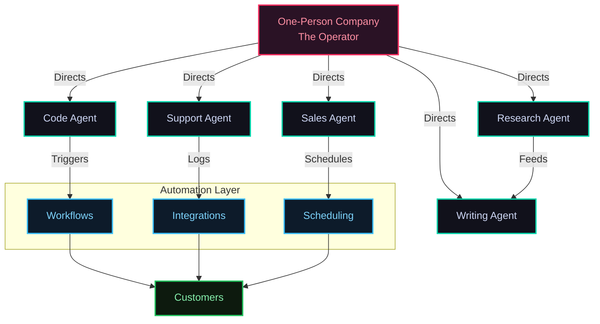
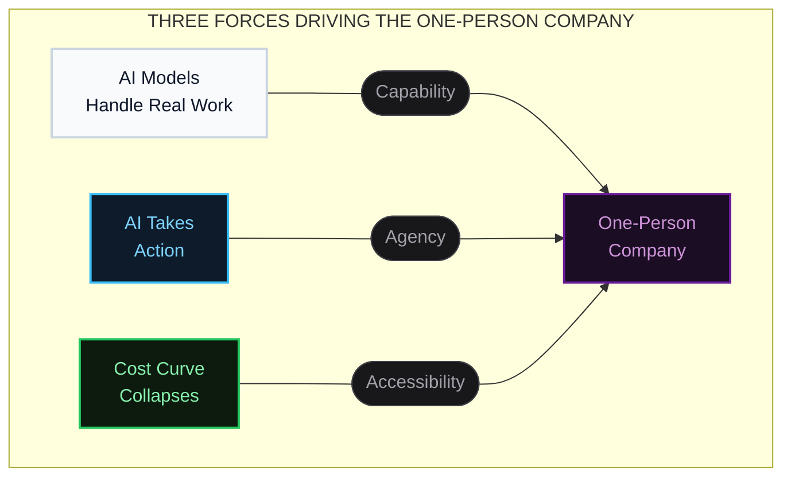
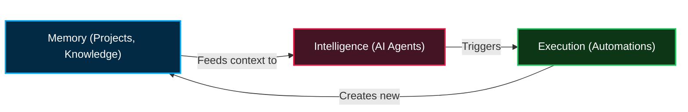
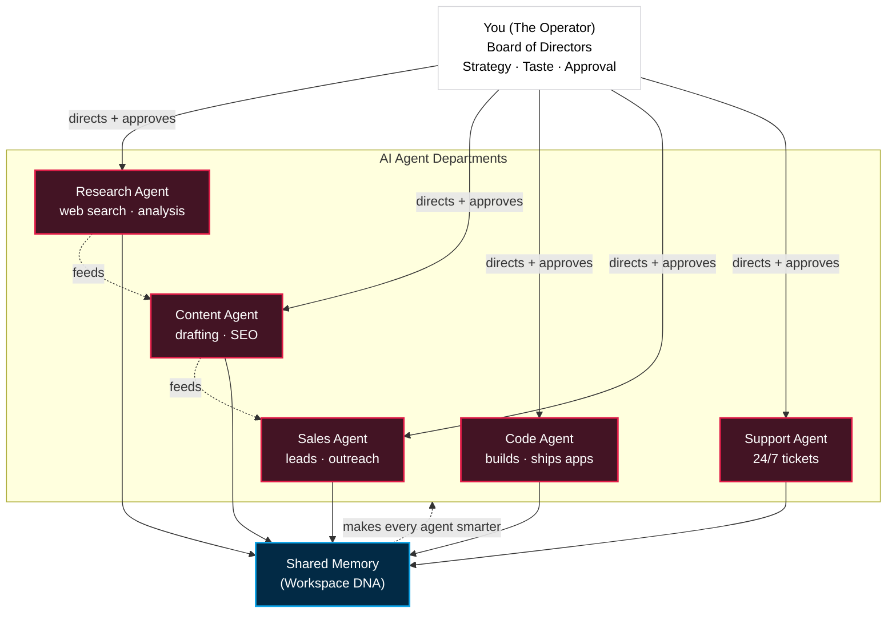
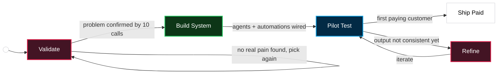
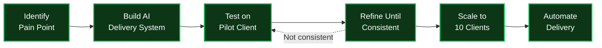
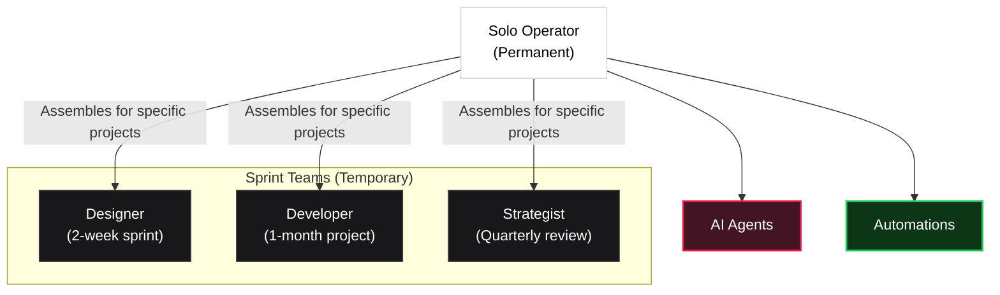
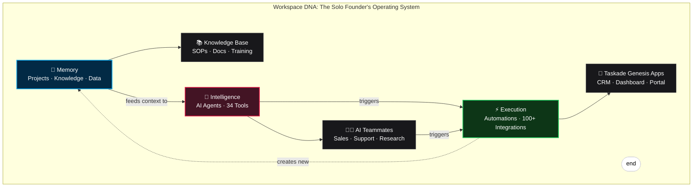

# Doanh Nghiệp Một Người: Cẩm Nang AI Cho Solo Founder

- **Phần 1: Sự trỗi dậy của Doanh nghiệp Một người (One-Person Company):** Lời tiên tri tỷ đô, 3 động lực chính (Năng lực AI, Khả năng hành động, Chi phí sụp đổ) và lợi thế biên lợi nhuận khổng lồ.
- **Phần 2: 5 Luồng công việc thực chiến (Workflows):** Giải phẫu các mô hình kinh doanh Solo kiếm hàng chục đến hàng trăm ngàn USD (Podcast Agency, Local Biz Automation, Micro-SaaS, Content Agency, E-commerce).
- **Phần 3: Sử dụng AI vs. Điều phối AI (Orchestration):** Sự khác biệt cốt lõi giữa việc coi AI là công cụ rời rạc so với việc biến AI thành hệ thống nhân sự chia sẻ chung bộ nhớ (Memory).
- **Phần 4: Bản đồ thực thi 5 Bước (The Playbook):** Từ Validation State Machine đến System Delivery Workflow, và mô hình vận hành lai (Hybrid Operating Model) với Workspace DNA.

> [!NOTE]
> **TÓM TẮT CỐT LÕI & CHIẾN LƯỢC ỨNG DỤNG**
> 
> **1. Lõi tư tưởng:**
> Lợi thế cạnh tranh tối thượng không còn nằm ở quy mô nhân sự, mà ở năng lực "điều phối" (orchestration) hệ thống AI. Người điều hành (Operator) tư duy như một Hội đồng Quản trị, giao phó mọi tác vụ execution cho mạng lưới AI Agents có chung bộ nhớ (Memory).
> 
> **2. Framework & Quy trình:**
> - **Validation State Machine:** Máy trạng thái thẩm định ý tưởng — tuyệt đối không build hệ thống nếu chưa validate được nỗi đau thật sự của thị trường bằng những cuộc gọi thực tế.
> - **System Delivery Workflow:** Đóng gói toàn bộ quá trình biến input thành output, tách rời "Quy trình" khỏi "Người thực thi" để AI có thể thay thế.
> - **Hybrid Operating Model:** Mô hình vận hành kết hợp: Human (Cốt lõi/Quyết định) + AI Agents (Nhiệm vụ liên tục) + Automations (Logic tĩnh) + Freelance Sprints (Dự án đặc thù).
> - **Workspace DNA:** Vòng lặp tự nâng cấp: `Memory -> Intelligence -> Execution`. Mỗi hành động tạo ra tri thức mới, lưu ngược lại vào Memory để làm Agent thông minh hơn.
> 
> **3. Đối chiếu Playbook Chiến lược:**
> Tài liệu này tương thích 100% với Identity v4.1 (Định hướng Solopreneur & Tự do thời gian/địa điểm). Cung cấp mảnh ghép chiến lược lớn nhất để giải quyết nỗi đau `system-bloat` (hệ thống cồng kềnh) ở Phase 3 & 4. Xóa bỏ tư duy "thuê nhân sự" truyền thống, thay bằng tư duy "build agent".

> - **Nguồn:** [Taskade Blog](https://www.taskade.com/blog/one-person-companies)
> - **Ngày đăng:** March 30, 2026 (Cập nhật: June 12, 2026)
> - **Tags:** #one-person-company, #solopreneur, #ai-agents


For most of modern history, the limiting factor of business was labor. If you wanted to do more, you needed more people. More work meant more hiring, more coordination, more payroll, more micromanagement. You could not scale output without scaling headcount.

That equation broke in 2025.

[AI agents](https://www.taskade.com/blog/what-are-ai-agents) don't just make people faster — they change the economics of output. When production becomes cheap, the business model built on headcount collapses. The unit of scale shifts from employees to agents. And a new category of business emerges: the **one-person company**.

Not a freelancer hustling 80-hour weeks. Not a lifestyle blogger with affiliate links. A single operator sitting at the center of an AI-powered system that produces the output of a 10-person team — while the human focuses on strategy, taste, and customer outcomes.

> **TL;DR:** One-person companies are becoming the default operating model for knowledge work in 2026. Solo founders like Pieter Levels (\$3M+/year, zero employees) prove the model works today. AI agents handle 80-85% of execution at 2-5% the cost of a traditional team. The winning skill isn't using AI — it's **orchestrating** it. The operating system for this new era is the [agentic workspace](https://www.taskade.com/blog/agentic-workspaces): memory, agents, and automations in a single compound loop. [Build your one-person company with Taskade Genesis →](https://www.taskade.com/create)

_Last tested: June 2026._

* * *

## What Is a One-Person Company?

A one-person company is not one person doing all jobs. It's one operator directing a system of AI agents, [automations](https://www.taskade.com/automate), and specialized tools that handle execution — while the human retains control over strategy, quality, and customer relationships.

The concept predates AI. In 2017, Paul Jarvis published _Company of One_, arguing that growth isn't always the goal — some businesses should stay small intentionally. But the 2025-2026 wave is fundamentally different. This isn't about choosing to stay small. It's about **one person generating the output of ten** because AI eliminated the execution bottleneck.

| Era | Scaling Unit | Bottleneck | Revenue Ceiling |
| --- | --- | --- | --- |
| **Pre-internet** (before 1995) | Employees + physical presence | Geography, capital | Limited by local market |
| **Internet era** (1995-2015) | Digital teams + outsourcing | Coordination, hiring | \$1-10M with 10-50 people |
| **SaaS era** (2015-2023) | Cloud tools + contractors | Tool fragmentation | \$1-5M with 5-15 people |
| **AI agent era** (2024-present) | AI agents + orchestration | Taste, judgment, distribution | \$1-10M+ with 1 person |

The shift from the SaaS era to the AI agent era is the critical transition. In the SaaS era, tools like Notion, Slack, and Zapier made small teams more efficient — but you still needed humans for execution. In the AI agent era, [the agents themselves execute](https://www.taskade.com/agents).



* * *

## The \$1 Billion Prediction: A Timeline

The idea of a one-person billion-dollar company didn't appear overnight. It escalated through a series of predictions from tech leaders, each more ambitious than the last.

### Sam Altman's Escalation

| Date | Statement | Context |
| --- | --- | --- |
| **September 2023** | _"I think it's possible that we'll have a one-person billion-dollar company in the not-too-distant future."_ | Blog post, post-GPT-4 launch |
| **February 2024** | _"The first one-person unicorn is coming soon."_ | Interview, AI agent capabilities emerging |
| **March 2025** | _"We are going to see 10,000-person-equivalent companies with one person."_ | Reddit AMA, post-GPT-5 release |
| **YC 20th Anniversary (2024)** | _"I think it's going to happen way faster than people think."_ | Y Combinator event keynote |

Altman clarified he didn't mean literally zero employees — he meant the _cognitive leverage_ of AI would let one person achieve what historically required massive organizations. The nuance matters: it's not about doing everything alone, it's about **directing AI to do the work**.

### Other Tech Leaders Weigh In

| Leader | Quote | Date |
| --- | --- | --- |
| **Jensen Huang** (NVIDIA) | _"With AI, every employee can be a department. Every department can be a company."_ | CES 2025 |
| **Satya Nadella** (Microsoft) | _"A one-person startup can now have enterprise-grade capabilities."_ | Davos 2025 |
| **Eric Schmidt** (Ex-Google) | _"The next great companies will be built by small teams using AI. The advantage of being big is going away."_ | Stanford Talk 2024 |
| **Dario Amodei** (Anthropic) | Described AI enabling "compressed timescales" — years of work in weeks | _Machines of Loving Grace_ essay, Oct 2024 |
| **Emad Mostaque** (Ex-Stability AI) | _"By 2030, no company will need more than 10 employees to be worth a billion dollars."_ | Interview 2024 |
| **Paul Graham** (Y Combinator) | _"AI is making the solo founder more viable than ever. I was wrong to be so absolute about needing co-founders."_ | Twitter/X 2024 |
| **Garry Tan** (Y Combinator) | _"We're seeing more solo founders than ever, and they're building faster than teams of 10 did five years ago."_ | Interview Jan 2025 |

Paul Graham's reversal is particularly telling. He wrote in his famous 2006 essay "The 18 Mistakes That Kill Startups" that having a single founder was mistake #1. Twenty years later, AI forced him to publicly revise that position.

Garry Tan's take connects directly to [his broader prediction about vibe coding killing SaaS](https://www.taskade.com/blog/will-vibe-coding-kill-saas) — if a solo founder can build and ship software through natural language, the traditional development team becomes optional.

### The Prediction Scorecard

| Prediction | Status (March 2026) | Evidence |
| --- | --- | --- |
| One-person \$1B company | **Not yet achieved** | Closest: Maor Shlomo (Base44, sold to Wix for \$80M, built alone in 6 months) |
| Solo founders earning \$1M+ ARR | **Achieved by dozens** | Pieter Levels, Danny Postma, Marc Lou, Mike Perham, and others |
| 10,000-person-equivalent solo operator | **Partially achieved** | AI coding agents produce 4% of all GitHub commits; solo devs ship at team-scale velocity |
| AI agents replacing knowledge workers | **In progress** | Klarna replaced 700 agents; Gartner: 20% of orgs will flatten structure by 2026 |

Dario Amodei gives the first one-person billion-dollar company a **70-80% probability of happening in 2026**, most likely in proprietary trading, developer tools, or automated customer service.

### The China Signal: 16 Million One-Person Companies

While Silicon Valley debates whether the one-person company is viable, China is building national policy around it.

In early 2026, Chinese local governments launched aggressive subsidy programs to incubate AI-powered one-person companies (OPCs). The numbers are staggering:

| Metric | Value | Source |
| --- | --- | --- |
| Total one-person companies in China | **16M+** | National Bureau of Statistics |
| Year-over-year growth | **47%** | Rest of World (March 2026) |
| New OPCs in 6 months (H2 2025) | **2.86 million** | Government filings |
| Suzhou OPC communities planned | 30 communities, 1,000 enterprises by 2028 | Suzhou municipal government |
| Shanghai Pudong compute subsidies | Up to **300,000 yuan (~\$44K)** per OPC | Pudong New Area policy |

Suzhou, Shanghai, and other Chinese cities are providing compute subsidies, co-working spaces, and regulatory fast-tracks specifically for AI-powered solo businesses. The Chinese government views one-person companies not as a niche — but as **a new economic category** that could drive the next wave of growth.

Jensen Huang reinforced this at GTC 2026, revealing that NVIDIA internally runs **100 AI agents per human employee** — 7.5 million agents serving 75,000 humans. His framing: _"In the future, the IT department of every company is going to be the HR department of AI agents."_

The Lean AI Native Companies Leaderboard — tracking companies with the highest revenue per employee — shows the trend accelerating:

| Company | Revenue/Employee | Total Revenue | Employees |
| --- | --- | --- | --- |
| **BuiltWith** | ~\$14M | ~\$14M | ~1 |
| **Midjourney** | \$4.7M | ~\$500M | 107 |
| **Cursor (Anysphere)** | \$3.3M | \$2B ARR | ~600 |
| **Pieter Levels (combined)** | \$3-5M | \$3-5M | 0 |
| **Top 10 Lean AI average** | \$3.48M | — | — |
| **Traditional SaaS average** | \$200-300K | — | — |

The gap between lean AI companies and traditional SaaS is **10-15x in revenue per employee.** That's not a trend — it's a structural shift in how value gets created. The [agentic engineering platforms](https://www.taskade.com/blog/agentic-engineering-platforms) powering this shift are already in production at scale.

* * *

## David's Slingshot: Why One-Person Companies Are a National Strategy

In Palantir CTO Shyam Sankar's April 2026 a16z American Dynamism interview, he described the one-person company shift in geopolitical terms most builders don't hear:

> "We have a historic opportunity to fix the fundamental breakdown that happened in the '70s between wage growth and GDP growth. The Intel warrant officer who's suddenly able to do so much — I see that playing out on the ICU floor. I see that on the factory floor. There's an opportunity to give the American worker superpowers with AI. **It's David's slingshot in a world where the Chinese Goliath has been a giant sucking sound of American prosperity.**"
> 
> 
> Shyam Sankar, Palantir — a16z American Dynamism (April 2026)

The insight that matters for solo founders: AI's economic value is **asymmetric**. It is not a 10% productivity bump distributed across the existing org chart. It is a 50–100x multiplier handed directly to people with deep domain expertise — the intel warrant officer, the senior nurse, the master machinist, the founder who actually understands the customer. Sankar's example from inside the U.S. Army: junior enlisted soldiers building production AI applications in two weeks that previously would have lived as PowerPoint slides briefing program managers who would tell them why they could not work.

```mermaid
flowchart TD
    subgraph NEW ["AI-DRIVEN PRODUCTION FUNCTION"]
        direction LR
        A1["Domain expert"]:::customer
        B1["Idea / Intent"]:::customer
        C1["AI harness:<br>agents · automations · apps"]:::operator
        D1["2-week build cycle"]:::customer
        E1["Specific, sharp output<br>tuned to YOUR edge"]:::customer
        
        A1 --> B1 --> C1 --> D1 --> E1
    end

    subgraph OLD ["PRE-AI PRODUCTION FUNCTION"]
        direction LR
        A2["Domain expert"]:::neutral
        B2["Idea / Intent"]:::neutral
        C2["10-20 specialist hires<br>or vendor contracts"]:::warning
        D2["6-18 month build cycle"]:::warning
        E2["Generic, watered-down<br>output"]:::warning
        
        A2 --> B2 --> C2 --> D2 --> E2
    end

    classDef operator fill:#2a1225,stroke:#ff2d60,stroke-width:2px,color:#ff8fa3;
    classDef customer fill:#0d1a0e,stroke:#22c55e,stroke-width:2px,color:#86efac;
    classDef neutral fill:#1e1e2e,stroke:#475569,stroke-width:1px,color:#94a3b8;
    classDef warning fill:#1a140a,stroke:#e65100,stroke-width:2px,color:#ffb74d;
```




### Innovation Is Downstream of Production (Why Co-location Beats Globalization)

Sankar's other framing that hits hard: **innovation is a consequence of productivity**. If you do not make the thing, you cannot innovate on how you make the thing or what the thing is. SpaceX co-locates R&D engineers on the production floor for exactly this reason — the feedback loop and cycle time are unmatched. When America offshored production in the '90s and 2000s under the assumption that "we innovate here, they make it there," innovation slowly migrated with the production. WuXi went from cheap pipette-handling arms to running 50% of all clinical trials. Production captures the next innovation it spawns.

For a solo founder this is the most important strategic insight in the article. Your "factory floor" is your customer — the people whose problem you solve, whose data flows through your system, whose feedback shapes your roadmap. Build, ship, and operate inside that loop and the next innovation emerges naturally. Outsource any of those layers and the innovation goes with the outsource.

```text
Industrial Era              Globalization Era            AI-Empowered Era
   ─────────────────          ──────────────────────         ─────────────────────   R&D ▶ Production           R&D here ▶ Production there    R&D ◀▶ Production        ▲                              ▲                          (same person,        └─ tight feedback              └─ feedback decays           AI does both)
```

```text
Innovation accelerates     Innovation drifts overseas       Innovation re-localizes                                                              and accelerates again
```

This is the deepest reason **alpha software wins** in the post-SaaS era (see our [SaaS unbundling analysis](https://www.taskade.com/blog/great-saas-unbundling)): the founder who builds, deploys, and operates their own AI-native workflow gets a feedback loop that no \$300/month BPO contractor and no \$50K/year SaaS vendor can match. AI is not just a cost reducer; it is a **co-location enabler** — the same human can now do production-grade work across functions that previously required separate teams in separate buildings.

## Three Forces That Changed Everything

The one-person company didn't emerge from a single breakthrough. It's the convergence of three forces that together create a new economic reality.




### Force 1: Models Handle Real Work

Not random prompts — tasks involving context, structure, and multi-step reasoning. [AI agents](https://www.taskade.com/blog/what-are-ai-agents) can write, plan, analyze, code, design, and execute workflows with fewer mistakes than before.

The jump from GPT-3 to GPT-4 to [Claude Opus](https://www.taskade.com/blog/anthropic-claude-history) wasn't incremental — it was qualitative. Early models could autocomplete sentences. Current models can manage multi-step projects, maintain context across thousands of tokens, and reason through ambiguous requirements. Inside [Taskade Genesis](https://www.taskade.com/create), the "Auto" setting routes each task to one of 15+ frontier models from OpenAI, Anthropic, Google, and open-weight providers, so a solo operator never has to pick a model by hand.


### Force 2: AI Moved From Chatbot to Actor

AI no longer just answers questions. It clicks buttons, calls APIs, triggers [automations](https://www.taskade.com/automate), updates databases, and operates inside the tools you already use. The moment AI takes action, it stops being software you use and becomes **software that works**.

This is the shift from [vibe coding](https://www.taskade.com/blog/vibe-coding-for-non-developers) to [agentic engineering](https://www.taskade.com/blog/agentic-engineering-platforms) — from telling AI what to build to letting AI build, deploy, and operate autonomously.

### Force 3: The Cost Curve Collapsed

| AI Tool | Key Metric (Q1 2026) | What It Means |
| --- | --- | --- |
| **Cursor** | \$2B ARR, fastest-growing SaaS ever | AI-assisted coding is mainstream |
| **Claude Code** | 4% of all GitHub public commits (135K+ commits/day) | AI writes production code at scale |
| **Replit** | 50M users, \$9B valuation, \$120M ARR | Non-coders build software with AI |
| **GitHub Copilot** | 37-42% enterprise market share | Default developer tool |
| **Midjourney** | ~\$500M revenue, 107 employees (\$4.7M/employee) | Proof that tiny teams = massive output |

The price of intelligence and generation keeps dropping. In the old world, hiring a smart person was expensive and slow. In the new world, deploying an AI agent is instant, scalable, and cheap enough to run multiples simultaneously.

Put these three together and you get a new capability: **a single human delegates tasks to AI workers the same way a CEO delegates to a team.**

That's what people miss. It's not "AI makes you faster." It's AI makes you **a manager of capacity.**

* * *

## The Numbers: Solo Founders Making Millions

The one-person company isn't theoretical. Real solo founders are posting real revenue — publicly, on Twitter/X and Indie Hackers.

### Verified Solo Founder Revenue (2024-2026)

| Founder | Product(s) | Annual Revenue | Team Size | Stack |
| --- | --- | --- | --- | --- |
| **Pieter Levels** | PhotoAI, NomadList, RemoteOK | **\$3-5M/year** | 0 employees | PHP, jQuery, SQLite + AI |
| **Danny Postma** | HeadshotPro | **\$3.6M ARR** | Solo → 3 | AI headshot generation |
| **Marc Lou** | ShipFast + portfolio | **\$1M+/year** | 1 | Next.js boilerplate + AI tools |
| **Maor Shlomo** | Base44 | **Sold to Wix for \$80M** | 1 (built in 6 months) | AI app builder |
| **Tony Dinh** | TypingMind | **\$500K+ ARR** | 1 | ChatGPT alternative UI |
| **Mike Perham** | Sidekiq | **\$2M+ ARR** | 1 | Ruby background jobs |
| **Damon Chen** | Testimonial.to | **\$1M+ ARR** | 1 → 2 | Video testimonial SaaS |
| **Pat Walls** | Starter Story | **\$1M+ ARR** | 1 → 2 | Content/SaaS |
| **Caleb Porzio** | Livewire/Alpine.js | **\$1M+/year** | 1 | Open source sponsorships |
| **Jon Yongfook** | Bannerbear | **\$600K+ ARR** | 1 | API/image automation |

Pieter Levels is the poster child. He runs his entire portfolio on vanilla PHP, jQuery, and SQLite — plus AI coding assistants. No employees, no office, no venture capital. Just a laptop and a stack of [AI tools](https://www.taskade.com/ai/apps). For solo founders starting from zero budget, the same playbook now runs on [free AI app builders](https://www.taskade.com/blog/free-ai-app-builders) that ship a working product without a single line of code.

> _"The age of the solo developer making millions is here. AI handles what I used to hire people for."_ — Pieter Levels, 2024

### The Revenue Distribution Reality

The success stories above are **extreme outliers**. Indie Hackers data reveals the full distribution:

| Revenue Tier | Percentage of Solo Founders |
| --- | --- |
| Under \$1,000/month | ~70% |
| \$1,000-\$5,000/month | ~20% |
| \$5,000-\$50,000/month | ~7-8% |
| \$50,000+/month | ~1-2% |
| \$1M+ ARR | ~2-3% |

The median solo founder earns **\$3,000/month** (~\$36K/year). The \$1M+ founders are visible because of survivorship bias — the struggling ones are invisible.

But the denominator is exploding. **Solo-founded startups jumped from 23.7% of new startups in 2019 to 36.3% by mid-2025.** The U.S. Census Bureau counts **28.5 million non-employer businesses** — 81% of all U.S. businesses. MBO Partners reports **6.2 million high-earning independents** (\$100K+/year), up from 4.8M in 2022.

### The Shrinking Team Benchmark

The average startup team is getting smaller every year:

| Year | Median Seed-Stage Team Size | Source |
| --- | --- | --- |
| 2020 | 7 | SignalFire |
| 2022 | 6 | SignalFire |
| 2024 | 4 | SignalFire |
| 2025 | 3.5 | Kruze Consulting |

Y Combinator's W2025 batch was **~75% AI-focused**, with a notable increase in solo founders (~15-20% of the batch, up from ~5-10% historically). Jared Friedman, YC partner, stated: _"The minimum viable team is shrinking. What used to take 5 engineers now takes 1 engineer with AI tools."_

* * *

## The \$300/Month Team: What the AI Stack Actually Looks Like

Here's the uncomfortable math. A traditional 10-person team costs **\$80,000-\$120,000/month** fully loaded (salary, benefits, office, equipment, recruiting).

A solo founder running [AI agents](https://www.taskade.com/agents) spends **\$300-\$500/month**.

### Traditional Team vs. AI Stack (Monthly Cost Comparison)

| Role/Function | Traditional Hire (Monthly) | AI Replacement | AI Cost (Monthly) |
| --- | --- | --- | --- |
| Software Developer (2) | \$23,000 | Cursor + Claude Code | ~\$40 |
| Marketing Manager | \$10,000 | ChatGPT + SEO tools | ~\$30 |
| Designer | \$8,000 | Canva Pro + Midjourney | ~\$25 |
| Content Writer | \$6,500 | Claude Pro + Descript | ~\$40 |
| Customer Support (2) | \$10,000 | Intercom Fin | ~\$30 + \$0.99/resolution |
| Sales Rep | \$9,000 | Clay + Apollo | ~\$50 |
| Operations Manager | \$10,000 | Make/n8n + Zapier | ~\$30 |
| Virtual Assistant | \$4,500 | [Taskade Genesis](https://www.taskade.com/pricing) agents | ~\$6 |
| **Total** | **~\$81,000/month** |  | **~\$300-500/month** |

Add overhead (office, benefits, equipment, recruitment) and the traditional team approaches **\$100,000-\$120,000/month**. The AI stack: **\$3,600-\$6,000/year**.

That's a **95-98% cost reduction.**

```mermaid
xychart-beta
    title "Monthly Operating Cost: Traditional Team vs. AI Stack"
    x-axis ["Dev (2)", "Marketing", "Design", "Content", "Support (2)", "Sales", "Ops", "VA"]
    y-axis "Monthly Cost ($)" 0 --> 25000
    bar [23000, 10000, 8000, 6500, 10000, 9000, 10000, 4500]
    bar [40, 30, 25, 40, 30, 50, 30, 8]
```




### The Margin Advantage

| Metric | Traditional (10-person) | AI-Powered (1 person) |
| --- | --- | --- |
| Monthly operating cost | \$80,000-\$120,000 | \$300-\$500 |
| Annual operating cost | \$960,000-\$1,440,000 | \$3,600-\$6,000 |
| Operating margin | 10-20% | **60-80%** |
| Time to hire/scale | 2-6 months | Minutes |
| Coordination overhead | Meetings, Slack, 1:1s, standups | Zero |
| Break-even revenue | ~\$100K/month | ~\$500/month |

McKinsey's 2025 State of AI report found that **71% of organizations regularly use generative AI** — but over 80% report no measurable impact on enterprise EBIT. The irony: the technology works better for individuals than for bureaucracies. One person with clear direction extracts more value from AI than a 500-person company drowning in alignment meetings.

* * *

## The Solo Founder's AI Tool Stack: One Workspace vs. Eight Subscriptions

A one-person company needs seven functions covered: building, agents, automation, project management, knowledge, support, and distribution. The fragmented stack stitches eight subscriptions (\$85-200/month) that don't share context. [Taskade Genesis](https://www.taskade.com/create) covers all seven in one workspace from \$6/month, because Memory, Intelligence, and Execution share a single state. Here is the function-by-function map.

| Business Function | Fragmented Stack | Taskade Genesis (1 workspace) |
| --- | --- | --- |
| Build the product | Cursor / Bolt + hosting + DB | One prompt → deployed app |
| AI teammates | Separate ChatGPT/Claude seats | 34 built-in tools, workspace-aware agents |
| Automation | Zapier / Make / n8n | Native, 100+ bidirectional integrations |
| Project + knowledge | Notion / Monday | 7 project views + agent memory |
| Support + distribution | Intercom + Slack + Loom | Built-in agents + Community Gallery |

To be fair to the fragmented stack, it is genuinely best-of-breed per function. Cursor and Claude Code are the strongest dedicated coding surfaces, and Zapier and Make have the widest third-party trigger catalogs. A solo founder optimizing a single function may prefer the specialist tool. The edge of an [agentic workspace](https://www.taskade.com/blog/agentic-workspaces) is not beating each specialist head to head. It is shared context across all seven functions, so the research agent feeds the writing agent and the [automation](https://www.taskade.com/automate) knows what the agent learned yesterday.


* * *

## Inside the One-Person Company: Five Real Workflows

### Workflow 1: Podcast Production Agency (\$18K/month)

Take Sarah — a podcast production company operator featured in the viral [There's An AI For That video](https://www.youtube.com/watch?v=Q5FvShPlLVY) (204K views).

She takes long-form podcast episodes and turns them into 30 high-retention short clips per week for her clients. She charges **\$3,000/month per client** and has six clients. That's **\$18,000/month in revenue.**


```text
PODCAST PRODUCTION WORKFLOW
───────────────────────────────────────────────────────────────────────────────────────────────────────────────
[Raw Podcast] ──► [AI Transcription] ──► [Custom GPT Clip] ──► [AI Editor ] ──► [AI Captions +] ──► [Sarah Reviews]
[Upload     ]     [(Opus Clip)     ]     [Selection      ]     [(Descript)]     [Thumbnails   ]     [& Ships      ]
```

| Step | Tool | Time | Human Involvement |
| --- | --- | --- | --- |
| Transcription | Opus Clip | 5 min | Upload only |
| Clip identification | Custom GPT | 10 min | Review selections |
| Video cutting | Descript | 15 min | Approve cuts |
| Captions + thumbnails | AI generator | 10 min | Quality check |
| Final review + ship | Manual | 20 min | Creative direction |
| **Total per client/week** |  | **~2 hours** | **~45 min active** |

In the old world, she'd need editors, script writers, thumbnail designers, and a project manager — **a 4-person team costing \$25,000+/month**. AI handles 85% of execution. The human stays in the loop as a **director**, not a laborer.

### Workflow 2: Local Business Automation (\$20K/month)

Build a workflow that monitors new Google reviews for dental clinics, triggers a thank-you message with a booking link, and sends a follow-up sequence to five-star reviewers asking for referrals. Charge \$2,000/month per clinic. Handle 10 clients solo.

| Component | AI Tool | Function |
| --- | --- | --- |
| Review monitoring | Google Business API + n8n | Detect new reviews in real time |
| Thank-you message | [Taskade Genesis](https://www.taskade.com/create) agent | Personalized response with booking link |
| Follow-up sequence | Make automation | 3-email drip to 5-star reviewers |
| Referral tracking | Custom dashboard | Built with Taskade Genesis in one prompt |
| Monthly reporting | AI-generated PDF | Auto-sent to clinic owners |

**Revenue: \$20,000/month. Marginal cost per client: ~\$30/month in AI tool costs.**


### Workflow 3: Micro-SaaS (\$50K+ MRR)

Build a specialized tool for one industry. The new pattern: describe the app in natural language → [vibe code](https://www.taskade.com/blog/vibe-coding-for-non-developers) it into existence → deploy with custom domain → iterate based on user feedback.

| Stage | Old Way (2022) | New Way (2026) |
| --- | --- | --- |
| MVP development | 3-6 months, 2-3 developers | 1-3 days, solo with AI |
| Design/UI | Hire designer, \$5K-\$15K | Canva AI + v0 + Midjourney, ~\$50 |
| Backend/infra | DevOps engineer, CI/CD setup | One-click deploy via [Taskade Genesis](https://www.taskade.com/create) |
| Customer support | Hire support rep, \$4K/month | Intercom Fin, \$0.99/resolution |
| Marketing site | Copywriter + designer, \$3K-\$8K | AI-generated in 30 minutes |
| **Total to launch** | **\$50K-\$150K + 6 months** | **\$500-\$2K + 1 week** |

Gil Hildebrand pre-sold 50 lifetime deals generating **\$20K before writing any code** for Subscribr — validating demand first, building second. Maor Shlomo built Base44 alone in 6 months and sold to Wix for **\$80M**.


### Workflow 4: AI Content Agency (\$30K/month)

| Function | AI Agent | Human Touch |
| --- | --- | --- |
| Topic research | Perplexity + Claude Research | Validate with audience data |
| Content drafting | Claude (long-form), ChatGPT (short) | Brand voice calibration |
| SEO optimization | Surfer SEO + Clearscope | Final keyword decisions |
| Visual assets | Midjourney + Canva AI | Style consistency |
| Social distribution | [Taskade automations](https://www.taskade.com/automate) | Engagement monitoring |
| Client reporting | Auto-generated dashboards | Strategic recommendations |

Charge \$5,000/month per client. 6 clients. Research feeds directly into AI-generated drafts matching each client's brand voice. Quality checks happen automatically before human review. The human focuses on **strategy and client relationships** while AI handles execution.

### Workflow 5: E-commerce Operator (\$100K+/month)

| Component | Stack | AI Leverage |
| --- | --- | --- |
| Store | Shopify + custom Genesis apps | Product descriptions, inventory automation |
| Ads | Meta/Google Ads + AI creative | AI generates and A/B tests ad variations |
| Support | Intercom Fin + Shopify integration | 24/7 resolution, escalation to human for edge cases |
| Fulfillment | 3PL + n8n automations | Order routing, tracking updates |
| Analytics | PostHog + custom dashboards | AI-generated weekly performance reports |

The [Shopify integration in Taskade automations](https://www.taskade.com/automate) connects product catalog, order management, and customer support into a single [agentic workspace](https://www.taskade.com/blog/agentic-workspaces).


* * *

## The Economics of Leverage: From Headcount to Agent Count

For most of modern history, the most powerful companies were the ones who could afford the biggest teams. The advantage was not creativity — it was **capacity**. Whoever had the most people could produce the most output.

AI flips this completely.

### Revenue Per Employee: The Leverage Metric

| Company | Employees | Revenue | Revenue/Employee | Year |
| --- | --- | --- | --- | --- |
| **Midjourney** | 107 | ~\$500M | **\$4.7M** | 2025 |
| **Cursor (Anysphere)** | ~600 | \$2B ARR | **\$3.3M** | 2026 |
| **Pieter Levels** | 0 | \$3-5M | **\$3-5M** (one person) | 2025 |
| **Instagram** (at acquisition) | 13 | — | \$77M/employee (by valuation) | 2012 |
| **WhatsApp** (at acquisition) | 55 | — | \$345M/employee (by valuation) | 2014 |
| **OpenAI** | ~3,000 | \$4.5B ARR | **\$1.5M** | 2025 |
| **Traditional SaaS average** | — | — | \$200K-\$300K | — |

The pattern: the most leveraged companies in history have the **fewest people per dollar of value created.** AI extends this trend to its logical endpoint — one person, multiple revenue streams, zero payroll.

> **The platform-side mirror of this trend:** legacy decacorn-era SaaS companies are racing to refound themselves around the same workspace-native architecture solo operators already use. Airtable is the clearest case — CEO Howie Liu reorganized his entire 14-year-old company into "fast-thinking" and "slow-thinking" halves and shipped three AI-native products in 18 months: Omni (June 2025), Superagent (January 2026 — Airtable's first standalone product in 13 years), and Hyperagent (early 2026). The full play-by-play is in the [history of Airtable](https://www.taskade.com/blog/history-of-airtable). The signal: solo operators ship faster on workspace-native architecture, and decacorn-era platforms refound themselves around it.

### The Seat Compression Effect

This connects to [the great SaaS unbundling](https://www.taskade.com/blog/great-saas-unbundling). When one person does the work of ten, companies need **90% fewer software seats**. Per-seat SaaS pricing — the \$285 billion revenue model — collapses.

| SaaS Company | What Happened | Impact |
| --- | --- | --- |
| **Atlassian** | Declining seat growth in 2025 | Revenue deceleration |
| **Salesforce** | \$300/seat pricing under pressure | Launched Agentforce (AI-first) |
| **Monday.com** | Replaced human SDRs with AI | Fewer internal seats needed |
| **Notion** | AI features reduce team coordination needs | Per-seat model under question |

Garry Tan called it: _"Vibe coding will eat SaaS."_[His prediction scorecard](https://www.taskade.com/blog/garry-tan-prediction-scorecard) three months later shows the disruption accelerating faster than expected.

For one-person companies, this is a double tailwind: the AI that reduces corporate seat counts is the same AI that enables solo operators to run entire businesses.

* * *

## The Skill That Separates Winners: AI Orchestration

If you reduce the one-person company to a single skill, it's **orchestration** — not just using AI but directing it like a workforce.

### Using AI vs. Orchestrating AI

| Dimension | Using AI | Orchestrating AI |
| --- | --- | --- |
| **Input** | Single prompt | Structured multi-step system |
| **Output** | One-shot result | Iterative, refined deliverable |
| **Context** | Conversation-scoped | Persistent across sessions |
| **Agents** | One chatbot | Multiple specialized agents |
| **Feedback loop** | Manual copy-paste | Automated agent-to-agent |
| **Revenue potential** | Marginal productivity gain | Business-scale leverage |

Here's the difference in practice:

**Person A** asks ChatGPT: _"Write me a landing page for my coaching business."_ Gets a generic result. Gives up.

**Person B** breaks it down: _"Write a landing page for executive coaches who help burnt-out VPs transition into consulting. Promise: land your first \$50K consulting client in 90 days. Tone: direct, experienced, no fluff. Include social proof, clear CTA, and address the fear of leaving corporate security."_ Gets a strong draft. Refines through 3-5 iterations. Ships it.

Person A uses AI. Person B **orchestrates** AI. That's the difference between dabbling and winning.

### The Orchestration Stack in 2026

Three protocols are standardizing how agents interact:

| Protocol | Creator | Function | Adoption |
| --- | --- | --- | --- |
| **MCP** (Model Context Protocol) | Anthropic → Linux Foundation | How agents use tools | 75+ connectors in Claude |
| **A2A** (Agent-to-Agent) | Google | How agents collaborate | 150+ supporting organizations |
| **AG-UI** | CopilotKit | How agents talk to users | Open standard |

Gartner reported a **1,445% surge in enterprise inquiries about multi-agent orchestration** in 2025. The autonomous AI agent market crossed **\$7.6 billion in 2025** and is projected to reach **\$50 billion by 2030** (Deloitte).

For solo founders, the practical implication: **your AI agents need to share context.** A research agent should feed a writing agent. A customer support agent should inform a product roadmap agent. Isolated chatbots hit a ceiling. Connected agents compound.




This is [Workspace DNA](https://www.taskade.com/blog/agentic-workspaces) — the self-reinforcing loop where Memory feeds Intelligence, Intelligence triggers Execution, and Execution creates new Memory. Every cycle makes the system smarter. Every task completed informs the next task. For a one-person company, this loop **is** the moat.

### What Does a Solo Founder's Agent Org Chart Look Like?

A one-person company's org chart has one human at the top acting as the board of directors, with AI agents filling every department below. The operator sets strategy and approves output. Agents handle research, content, code, sales, and support, and they hand work to each other through shared memory. This is the structure, drawn.





Structured agent-hierarchy framings like the "solopreneur org chart" are a genuinely useful mental model, and the category of thinking is worth adopting. The detail that turns the diagram into a working business is the shared memory in the center. Five isolated chatbots hit a ceiling because each one starts from zero every session. The same five [AI agents](https://www.taskade.com/agents) connected through Workspace DNA compound, because every research result, draft, and ticket flows back into one knowledge base the next agent reads from. NVIDIA runs 100 AI agents per human employee internally, proving the department-per-agent model scales far past five.

* * *

## The Dangerous Misunderstanding: Why Most Will Fail

There's a dangerous lie floating around: anyone can get rich quick with AI.

AI lowers the cost of production. It doesn't remove the need for value. When output becomes easy, **output becomes worthless.** That's the paradox.

> _"AI creates an explosion of supply. The world is about to be flooded with mediocre products, mediocre content, mediocre services."_ — paraphrased from the viral video, which accumulated 204K views precisely because it named this uncomfortable truth.

When everyone can produce, production stops being the advantage. What becomes the advantage?

| Old Advantage | New Advantage |
| --- | --- |
| Ability to produce | **Direction** — knowing what to build |
| Team size | **Distribution** — reaching the right audience |
| Technical skill | **Taste** — knowing good from mediocre |
| Capital | **Trust** — earning customer confidence |
| Speed of typing | **Speed of deciding** |

### The Illusion of Progress

The failure mode of the one-person company era looks like this:

1.   Generate for weeks
2.   Polish the landing page endlessly
3.   Create 1,000 pieces of content
4.   Build the [automation](https://www.taskade.com/automate) pipeline
5.   Design the brand identity
6.   Feel incredibly productive
7.   **Nobody buys** — because the missing piece was **demand**

Real demand. The boring part. Talking to customers, validating pain, understanding what people already pay for.

As one YouTube commenter put it: _"Im currently an unemployed IT guy with three RTX3090s and some good coffee. Fear me."_ — 459 likes. The humor lands because it captures the gap between capability and execution.

Another commenter nailed the tension: _"I build AI systems for a living (and have a BG in ML) and I can tell you, you still need human oversight. So it could never be a truly passive business."_ — 354 likes.

AI removes the execution barrier. It doesn't remove **fear of failure, fear of sales, fear of responsibility, or fear of being alone with your outcomes.**

### The Latent Demand Principle: What Silicon Valley's Best Builders Know

Marc Andreessen and former Microsoft strategy head Charlie Songhurst identified the concept that separates successful solo founders from the 97% who fail: **latent demand** — intent that already exists, waiting to be formalized.

Boris Cherny, creator of [Claude Code](https://www.taskade.com/blog/claude-code-alternatives) and former Meta principal engineer, calls it "the single most important principle in product":

> "You can never get people to do something they do not yet do. Find the intent they have and steer it."

At Meta, 40% of Facebook Group posts were buy/sell activity. Users were already doing commerce; Marketplace just formalized the workflow. 60% of profile views were opposite-gender non-friends — users were already browsing potential matches; Dating just formalized the intent.

For one-person companies, the implication is direct: **don't build what AI makes possible — build what people already hack together manually.** The solo founder who automates a workflow that 500 people currently do with spreadsheets and email has latent demand. The solo founder who builds a novel AI-powered app because it seems cool has a supply problem.

Andreessen also identified why Silicon Valley's high-trust culture accelerates founders who find latent demand. In tech, unlike Hollywood, the industry is **non-zero-sum** — one company's success doesn't prevent another's. This creates what Andreessen calls the FOMO-driven trust dynamic: investors and partners fear missing the next breakout (a category-two error that "tortures you for decades") more than they fear losing money on a bad bet. Andy Bechtolsheim wrote a \$100K check to "Google Inc." before the company even existed — no terms, no nothing.

For solo founders, the practical takeaway: **don't try to convince people your idea will succeed — create a credible fear that passing on it means watching someone else win for the next 20 years.**

> "When the company goes bankrupt, the pain is over. When you pass on a company that succeeds, the pain is forever." — Marc Andreessen

### What the Data Actually Says

| Metric | Reality |
| --- | --- |
| Median solo founder income | \$3,000/month (~\$36K/year) |
| Solo founders crossing \$1M ARR | ~2-3% |
| Solo founders crossing \$10M ARR | Near-zero (almost all hire at this level) |
| AI projects cancelled by 2027 | 40%+ (Gartner) |
| Enterprises seeing AI ROI | 1 in 5 delivers measurable ROI (Gartner) |
| Solo founders surviving past 6 months | Small minority |

The honest take: AI makes it possible for millions to start one-person companies. A small percentage will commit. An even smaller percentage will make it past 6 months.

* * *

## What One-Person Companies Will Destroy

Some businesses only exist because doing certain work used to be expensive, slow, or annoying. When AI makes that work cheap, these businesses lose their leverage.

### Businesses at Risk

| Business Type | Why It Collapses | Timeline |
| --- | --- | --- |
| Agencies selling basic content packages | Clients generate good-enough output instantly | Already happening |
| Generic landing page builders | [Vibe coding](https://www.taskade.com/blog/vibe-coding-for-non-developers) creates pages in minutes | Already happening |
| Freelancers doing repetitive admin | [Automation](https://www.taskade.com/automate) handles at near-zero cost | 2025-2026 |
| Copy-paste formatting services | Definition of automatable work | Already happening |
| Basic bookkeeping/data entry | AI + OCR + automation | 2025-2027 |
| Junior customer support roles | Intercom Fin, Ada, Sierra resolve 80%+ of tickets | Already happening |
| Template-based design work | Canva AI, Midjourney replace commodity design | 2024-2026 |

They don't collapse because AI is evil. They collapse because **the cost of their core deliverable collapses.**

### The Klarna Example

Klarna is the most dramatic case study. CEO Sebastian Siemiatkowski announced their AI chatbot replaced the work of **700 customer service agents**. The company reduced headcount from ~5,000 to ~3,800 (2022-2024) while revenue grew. Siemiatkowski said: _"We've essentially frozen hiring. AI can do the job."_

Other examples:

| Company | Action | Scale |
| --- | --- | --- |
| **Duolingo** | Cut 10% of contractors doing translation | Replaced by AI |
| **Dropbox** | Laid off 16% of workforce (~500 people) | CEO cited AI explicitly |
| **Chegg** | Lost 50% of stock value | ChatGPT replaced tutoring service |
| **GitHub** | 46% of new code is AI-generated | Copilot adopted enterprise-wide |

### What Survives

The middle collapses first. Average providers get squeezed. Only **high-trust specialists** and **high-outcome operators** survive.

| Dies | Survives |
| --- | --- |
| Selling effort | Selling outcomes |
| Generic services | Niche expertise |
| Commodity content | Opinionated perspectives |
| Hourly billing | Value-based pricing |
| Template work | Strategic advisory |

If you're selling effort, you're cooked. If you're selling outcomes, you're just getting started.

* * *

## The Head-to-Head: One Person vs. Ten People

A 10-person marketing agency gets a client request: _"We need a new positioning strategy and content plan for our product launch in 2 weeks."_

### Agency Process (10 People)

| Day | Activity | People Involved |
| --- | --- | --- |
| Monday | Kickoff meeting | Account manager, strategist, PM |
| Tuesday-Wednesday | Research and brainstorming | 3-4 team members |
| Thursday | Draft review with internal stakeholders | 5+ people in a room |
| Friday | Revisions based on feedback | Writer, designer, strategist |
| Next Monday | Client presentation | Account manager, strategist |
| **Timeline** | **7+ days** |  |
| **Cost** | **\$8,000** |  |

### One-Person Company Process (1 Operator)

| Step | Activity | Time |
| --- | --- | --- |
| 1 | AI researches competitors, analyzes market positioning | 30 min |
| 2 | AI generates three strategic options with content calendars | 30 min |
| 3 | Operator reviews, selects best option, refines | 45 min |
| 4 | AI produces final deliverable with visual mockups | 15 min |
| **Timeline** | **Same day or next** |  |
| **Cost** | **\$3,000** |  |

The client gets the same outcome faster and cheaper. The advantage isn't typing speed — it's **decision speed.** A one-person company can decide everything faster than a 10-person company can schedule a meeting about it.

> _"Who has the biggest team vs. who has the biggest dream."_ — YouTube commenter, 174 likes

Big teams have friction. Coordination costs, meetings, approvals, communication overhead, misalignment, slow decision-making, politics. A one-person company has almost none of that. One decision maker, one direction, one set of priorities, one owner of outcomes.

> _"I have a small programming business. I have learned that every employee means I work an extra 10%. It also means I have a ton of paperwork because employees require paperwork that doesn't exist when you are a sole proprietor."_ — YouTube commenter, 50 likes

### Where One Person Loses

| Dimension | One Person Advantage | Ten People Advantage |
| --- | --- | --- |
| Speed | Faster decisions | — |
| Cost | 95% cheaper | — |
| Focus | No alignment meetings | — |
| Resilience | — | Bus factor, redundancy |
| Complex negotiations | — | Multiple relationships |
| Regulated industries | — | Compliance teams |
| 24/7 coverage | — | Shift rotations |
| Enterprise sales | — | Multiple touchpoints |

The one-person model dominates **knowledge work, creative services, content, [micro-SaaS](https://www.taskade.com/blog/what-are-micro-apps), and consulting.** Not everything. Biotech, hardware, regulated industries, and enterprise sales still require teams.

* * *

## How Do You Start a One-Person Company? The 30-Day Build Plan

You start a one-person company by validating demand in week one, building the delivery system in weeks two and three, and shipping to your first paying customer by day 30. The sequence is fixed: prove the problem manually, then build the AI system to repeat it. Below is the 30-day plan one operator runs inside a single [Taskade Genesis](https://www.taskade.com/create) workspace.

| Week | Goal | What You Do | AI Does |
| --- | --- | --- | --- |
| **Week 1** | Validate demand | Call 10 people for advice; find a workflow they hack manually | Research agent maps competitors + pricing |
| **Week 2** | Build the system | Prompt one delivery system; wire agents + automations | Taskade Genesis builds the app; agents draft SOPs |
| **Week 3** | Pilot + refine | Run one pilot client until output is consistent | Agents execute; automations run while you sleep |
| **Week 4** | Ship to first paid client | Record proof (Loom + testimonial); charge | Support agent handles tickets; CRM auto-updates |

The fixed-sequence framing is the same calendar discipline that structured how-to guides like NxCode's one-person-unicorn roadmap teach. The category of advice is genuinely useful: a week-by-week cadence beats an open-ended "go build something" prompt because it forces validation before code. The state machine below shows where most operators stall, and where the loop sends them back.




Before any of that, run the go/no-go test. Most failed one-person companies build something nobody hacks together manually yet, which is a supply problem AI cannot fix. The tree below is the gate.

```text
┌─────────────────────────────────────────────────────────────┐
│ THE ONE-PERSON COMPANY GO/NO-GO TREE                        │
└─────────────────────────────────────────────────────────────┘

Do 10+ people already hack this together manually?
       │
       ├── NO ──▶  STOP. That's a supply problem AI can't fix.
       │           Find latent demand first. (See § Latent Demand)
       │
       └── YES ─▶  Can AI do 80% of the work?
                       │
                       ├── NO ──▶  Wrong niche. Pick a workflow,
                       │           not a craft.
                       │
                       └── YES ─▶  Will someone pull out a card on
                                   a Tuesday call (Wizard of Oz)?
                                       │
                                       ├── NO ──▶  Keep validating.
                                       │           Don't build.
                                       │
                                       └── YES ─▶  BUILD IT.
                                                   1 prompt → 1 system
                                                   in Taskade Genesis.
```

* * *

## The One-Person Company Playbook (5 Steps)

### ▲ ■ ● Dan Martell's "Wizard of Oz Before MVP" Rule

Dan Martell's April 2026 6-step playbook ("\$10M Solo AI Business with Zero Code") inserts a counter-intuitive step between _find the painful problem_ and _build the MVP_: **solve it manually first, then build a clickable prototype that fakes the back-end.** The customer thinks they're using software; you're doing the work behind the curtain.

| Step | What it sounds like | What it actually is |
| --- | --- | --- |
| 1 | Stop throwing bodies at problems | Design the system, don't do the work |
| 2 | Find a painful problem worth solving | **Call ten people for advice, not for a sale.** "If you call to try to sell them something, you'll get advice. If you call for advice, you'll get a sale." |
| 3 | Solve manually first | You, in your living room, with Slack and a spreadsheet — no code yet |
| 4 | **Wizard of Oz prototype** | Front-end is real, back-end is you behind the curtain |
| 5 | Build the MVP | Core features only. No white-labeling. No admin dashboards. |
| 6 | Scale with agents, not headcount | "I dare you to scale your business by adding the least amount of people as possible." |

> _"Build a clickable prototype that looks real, that doesn't actually work. We call this the Wizard of Oz. I once built a company called Flowtown. We presented a bunch of people the product… we validated that the customer understood their pain, that they wanted it solved the way our solution worked, that they were willing to pull out a credit card, and because we had nothing built, we had to put them on pause. So we just said that we had so much demand that the servers were overloaded."_
> 
> — Dan Martell, April 2026.

Two more lines worth pinning to the wall:

> _"Complexity kills more businesses than competition."_ — Dan Martell.
> 
> 
> _"You don't need an army. You just need a system, an AI-powered system, and the guts to do it differently."_ — Dan Martell.

Why this matters for one-person companies: most solo operators skip step 3 because vibe-coding makes step 5 feel free. Once you've done the work by hand 10 times, you know exactly which automation to build first — and you have 10 customer testimonials to cite when you ship. Real proof point: Martell mentioned a company already at **\$83K/month MRR with just the founder and two part-time contractors** by following this exact sequence.

[Jon Cheney's \$400 → \$2.5M arc](https://www.taskade.com/blog/vibe-coded-business) is the canonical example of this discipline. He vibe-coded a quiz funnel in three days, but his first \$15K customer was _bought on a Tuesday call_ before the agent stack existed — Cheney was the agent. He converted his cold-DM motion into a recurring fractional Chief AI Officer retainer over the next four months, then built the Slack-Jarvis automation only once the manual workflow was repeatable. **Manual first. Wizard of Oz second. Code third. Agents fourth.**

* * *

### Step 1: Pick a Narrow Problem People Already Pay to Solve

Don't choose "AI automation." Choose a painful bottleneck with a clear outcome.

Go to Upwork or Fiverr. Search for services priced above \$500. Look at who has the most completed jobs. That's **validated demand**. Then ask: can AI do 80% of this?

| Bad Positioning | Good Positioning | Why It Works |
| --- | --- | --- |
| "I do marketing with AI" | "I help dental clinics turn Google reviews into 15 booked appointments per month" | Specific audience, measurable outcome |
| "AI content creation" | "I produce 30 short-form clips per week from your podcast for \$3K/month" | Clear deliverable, clear pricing |
| "AI automation services" | "I build AI-powered lead gen systems for real estate agents that book 20 showings/month" | Pain point, audience, metric |

The first column is about tools. Nobody cares about tools. The second column is about a **painful problem for specific people who already spend money to solve it.**

### Step 2: Build a Delivery System That Produces Outcomes Repeatedly

Don't sell effort. Sell a result. Build a system using [AI agents](https://www.taskade.com/agents) and [automations](https://www.taskade.com/automate) that delivers that result consistently. Test it on yourself or a pilot client until the output is reliable.

The system matters more than any individual tool. Pieter Levels runs a \$3M+ business on PHP and jQuery — his edge isn't the stack, it's the system.




### Step 3: Create Undeniable Proof

In a world of infinite claims, **proof becomes the only currency.**

| Proof Type | Example | Impact |
| --- | --- | --- |
| Loom video | Before/after walkthrough | Shows process, builds trust |
| Screenshot | Revenue dashboard, analytics | Quantifiable results |
| Testimonial | Client quote with name and company | Social proof |
| Case study | Full narrative with metrics | SEO + sales asset |
| Public building | Twitter/X thread documenting progress | Distribution + credibility |

Record a Loom video showing before and after. Screenshot the result. Get a testimonial. Show your work publicly on the [community](https://www.taskade.com/community). Make it undeniable.

### Step 4: Build Distribution

AI makes production cheap. That means **attention becomes the bottleneck.** Pick one channel and go deep.

| Channel | Best For | Time to Results |
| --- | --- | --- |
| SEO / blog content | Compounding traffic | 3-6 months |
| Twitter/X building in public | Developer/founder audience | 1-3 months |
| YouTube tutorials | Trust + authority | 3-6 months |
| Cold email (AI-powered) | B2B services | 1-2 weeks |
| Community presence | Niche expertise | 1-3 months |
| Partnerships | Complementary services | Variable |

38% of seven-figure solopreneur businesses are built on content distribution. Show your process. Document your wins. Teach what you learn.

### Step 5: Keep the Human Edge

Relationships. Taste. Judgment. Trust. Accountability. That's what makes you more than another AI wrapper.

Your clients don't hire you because you use AI. They hire you because they **trust you with outcomes.** AI removes the execution bottleneck. The human provides the direction, quality bar, and accountability that no agent can replicate.

> _"It's cool to do it by yourself but more fun to have other people come with you!"_ — YouTube commenter, 12 likes

The one-person company doesn't mean one person forever. It means **one person who can create value independently** — and then chooses when and how to expand.

* * *

## Flash Teams: The Hybrid Model

Not every task fits the pure solo model. For bigger sprints, one-person companies use **flash teams** — temporary groups of experts assembled for a specific project, then disbanded.

### The Origin of Flash Teams

The concept was coined by Stanford HCI researchers (Michael Bernstein et al., 2014-2015) to describe crowdsourcing workflows where experts rapidly assembled for short-duration projects. It was revived and rebranded in 2024-2025 as AI enabled faster assembly and dissolution of teams.

Reid Hoffman popularized the modern version in his 2025 book _Superagency_: _"AI creates 'superagency' — the ability for individuals to punch far above their weight. Teams will be liquid, assembling around projects and dissolving when done."_

### The Hollywood Model Goes Mainstream

The analogy everyone uses: film production. Assemble experts for a project, execute, disband. Now this model works for software, marketing, and product development.

| Platform | Model | Growth |
| --- | --- | --- |
| **A.Team** | Elite freelancer assembly | 300% growth in 2024 |
| **Contra** | Portfolio careers | 1M+ members |
| **Toptal** | Top 3% freelancers on demand | Enterprise adoption |
| **Braintrust** | Decentralized talent network | Web3-native |

### The Hybrid Operating Model




**Solo founder maintains the vision and product. AI handles daily execution. Contractors join for specific sprints. The team is fluid, not fixed.**

> _"Flash teams may be the future. One could think a movie making team as a precursor where one brings experts together for a short time for a singular task, then dissolves when over."_ — YouTube commenter, 6 likes

* * *

## The Vibe Coding Connection

The one-person company movement is inseparable from [vibe coding](https://www.taskade.com/blog/vibe-coding-for-non-developers) — building software by describing what you want in natural language and letting AI generate the code.

Andrej Karpathy coined the term in early 2025. The concept connects directly to what [Garry Tan predicted](https://www.taskade.com/blog/will-vibe-coding-kill-saas): if a non-technical founder can describe an app and have it built, deployed, and running in hours, the traditional 5-person development team is no longer a prerequisite.

### From Vibe Coding to One-Person Company

| Stage | What Happens | Tool |
| --- | --- | --- |
| 1. **Ideation** | Describe the app in natural language | [Taskade Genesis](https://www.taskade.com/create) prompt |
| 2. **Building** | AI generates the full application | Genesis app builder |
| 3. **Deployment** | One-click deploy with custom domain | Taskade Genesis hosting |
| 4. **Agents** | Add [AI agents](https://www.taskade.com/agents) for customer support, data analysis | Taskade Genesis AI agents (34 tools) |
| 5. **Automation** | Wire up [workflows](https://www.taskade.com/automate) for ongoing operations | Taskade Genesis automations (100+ integrations) |
| 6. **Scaling** | Publish to [Community Gallery](https://www.taskade.com/community) for distribution | Community marketplace |

This is why one commenter on the viral video noted: _"Replit built me a \$5-10k website for \$600. And that's me combing through every single detail. It was basically done at \$200."_ — 39 likes.

The implication for one-person companies: the cost of building a digital product has collapsed by 95%+. When building is cheap, the competitive advantage shifts entirely to **knowing what to build and for whom.**

[Teams using vibe coding report shipping 10x faster](https://www.taskade.com/blog/vibe-coding-for-teams) — and that's for teams. For solo founders with no coordination overhead, the multiplier is even higher.

* * *

## The Counterarguments (And Why They're Partially Right)

The one-person company narrative has real limitations. Intellectual honesty requires examining them.

### Counterargument Scorecard

| Criticism | Validity | Nuance |
| --- | --- | --- |
| "It's just lifestyle businesses" | **Partially valid** | \$1M/year solo is real but not \$1B. Getting to \$10M+ solo is extremely rare. |
| "AI creates illusion of progress" | **Valid** | Median solo founder earns \$36K/year. The \$1M+ founders are outliers. |
| "Low barriers = low moat" | **Valid** | If AI makes it easy to build X, 1,000 others will too. AI wrapper problem is real. |
| "Solo founders burn out" | **Valid** | HBR: solo founders report higher burnout/depression than co-founded teams. |
| "Complex problems need teams" | **Valid** | Biotech, hardware, regulated industries still require organizations. |
| "Per-seat pricing will adapt" | **Partially valid** | SaaS companies will shift to usage/outcome pricing, but the transition is painful. |
| "AI output is mediocre without expertise" | **Valid** | Direction and taste remain human advantages. "Garbage in, garbage out" still applies. |

### The AI Skeptic's Case

Gary Marcus (NYU) has consistently argued that AI capabilities are overstated. Gartner placed "AI-augmented software development" at the **Peak of Inflated Expectations** in their 2024 Hype Cycle — suggesting a trough of disillusionment ahead.

McKinsey found that while **71% of organizations use generative AI**, only **1 in 50 AI investments delivers transformational value.** The disconnect between AI adoption and AI impact is real.

### The Loneliness Problem

> _"The one-person company model gives you all of the leverage in the world, but it also gives you all of the accountability. There's no team to blame, no boss to hide behind, and no corporate structure to absorb your mistakes."_ — from the viral video

Harvard Business Review (2024) found solo founders report **higher rates of burnout and depression** than those with co-founders. The psychological cost of running everything alone is real and often underestimated.

The one-person company era will not reward the biggest players. But it will also not reward the most isolated. The winners will be those who combine **AI leverage with human connection** — customers, communities, collaborators.

* * *

## The Operating System: Why Agentic Workspaces Win

A solo founder juggling 8 disconnected AI tools hits a wall fast. The research tool doesn't talk to the writing tool. The automation doesn't know what the agent learned yesterday. Context gets lost between every handoff.

This is the fragmented stack problem — and it's why [agentic workspaces](https://www.taskade.com/blog/agentic-workspaces) are becoming the operating system for one-person companies.

### Fragmented Stack vs. Agentic Workspace

| Dimension | Fragmented Stack | Agentic Workspace |
| --- | --- | --- |
| **Tools** | Notion + Zapier + ChatGPT + no-code builder | Single unified platform |
| **Cost** | \$85+/month (tools that don't share state) | From \$6/month |
| **Context** | Lost between every handoff | Persistent across all agents |
| **Memory** | Conversation-scoped, ephemeral | Project-scoped, permanent |
| **Agents** | Isolated chatbot instances | Multi-agent teams sharing context |
| **Automations** | External triggers only | Native, workspace-aware |
| **Learning** | Starts from zero each session | Compounds over time |

### How Workspace DNA Powers One-Person Companies

[Taskade Genesis](https://www.taskade.com/create) was built for exactly this use case. Where other platforms force you to choose between building apps (Cursor, Bolt, Lovable), managing projects (Notion, Monday, Asana), or running automations (Zapier, Make, n8n) — Taskade Genesis combines all three into a single self-reinforcing system.

| Layer | Component | What It Does for Solo Founders |
| --- | --- | --- |
| **Memory** | Projects, documents, structured knowledge bases across [7 project views](https://www.taskade.com/blog/what-are-ai-agents) (List, Board, Calendar, Table, Mind Map, Gantt, Org Chart) | Stores everything your agents need to know — and organizes it the way you think |
| **Intelligence** | [AI agents](https://www.taskade.com/agents) with 34 built-in tools, custom slash commands, persistent memory, multi-model support (15+ frontier models from OpenAI, Anthropic, Google) | Executes tasks using accumulated context — remembers what they learned last week |
| **Execution** | [Workflow automations](https://www.taskade.com/automate) with 100+ integrations, branching/looping/filtering, Shopify, Slack, Gmail, HubSpot, Stripe | Triggers actions based on agent decisions — runs while you sleep |

The self-reinforcing loop: Memory feeds Intelligence → Intelligence triggers Execution → Execution creates new Memory. **Every cycle makes the system smarter.** This is [Workspace DNA](https://www.taskade.com/blog/agentic-workspaces) — and it's what separates a compound system from a collection of disconnected tools.




This is the [latent demand](https://www.taskade.com/blog/one-person-companies) Andreessen and Cherny describe: solo founders are already stitching together 8 disconnected tools. Taskade Genesis formalizes that intent into one workspace. The learning loop that [Martin Fowler](https://www.taskade.com/blog/what-is-vibe-coding) says is missing from vibe coding is built into the architecture — every agent interaction makes Memory smarter, which makes the next agent interaction better.

### What a Solo Founder Can Build with Taskade Genesis

| Use Case | What You Get | How It Works |
| --- | --- | --- |
| **AI-powered CRM** | Replace [\$300/seat Salesforce](https://www.taskade.com/blog/build-own-crm-vs-salesforce) | One prompt → deployed CRM with AI lead scoring, automated follow-ups |
| **Client portal** | Branded dashboard with custom domain | Prompt → deploy → share with password protection |
| **Internal tools** | Dashboards, forms, calculators, trackers | [Vibe code](https://www.taskade.com/blog/vibe-coding-for-non-developers) it in natural language |
| **AI customer support** | 24/7 agent trained on your knowledge base | Deploy agent → connect to website → auto-resolve tickets |
| **Content pipeline** | Research → draft → edit → publish | [Multi-agent team](https://www.taskade.com/blog/build-ai-agents-without-code) handles each stage |
| **Automation hub** | Lead gen, invoicing, reporting, onboarding | Wire [100+ integrations](https://www.taskade.com/automate) with branching logic |
| **Public app** | Share on [Community Gallery](https://www.taskade.com/community) | 150,000+ apps already built — yours could be next |

#### Clone a One-Person Company App

These are the exact systems a solo operator runs: a sales CRM, a branded client portal, a finance tracker, and a customer-health dashboard. Each one is live in the [Community Gallery](https://www.taskade.com/community). Open one, then clone it into your own workspace and rename it for your niche.

[](https://www.taskade.com/share/apps/7iyc4shyd1f9eo1k)

[](https://www.taskade.com/share/apps/1s4lv2y3jb9z7zpf)

[](https://www.taskade.com/share/apps/8cm6rlh17r3yg5mt)

[](https://www.taskade.com/share/apps/564685gvoq7j7oua)

### Why Taskade Genesis Beats a Fragmented Stack

| Capability | Fragmented Stack (5-7 tools) | Taskade Genesis (1 platform) |
| --- | --- | --- |
| Build an app | Cursor/Bolt + hosting + DB | One prompt → deployed |
| Add AI agents | Separate ChatGPT/Claude subscription | Built-in, workspace-aware |
| Run automations | Zapier (\$30/mo) or Make (\$20/mo) | Native, 100+ integrations included |
| Project management | Notion (\$10/mo) or Monday (\$24/mo) | 7 project views, real-time collaboration |
| Knowledge base | Separate wiki/docs tool | Unified with agent memory |
| Team collaboration | Slack + Zoom + Loom | Built-in chat, video, screen recording |
| **Total cost** | **\$85-200+/month** | **From \$6/month** (Starter, annual) |
| **Context shared?** | No — each tool is an island | Yes — Workspace DNA loop |

### Which Taskade Plan Does a Solo Operator Need?

Most solo founders start on Free to test the loop, then move to Pro once client work is paying. The plan ladder below maps each tier to a stage of the one-person company. See [full pricing](https://www.taskade.com/pricing) for the complete feature matrix.

| Plan | Annual price | Best for | Solo unlocks |
| --- | --- | --- | --- |
| **Free** | \$0 | Testing the loop | Agents, automations, app building |
| **Starter** | \$6/mo | Validating week 1-4 | More agent runs, MCP access |
| **Pro** ★ | \$16/mo | Most solo founders (Popular) | 10 seats for contractors, monthly or annual |
| **Business** | \$40/mo | Client work | Custom domains, built-in sign-in (GenesisAuth) |
| **Max / Enterprise** | \$200 / \$400/mo | Scaling + agencies | Highest limits, SSO (Enterprise) |

MCP connects Claude Desktop, Cursor, and VS Code, and is available on every paid plan. For a developer running a one-person company, that means the same workspace memory powers both the [AI agents](https://www.taskade.com/agents) in the app and the coding tools on the desktop.

Unlike [code generators](https://www.taskade.com/blog/agentic-engineering-platforms) (Cursor, Bolt, Lovable) that create files you need to deploy and maintain, Taskade Genesis creates **deployed, intelligent, [living systems](https://www.taskade.com/blog/what-are-micro-apps)** with embedded [AI agents](https://www.taskade.com/agents) and workflow [automations](https://www.taskade.com/automate). Unlike productivity tools (Notion, Monday, Asana) that organize work, Taskade **executes** with AI. And unlike AI platforms (ChatGPT Teams, Claude for Work) that answer questions, Taskade **builds, deploys, and automates**.

This is why the [vibe coding](https://www.taskade.com/blog/vibe-coding-for-non-developers) movement and the one-person company movement converge at the same point: **a workspace where one prompt creates a complete system — not just code, but agents, automations, and memory working together.**

> **The one-person company needs an operating system, not just tools.** Code generators create files. Productivity tools organize tasks. AI chatbots answer questions. An [agentic workspace](https://www.taskade.com/blog/agentic-workspaces) does all three — and the outputs compound because memory, intelligence, and execution share a single context. Everything else is duct tape.

[See what 150,000+ builders have created with Taskade Genesis →](https://www.taskade.com/community)

* * *

## The IC-CEO Pattern (Why Even 14-Year-Old Companies Are Going Solo Again)

The one-person company is the _purest_ form of a broader pattern emerging at every scale: the CEO becoming an individual contributor again. Howie Liu, the co-founder/CEO of [Airtable](https://www.taskade.com/blog/history-of-airtable) — a \$11.7B-decacorn-era SaaS company with hundreds of employees — has publicly described his own day as the IC-CEO archetype. Standing 1:1s cancelled by default. Hourly Claude usage. 30 parallel Claude Code instances chained to autonomous browsers. He has stated he is the largest individual inference-cost user of his own product, globally.

The point is not that Liu's day looks like Pieter Levels' day. The point is that **the same operating shape is now economically rational at both ends of the headcount distribution.** A solo operator running their entire business on \$300/month of AI tooling and a 700-person company refounding itself for the AI era are converging on the same daily routine: the highest-leverage human is the one closest to the model, building things, making product decisions, and treating expensive inference runs as cheap relative to the value they unlock.

| Day-shape signal | Pieter Levels (solo) | Howie Liu (CEO of 14-yr-old SaaS) |
| --- | --- | --- |
| Standing 1:1s | None — there's no one to have them with | Cancelled by default |
| Daily AI usage | Constant; the business runs on it | Hourly; pride in being #1 inference-cost user |
| Build-mode hours | Most of the day | Most of the day, by design |
| Permission to play with new AI tools | Defaults to yes | Explicit org-wide permission slip — "cancel a week of meetings, go play" |
| Spend posture | Marginal — \$300/mo total stack | "Hundreds of dollars trivial vs. strategic value" |

The implication for one-person operators reading this post: the playbook you're running is not a _consolation_ for not having a team. It is the same playbook the most thoughtful founders of large existing companies are _trying_ to retrofit onto orgs that were built before AI. You start where they're trying to get back to.

The companion read on the platform-side version of this story is the full [history of Airtable](https://www.taskade.com/blog/history-of-airtable) — how Liu refounded the company around the same operating shape that solo operators have been running for two years.

* * *

## The Broader Shift: From Labor Economy to Leverage Economy

The one-person company is a symptom of a much larger transformation: the shift from a labor economy to a leverage economy.

### The Progression

| Company | Year | Employees at Major Milestone | Revenue/Valuation |
| --- | --- | --- | --- |
| **General Motors** | 1955 | 576,000 | Largest US company |
| **Microsoft** | 2000 | 39,000 | \$510B market cap |
| **Instagram** | 2012 | 13 | \$1B acquisition |
| **WhatsApp** | 2014 | 55 | \$19B acquisition |
| **Midjourney** | 2025 | 107 | ~\$500M revenue |
| **Pieter Levels** | 2025 | 0 | \$3-5M revenue |
| **???** | 2026-2027? | 1 | \$1B+ (predicted) |

The trend line is clear: each generation of technology enables more value creation with fewer people. AI is the steepest drop yet — from 55 employees (WhatsApp) to potentially 1 (predicted).

### What This Means for You

| If You Are... | The Opportunity | The Risk |
| --- | --- | --- |
| **Employed at a company** | Become the person who orchestrates AI — make yourself 10x more valuable | Your role gets automated if it's pure execution |
| **Freelancer** | Package AI-powered outcomes at premium prices | Commodity services get undercut by AI |
| **Aspiring founder** | Launch with near-zero capital and no team | Competition is also near-zero cost |
| **Agency owner** | Serve more clients with fewer people | Clients realize they can do it themselves |
| **Student** | Skip the "get a job" step entirely | Need to develop orchestration skills, not just technical skills |

As the viral video concluded: _"This era will not reward the biggest players anymore. It will reward the best operators."_

* * *

## The Era of the Operator

The one-person company is not a motivational concept. It's an economic reality driven by three collapsing curves: the cost of intelligence, the cost of production, and the cost of distribution.

The real competition is no longer who has the biggest team. It's who has the biggest leverage. The winners won't be the companies with the most employees — they'll be the people who know how to **orchestrate AI like a workforce.**

> _"We're in the peer to peer economy now."_ — YouTube commenter, 135 likes

Consider what's converging in 2026:

*   The [SaaS unbundling](https://www.taskade.com/blog/great-saas-unbundling) restructures how software is priced — [per-seat models are dying](https://www.taskade.com/blog/garry-tan-prediction-scorecard)
*   [Vibe coding](https://www.taskade.com/blog/vibe-coding-for-non-developers) collapses how software is built — [anyone can ship](https://www.taskade.com/blog/build-ai-agents-without-code)
*   [Agentic workspaces](https://www.taskade.com/blog/agentic-workspaces) redefine how work gets done — [memory + agents + automations](https://www.taskade.com/agents) in one loop
*   [Context engineering](https://www.taskade.com/blog/context-engineering-teams-guide) makes agents 4x more effective — the skill gap widens
*   [Micro-apps](https://www.taskade.com/blog/what-are-micro-apps) replace monolithic SaaS — one prompt, one purpose, one solution
*   China's 16M+ one-person companies signal a **global structural shift** — not a Silicon Valley bubble

The one-person company is where all these forces converge into a new way of building a business.

### What Comes Next

The one-person company of 2026 is the **seed** of what's coming. As [AI agents evolve](https://www.taskade.com/blog/what-is-agentic-engineering) from task executors to strategic partners — with [persistent memory](https://www.taskade.com/blog/agentic-workspaces), [multi-agent collaboration](https://www.taskade.com/blog/agentic-engineering-without-code), and increasingly autonomous decision-making — the ceiling on what one person can achieve will keep rising.

Taskade's vision is clear: **one prompt = one app. Your workspace = the backend. Your [agents](https://www.taskade.com/agents) = the team. Your [automations](https://www.taskade.com/automate) = the execution.** That's not a feature list — it's an operating model for the next era of work.

The companies that will matter most in 2030 may not have been founded yet. They may be founded next month by someone reading this article, sitting at a laptop with a [Taskade workspace](https://www.taskade.com/create) open and an idea worth pursuing.

This era doesn't reward the biggest players. It rewards the **best operators.**

And if you understand this early, you're not late to the future. You're early.
